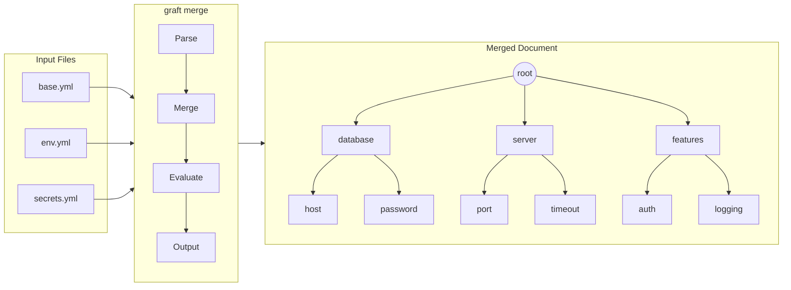

# Graft

Grafting YAML Trees for plentiful satisfactions.



## Introduction

`graft` is a general purpose YAML & JSON merging tool designed to be an intuitive utility for merging configuration templates together to generate complex config files in a repeatable fashion.

Use graft to:

- Stitch together generic/top-level definitions with site-specific overrides
- [DRY](https://en.wikipedia.org/wiki/Don%27t_repeat_yourself) up your configurations
- Manage secrets from Vault, AWS, or NATS
- Generate environment-specific configurations from templates
- Compare generated configurations semantically rather than line by line

## Features

- **Spruce Compatible**

  Runs spruce's operators, CLI flags, and merge semantics; the remaining
  differences are tracked in [Known Gaps](docs/spruce/known-gaps.md)

- **47 Operators**

  References, strings, arithmetic, comparison and boolean logic, arrays,
  external sources, and IP arithmetic

- **Control Flow**

  `if`/`elif`/`else`, `for`, `while`, and `case` blocks, expanded into plain
  YAML before the document is parsed

- **Multi-Backend Secrets**

  Vault, OpenBao, AWS Parameter Store, AWS Secrets Manager, NATS JetStream

- **Named Backend Targets**

  Route one lookup at a named backend with `(( vault@production "secret/db:password" ))`

- **Semantic Diff**

  `graft diff` reports structural changes — added, removed, and changed
  paths — instead of a textual diff

- **Embeddable Go Library**

  `pkg/graft` - embed configuration merging in your applications

## Quick Start

```sh
# Create a base configuration
cat > base.yml << 'EOF'
database:
  host: localhost
  port: 5432
server:
  timeout: 30
EOF

# Create an environment overlay
cat > prod.yml << 'EOF'
database:
  host: db.prod.example.com
server:
  timeout: 60
  ssl: true
EOF

# Merge them together
graft merge base.yml prod.yml
```

**Output:**

```yaml
database:
  host: db.prod.example.com
  port: 5432
server:
  ssl: true
  timeout: 60
```

## Installation

### Using Go

```sh
go install github.com/fivetwenty-io/graft/cmd/graft@latest
```

### Pre-built Binaries

Download from the [releases page](https://github.com/fivetwenty-io/graft/releases/) for:

- Linux (amd64, arm64)
- macOS (amd64, arm64)
- Windows (amd64)

### From Source

```sh
git clone https://github.com/fivetwenty-io/graft.git
cd graft
make build
```

For detailed installation instructions, see the [Installation Guide](docs/getting-started/installation.md).

## Documentation

Comprehensive documentation is available in the [docs/](docs/) directory:

- **[Documentation Hub](docs/index.md)**

  Start here for an overview of all documentation

- **[Getting Started](docs/getting-started/)**

  Installation, quick start tutorial, and Spruce migration guide

- **[User Guide](docs/user-guide/)**

  CLI commands, operators, secrets management, and configuration

- **[Developer Guide](docs/developer-guide/)**

  Library API reference, custom operators, embedding, and testing

- **[Architecture](docs/architecture/)**

  Processing pipeline, parser design, and parallel execution model

- **[Examples](docs/examples/)**

  Practical examples for common use cases

- **[Reference](docs/reference/)**

  Quick references, environment variables, error codes, and glossary

## Operator Quick Reference

All 47 registered operators:

| Category | Operators |
|----------|-----------|
| Reference | `grab` |
| String | `concat`, `join`, `split`, `stringify`, `base64`, `base64-decode` |
| Data | `keys`, `type`, `empty`, `null`, `negate` |
| Arithmetic | `+`, `-`, `*`, `/`, `%`, `calc` |
| Comparison & Logic | `==`, `!=`, `<`, `>`, `<=`, `>=`, `&&`, `\|\|`, `!`, `? :` |
| Array | `sort`, `shuffle`, `flatten`, `uniq`, `cartesian-product`, `cartesian` |
| Secrets | `vault`, `vault-try`, `awsparam`, `awssecret`, `nats` |
| External Sources | `file`, `load` |
| Merge structure | `inject`, `prune`, `param`, `defer` |
| IP arithmetic | `ips`, `static_ips` |

Two families sit outside that count. The array-merge markers — `append`,
`prepend`, `replace`, `inline`, `merge`, `merge on <key>`, `delete` — are
handled by the merger while documents are combined. The control-flow
keywords — `if`/`elif`/`else`/`fi`, `for`/`done`, `while`/`done`,
`case`/`when`/`default`/`esac`, and `range` — are expanded by a
source-to-source preprocessor before the YAML is parsed.

See the [Operator Reference](docs/reference/operators.md) for complete
documentation, or the [Operator Quick Reference](docs/reference/operator-quick-reference.md)
for syntax at a glance.

## Origins

Graft was originally forked from Geoff Franks's excellent [Spruce](https://github.com/geofffranks/spruce) tool to add additional features. After significant refactoring and the addition of new capabilities, it has grown into its own tool with a different focus and expanded use cases.

Graft aims to run any valid Spruce configuration unchanged, and adds
capabilities Spruce does not have — control flow, infix expressions,
`field=value` predicates, named backend targets, and the NATS backend among
them. The differences that remain are catalogued in
[Known Gaps](docs/spruce/known-gaps.md).

## Contributing

We welcome contributions! Please see [docs/contributing.md](docs/contributing.md) for guidelines, and [CONTRIBUTORS.md](CONTRIBUTORS.md) for the people behind Graft.

## License

Licensed under [the MIT License](LICENSE).
