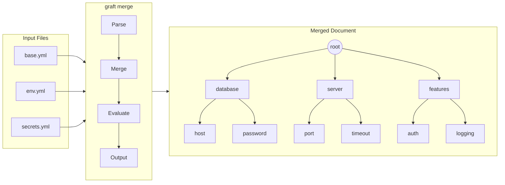

# Graft

Grafting YAML Trees for plentiful satisfactions.



## Introduction

`graft` is a general purpose YAML & JSON merging tool designed to be an intuitive utility for merging configuration templates together to generate complex config files in a repeatable fashion.

Use graft to:

- Stitch together generic/top-level definitions with site-specific overrides
- [DRY](https://en.wikipedia.org/wiki/Don%27t_repeat_yourself) up your configurations
- Manage secrets from Vault, AWS, or NATS
- Generate environment-specific configurations from templates
- Debug complex merge scenarios with an interactive REPL

## Features

- **Full Spruce Compatibility**

  Drop-in replacement for all spruce functionality

- **50+ Operators**

  Data manipulation, control flow, arithmetic, array operations, and more

- **Multi-Backend Secrets**

  Vault, OpenBao, AWS Parameter Store, AWS Secrets Manager, NATS JetStream

- **Rich Diff Output**

  Side-by-side, unified, and change list formats with colorization

- **Merge History Tracking**

  Complete traceability of where every value came from

- **Interactive Debugging REPL**

  Step through complex merges with breakpoints and inspection

- **Embeddable Go Library**

  `pkg/graft` - embed configuration merging in your applications

## Quick Start

```sh
# Create a base configuration
cat > base.yml << 'EOF'
database:
  host: localhost
  port: 5432
server:
  timeout: 30
EOF

# Create an environment overlay
cat > prod.yml << 'EOF'
database:
  host: db.prod.example.com
server:
  timeout: 60
  ssl: true
EOF

# Merge them together
graft merge base.yml prod.yml
```

**Output:**

```yaml
database:
  host: db.prod.example.com
  port: 5432
server:
  ssl: true
  timeout: 60
```

## Installation

### Using Go

```sh
go install github.com/wayneeseguin/graft/cmd/graft@latest
```

### Pre-built Binaries

Download from the [releases page](https://github.com/wayneeseguin/graft/releases/) for:

- Linux (amd64, arm64)
- macOS (amd64, arm64)
- Windows (amd64)

### From Source

```sh
git clone https://github.com/wayneeseguin/graft.git
cd graft
make build
```

For detailed installation instructions, see the [Installation Guide](docs/getting-started/installation.md).

## Documentation

Comprehensive documentation is available in the [docs/](docs/) directory:

- **[Documentation Hub](docs/index.md)**

  Start here for an overview of all documentation

- **[Getting Started](docs/getting-started/)**

  Installation, quick start tutorial, and Spruce migration guide

- **[User Guide](docs/user-guide/)**

  CLI commands, operators, secrets management, and configuration

- **[Developer Guide](docs/developer-guide/)**

  Library API reference, custom operators, embedding, and testing

- **[Architecture](docs/architecture/)**

  Processing pipeline, parser design, and parallel execution model

- **[Examples](docs/examples/)**

  Practical examples for common use cases

- **[Reference](docs/reference/)**

  Quick references, environment variables, error codes, and glossary

## Operator Quick Reference

| Category | Operators |
|----------|-----------|
| Data Manipulation | `grab`, `concat`, `join`, `split`, `stringify`, `keys`, `base64`, `type` |
| Control Flow | `if`/`elif`/`else`/`fi`, `for`/`while`/`done`, `case`/`when`/`esac` |
| Arithmetic | `+`, `-`, `*`, `/`, `%`, `calc` |
| Comparison & Logic | `==`, `!=`, `<`, `>`, `<=`, `>=`, `&&`, `\|\|`, `!`, `? :` |
| Array Operations | `append`, `prepend`, `merge`, `replace`, `inline`, `flatten`, `uniq`, `sort` |
| Secrets | `vault`, `awsparam`, `awssecret`, `nats` |
| External Sources | `file`, `load` |

See the [Operator Quick Reference](docs/reference/operator-quick-reference.md) for complete documentation.

## Origins

Graft was originally forked from Geoff Franks's excellent [Spruce](https://github.com/geofffranks/spruce) tool to add additional features. After significant refactoring and the addition of new capabilities, it has grown into its own tool with a different focus and expanded use cases.

Graft passes all original Spruce tests and should be considered a superset of Spruce - any valid Spruce configuration will work with graft.

## Contributing

We welcome contributions! Please see [docs/contributing.md](docs/contributing.md) for guidelines.

## License

Licensed under [the MIT License](LICENSE).
