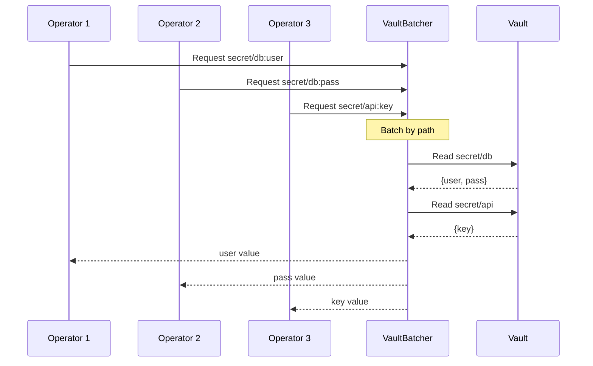

# Backend Architecture

Graft supports multiple external backends for secrets management and configuration storage. Each backend is designed with connection pooling, request batching, and multi-target support.

## Overview

### Supported Backends

| Backend | Operator | Purpose |
|---------|----------|---------|
| Vault / OpenBao | `vault` | Secrets management |
| AWS SSM | `awsparam` | Parameter Store |
| AWS Secrets Manager | `awssecret` | Secrets storage |
| NATS JetStream | `nats` | KV and Object store |

### Common Features

All backends share these design characteristics:

- **Multi-Target Support**

  Use `target@path` syntax for multiple environments

- **Connection Pooling**

  Reuse connections per target

- **Request Batching**

  Aggregate requests for efficiency

- **Caching**

  Configurable TTL cache

- **Fallback Values**

  Use `|| "default"` syntax

## Vault / OpenBao

### Operator Syntax

```yaml
# Basic access
password: (( vault "secret/db:password" ))

# With target (different Vault instance)
prod_pass: (( vault prod@"secret/db:password" ))
staging_pass: (( vault staging@"secret/db:password" ))

# Multiple paths with fallback
password: (( vault "secret/v2:pass; secret/v1:pass" ))

# With default value
password: (( vault "secret/db:password" || "default" ))

# Dynamic path construction
password: (( vault (concat "secret/" env ":password") ))
```

### Configuration

```go
type VaultConfig struct {
    Address    string        // Vault server URL
    Token      string        // Authentication token
    Namespace  string        // Enterprise namespace
    SkipVerify bool          // Skip TLS verification
    Timeout    time.Duration // Request timeout
    MaxRetries int           // Retry count
    RetryDelay time.Duration // Delay between retries
}
```

Environment variables:

- `VAULT_ADDR` - Vault server URL

- `VAULT_TOKEN` - Authentication token

- `VAULT_NAMESPACE` - Enterprise namespace

- `VAULT_SKIP_VERIFY` - Skip TLS verification

Per-target environment variables:

- `VAULT_{TARGET}_ADDR`

- `VAULT_{TARGET}_TOKEN`

- etc.

### Connection Pool

```go
type VaultClientPool struct {
    clients map[string]*vaultapi.Client
    configs map[string]*VaultConfig
    mu      sync.RWMutex
}

func NewVaultClientPool() *VaultClientPool {
    return &VaultClientPool{
        clients: make(map[string]*vaultapi.Client),
        configs: make(map[string]*VaultConfig),
    }
}

func (p *VaultClientPool) GetClient(target string) (*vaultapi.Client, error) {
    p.mu.RLock()
    if client, ok := p.clients[target]; ok {
        p.mu.RUnlock()
        return client, nil
    }
    p.mu.RUnlock()

    p.mu.Lock()
    defer p.mu.Unlock()

    // Double-check after acquiring write lock
    if client, ok := p.clients[target]; ok {
        return client, nil
    }

    // Create new client
    config := p.getConfig(target)
    client, err := p.createClient(config)
    if err != nil {
        return nil, err
    }

    p.clients[target] = client
    return client, nil
}

func (p *VaultClientPool) getConfig(target string) *VaultConfig {
    // Check for target-specific config
    if cfg, ok := p.configs[target]; ok {
        return cfg
    }

    // Build from environment
    prefix := ""
    if target != "" && target != "default" {
        prefix = strings.ToUpper(target) + "_"
    }

    return &VaultConfig{
        Address:    getEnv(prefix+"VAULT_ADDR", "https://127.0.0.1:8200"),
        Token:      getEnv(prefix+"VAULT_TOKEN", ""),
        Namespace:  getEnv(prefix+"VAULT_NAMESPACE", ""),
        SkipVerify: getEnvBool(prefix+"VAULT_SKIP_VERIFY", false),
        Timeout:    30 * time.Second,
    }
}
```

### Request Batching



```go
type VaultBatcher struct {
    pool       *VaultClientPool
    pending    map[string][]pendingRequest
    mu         sync.Mutex
    batchSize  int
    timeout    time.Duration
    timer      *time.Timer
}

func (b *VaultBatcher) flush(target string) {
    b.mu.Lock()
    requests := b.pending[target]
    b.pending[target] = nil
    if b.timer != nil {
        b.timer.Stop()
    }
    b.mu.Unlock()

    if len(requests) == 0 {
        return
    }

    // Group by path for efficiency
    byPath := make(map[string][]pendingRequest)
    for _, req := range requests {
        byPath[req.path] = append(byPath[req.path], req)
    }

    // Fetch each path once
    client, err := b.pool.GetClient(target)
    if err != nil {
        for _, req := range requests {
            req.errorCh <- err
        }
        return
    }

    for path, reqs := range byPath {
        secret, err := client.Logical().Read(path)
        if err != nil {
            for _, req := range reqs {
                req.errorCh <- err
            }
            continue
        }

        for _, req := range reqs {
            if secret == nil || secret.Data == nil {
                req.errorCh <- fmt.Errorf("secret not found: %s", path)
                continue
            }
            if value, ok := secret.Data[req.key]; ok {
                req.resultCh <- value
            } else {
                req.errorCh <- fmt.Errorf("key not found: %s:%s", path, req.key)
            }
        }
    }
}
```

## AWS Parameter Store

### Operator Syntax

```yaml
# Basic parameter
db_host: (( awsparam "/app/prod/db_host" ))

# With JSON key extraction
db_port: (( awsparam "/app/config?key=database.port" ))

# With target (different AWS account/region)
db_host: (( awsparam staging@"/app/db_host" ))

# With default
db_host: (( awsparam "/app/db_host" || "localhost" ))
```

### Configuration

```go
type AWSConfig struct {
    Region    string // AWS region
    Profile   string // AWS profile name
    Endpoint  string // Custom endpoint (for LocalStack)
    AccessKey string // Access key ID
    SecretKey string // Secret access key
}
```

Environment variables:

- `AWS_REGION` - AWS region

- `AWS_PROFILE` - AWS profile name

- `AWS_ACCESS_KEY_ID` - Access key ID

- `AWS_SECRET_ACCESS_KEY` - Secret access key

Per-target environment variables:

- `AWS_{TARGET}_REGION`

- `AWS_{TARGET}_PROFILE`

- etc.

### Session Pool

```go
type AWSSessionPool struct {
    sessions map[string]*session.Session
    configs  map[string]*AWSConfig
    mu       sync.RWMutex
}

func (p *AWSSessionPool) GetSession(target string) (*session.Session, error) {
    p.mu.RLock()
    if sess, ok := p.sessions[target]; ok {
        p.mu.RUnlock()
        return sess, nil
    }
    p.mu.RUnlock()

    p.mu.Lock()
    defer p.mu.Unlock()

    if sess, ok := p.sessions[target]; ok {
        return sess, nil
    }

    config := p.getConfig(target)
    sess, err := p.createSession(config)
    if err != nil {
        return nil, err
    }

    p.sessions[target] = sess
    return sess, nil
}

func (p *AWSSessionPool) createSession(config *AWSConfig) (*session.Session, error) {
    awsConfig := aws.NewConfig()

    if config.Region != "" {
        awsConfig = awsConfig.WithRegion(config.Region)
    }
    if config.Endpoint != "" {
        awsConfig = awsConfig.WithEndpoint(config.Endpoint)
    }
    if config.AccessKey != "" && config.SecretKey != "" {
        awsConfig = awsConfig.WithCredentials(credentials.NewStaticCredentials(
            config.AccessKey, config.SecretKey, "",
        ))
    }

    opts := session.Options{
        Config: *awsConfig,
    }
    if config.Profile != "" {
        opts.Profile = config.Profile
    }

    return session.NewSessionWithOptions(opts)
}
```

### Parameter Store Client

```go
type SSMClient struct {
    pool    *AWSSessionPool
    cache   map[string]cachedParam
    cacheMu sync.RWMutex
    ttl     time.Duration
}

func (c *SSMClient) GetParameter(target, path string) (string, error) {
    // Check cache
    cacheKey := target + ":" + path
    c.cacheMu.RLock()
    if cached, ok := c.cache[cacheKey]; ok && time.Now().Before(cached.expires) {
        c.cacheMu.RUnlock()
        return cached.value, nil
    }
    c.cacheMu.RUnlock()

    // Get session
    sess, err := c.pool.GetSession(target)
    if err != nil {
        return "", err
    }

    // Fetch parameter
    svc := ssm.New(sess)
    input := &ssm.GetParameterInput{
        Name:           aws.String(path),
        WithDecryption: aws.Bool(true),
    }

    result, err := svc.GetParameter(input)
    if err != nil {
        return "", err
    }

    value := aws.StringValue(result.Parameter.Value)

    // Cache result
    c.cacheMu.Lock()
    c.cache[cacheKey] = cachedParam{
        value:   value,
        expires: time.Now().Add(c.ttl),
    }
    c.cacheMu.Unlock()

    return value, nil
}
```

## AWS Secrets Manager

### Operator Syntax

```yaml
# Basic secret
api_key: (( awssecret "prod/api-key" ))

# With JSON key extraction
db_pass: (( awssecret "prod/db?key=password" ))

# With version/stage
db_pass: (( awssecret "prod/db?key=password&stage=AWSCURRENT" ))

# With target
api_key: (( awssecret prod@"api-credentials" ))
```

### Secrets Manager Client

```go
type SecretsManagerClient struct {
    pool    *AWSSessionPool
    cache   map[string]cachedSecret
    cacheMu sync.RWMutex
    ttl     time.Duration
}

func (c *SecretsManagerClient) GetSecret(target, name string, opts *SecretOptions) (interface{}, error) {
    // Check cache
    cacheKey := fmt.Sprintf("%s:%s:%s", target, name, opts.Stage)
    c.cacheMu.RLock()
    if cached, ok := c.cache[cacheKey]; ok && time.Now().Before(cached.expires) {
        c.cacheMu.RUnlock()
        return c.extractKey(cached.value, opts.Key), nil
    }
    c.cacheMu.RUnlock()

    // Get session
    sess, err := c.pool.GetSession(target)
    if err != nil {
        return nil, err
    }

    // Fetch secret
    svc := secretsmanager.New(sess)
    input := &secretsmanager.GetSecretValueInput{
        SecretId: aws.String(name),
    }
    if opts.Stage != "" {
        input.VersionStage = aws.String(opts.Stage)
    }

    result, err := svc.GetSecretValue(input)
    if err != nil {
        return nil, err
    }

    // Parse JSON
    var value map[string]interface{}
    if err := json.Unmarshal([]byte(aws.StringValue(result.SecretString)), &value); err != nil {
        // Return as plain string if not JSON
        return aws.StringValue(result.SecretString), nil
    }

    // Cache result
    c.cacheMu.Lock()
    c.cache[cacheKey] = cachedSecret{
        value:   value,
        expires: time.Now().Add(c.ttl),
    }
    c.cacheMu.Unlock()

    return c.extractKey(value, opts.Key), nil
}

func (c *SecretsManagerClient) extractKey(value map[string]interface{}, key string) interface{} {
    if key == "" {
        return value
    }

    // Support nested keys: "database.password"
    parts := strings.Split(key, ".")
    current := interface{}(value)

    for _, part := range parts {
        if m, ok := current.(map[string]interface{}); ok {
            current = m[part]
        } else {
            return nil
        }
    }

    return current
}
```

## NATS JetStream

### Operator Syntax

```yaml
# KV store access
config: (( nats "kv:bucket/key" ))

# Object store access
template: (( nats "obj:assets/template.yml" ))

# With target
config: (( nats synadia@"kv:config/settings" ))

# With explicit URL
config: (( nats "kv:bucket/key" "nats://server:4222" ))
```

### Configuration

```go
type NATSConfig struct {
    URL       string        // NATS server URL
    Token     string        // Authentication token
    TLSCert   string        // TLS certificate path
    TLSKey    string        // TLS key path
    TLSCA     string        // TLS CA certificate path
    Timeout   time.Duration // Connection timeout
}
```

Environment variables:

- `NATS_URL` - NATS server URL

- `NATS_TOKEN` - Authentication token

- `NATS_TLS_CERT` - TLS certificate path

- `NATS_TLS_KEY` - TLS key path

Per-target environment variables:

- `NATS_{TARGET}_URL`

- `NATS_{TARGET}_TOKEN`

- etc.

### Connection Pool

```go
type NATSConnectionPool struct {
    connections map[string]*nats.Conn
    configs     map[string]*NATSConfig
    mu          sync.RWMutex
}

func (p *NATSConnectionPool) GetConnection(target string) (*nats.Conn, error) {
    p.mu.RLock()
    if conn, ok := p.connections[target]; ok {
        if conn.IsConnected() {
            p.mu.RUnlock()
            return conn, nil
        }
    }
    p.mu.RUnlock()

    p.mu.Lock()
    defer p.mu.Unlock()

    // Create new connection
    config := p.getConfig(target)
    conn, err := p.createConnection(config)
    if err != nil {
        return nil, err
    }

    p.connections[target] = conn
    return conn, nil
}

func (p *NATSConnectionPool) createConnection(config *NATSConfig) (*nats.Conn, error) {
    opts := []nats.Option{
        nats.Timeout(config.Timeout),
    }

    if config.Token != "" {
        opts = append(opts, nats.Token(config.Token))
    }

    if config.TLSCert != "" && config.TLSKey != "" {
        opts = append(opts, nats.ClientCert(config.TLSCert, config.TLSKey))
    }

    if config.TLSCA != "" {
        opts = append(opts, nats.RootCAs(config.TLSCA))
    }

    return nats.Connect(config.URL, opts...)
}
```

### NATS Client

```go
type NATSClient struct {
    pool    *NATSConnectionPool
    cache   map[string]cachedValue
    cacheMu sync.RWMutex
    ttl     time.Duration
}

func (c *NATSClient) Get(target, path string) (interface{}, error) {
    // Parse path: "kv:bucket/key" or "obj:bucket/key"
    parts := strings.SplitN(path, ":", 2)
    if len(parts) != 2 {
        return nil, fmt.Errorf("invalid NATS path: %s", path)
    }

    storeType := parts[0]
    storePath := parts[1]

    switch storeType {
    case "kv":
        return c.getKV(target, storePath)
    case "obj":
        return c.getObject(target, storePath)
    default:
        return nil, fmt.Errorf("unknown NATS store type: %s", storeType)
    }
}

func (c *NATSClient) getKV(target, path string) (interface{}, error) {
    // Parse: "bucket/key"
    parts := strings.SplitN(path, "/", 2)
    if len(parts) != 2 {
        return nil, fmt.Errorf("invalid KV path: %s", path)
    }

    bucket := parts[0]
    key := parts[1]

    conn, err := c.pool.GetConnection(target)
    if err != nil {
        return nil, err
    }

    js, err := conn.JetStream()
    if err != nil {
        return nil, err
    }

    kv, err := js.KeyValue(bucket)
    if err != nil {
        return nil, err
    }

    entry, err := kv.Get(key)
    if err != nil {
        return nil, err
    }

    // Try to parse as JSON
    var value interface{}
    if err := json.Unmarshal(entry.Value(), &value); err != nil {
        // Return as string
        return string(entry.Value()), nil
    }

    return value, nil
}
```

## Caching Strategy

### Cache Interface

```go
type BackendCache interface {
    Get(key string) (interface{}, bool)
    Set(key string, value interface{}, ttl time.Duration)
    Delete(key string)
    Clear()
}
```

### LRU Cache Implementation

```go
type LRUCache struct {
    capacity int
    items    map[string]*cacheItem
    order    *list.List
    mu       sync.RWMutex
}

type cacheItem struct {
    key     string
    value   interface{}
    expires time.Time
    element *list.Element
}

func NewLRUCache(capacity int) *LRUCache {
    return &LRUCache{
        capacity: capacity,
        items:    make(map[string]*cacheItem),
        order:    list.New(),
    }
}

func (c *LRUCache) Get(key string) (interface{}, bool) {
    c.mu.RLock()
    item, ok := c.items[key]
    if !ok {
        c.mu.RUnlock()
        return nil, false
    }

    if time.Now().After(item.expires) {
        c.mu.RUnlock()
        c.Delete(key)
        return nil, false
    }
    c.mu.RUnlock()

    // Move to front (most recently used)
    c.mu.Lock()
    c.order.MoveToFront(item.element)
    c.mu.Unlock()

    return item.value, true
}

func (c *LRUCache) Set(key string, value interface{}, ttl time.Duration) {
    c.mu.Lock()
    defer c.mu.Unlock()

    // Update existing
    if item, ok := c.items[key]; ok {
        item.value = value
        item.expires = time.Now().Add(ttl)
        c.order.MoveToFront(item.element)
        return
    }

    // Evict if at capacity
    if len(c.items) >= c.capacity {
        oldest := c.order.Back()
        if oldest != nil {
            oldItem := oldest.Value.(*cacheItem)
            delete(c.items, oldItem.key)
            c.order.Remove(oldest)
        }
    }

    // Add new
    item := &cacheItem{
        key:     key,
        value:   value,
        expires: time.Now().Add(ttl),
    }
    item.element = c.order.PushFront(item)
    c.items[key] = item
}
```

### Multi-Tier Caching

```go
type CacheManager struct {
    // L1: In-memory LRU
    l1 *LRUCache

    // L2: External cache (optional)
    l2 ExternalCache

    // TTL configuration
    defaultTTL time.Duration
    secretTTL  time.Duration
}

func (m *CacheManager) Get(key string) (interface{}, bool) {
    // Check L1
    if value, ok := m.l1.Get(key); ok {
        return value, true
    }

    // Check L2
    if m.l2 != nil {
        if value, ok := m.l2.Get(key); ok {
            // Promote to L1
            m.l1.Set(key, value, m.defaultTTL)
            return value, true
        }
    }

    return nil, false
}

func (m *CacheManager) Set(key string, value interface{}, isSecret bool) {
    ttl := m.defaultTTL
    if isSecret {
        ttl = m.secretTTL
    }

    m.l1.Set(key, value, ttl)

    if m.l2 != nil && !isSecret {
        m.l2.Set(key, value, ttl)
    }
}
```

## Error Handling

### Backend Errors

```go
type BackendError struct {
    Backend    string
    Target     string
    Operation  string
    Path       string
    Cause      error
    RetryCount int
    Retriable  bool
}

func (e *BackendError) Error() string {
    return fmt.Sprintf("%s[%s] %s %s: %v",
        e.Backend, e.Target, e.Operation, e.Path, e.Cause)
}

func (e *BackendError) Unwrap() error {
    return e.Cause
}
```

### Retry Logic

```go
type RetryConfig struct {
    MaxRetries   int
    InitialDelay time.Duration
    MaxDelay     time.Duration
}

func withRetry(ctx context.Context, config RetryConfig, fn func() error) error {
    var lastErr error

    for attempt := 0; attempt <= config.MaxRetries; attempt++ {
        err := fn()
        if err == nil {
            return nil
        }

        lastErr = err

        // Check if retriable
        if !isRetriable(err) {
            return err
        }

        // Check context
        select {
        case <-ctx.Done():
            return ctx.Err()
        default:
        }

        // Wait before retry with exponential backoff
        delay := config.InitialDelay * time.Duration(1<<attempt)
        if delay > config.MaxDelay {
            delay = config.MaxDelay
        }

        time.Sleep(delay)
    }

    return lastErr
}

func isRetriable(err error) bool {
    // Network errors are retriable
    var netErr net.Error
    if errors.As(err, &netErr) {
        return netErr.Temporary()
    }

    // Rate limit errors are retriable
    if strings.Contains(err.Error(), "rate limit") {
        return true
    }

    return false
}
```

## Security Considerations

### TLS Configuration

```go
type TLSConfig struct {
    Enabled    bool
    SkipVerify bool   // Only for development
    CertFile   string
    KeyFile    string
    CAFile     string
    MinVersion uint16
}

func (c *TLSConfig) Build() (*tls.Config, error) {
    if !c.Enabled {
        return nil, nil
    }

    config := &tls.Config{
        InsecureSkipVerify: c.SkipVerify,
        MinVersion:         c.MinVersion,
    }

    if c.MinVersion == 0 {
        config.MinVersion = tls.VersionTLS12
    }

    // Load client certificate
    if c.CertFile != "" && c.KeyFile != "" {
        cert, err := tls.LoadX509KeyPair(c.CertFile, c.KeyFile)
        if err != nil {
            return nil, err
        }
        config.Certificates = []tls.Certificate{cert}
    }

    // Load CA certificate
    if c.CAFile != "" {
        caCert, err := os.ReadFile(c.CAFile)
        if err != nil {
            return nil, err
        }
        config.RootCAs = x509.NewCertPool()
        config.RootCAs.AppendCertsFromPEM(caCert)
    }

    return config, nil
}
```

### Audit Logging

```go
type AuditEvent struct {
    Timestamp time.Time
    Operation string
    Backend   string
    Target    string
    Path      string
    User      string
    Success   bool
    Error     string
    Duration  time.Duration
}

type AuditLogger interface {
    Log(event AuditEvent)
}

// Log backend operations
func (c *VaultClient) Read(path string) (interface{}, error) {
    start := time.Now()

    value, err := c.client.Logical().Read(path)

    c.audit.Log(AuditEvent{
        Timestamp: start,
        Operation: "read",
        Backend:   "vault",
        Target:    c.target,
        Path:      path,
        Success:   err == nil,
        Error:     errString(err),
        Duration:  time.Since(start),
    })

    return value, err
}
```

## Performance Considerations

### Connection Pool Sizing

| Backend | Default Pool Size | Considerations |
|---------|-------------------|----------------|
| Vault | 5 | Balance between connection overhead and concurrency |
| AWS | 5 | AWS SDK handles connection reuse internally |
| NATS | 3 | NATS connections are multiplexed |

### Batch Size Tuning

| Backend | Default Batch Size | Limit |
|---------|-------------------|-------|
| Vault | 10 | Per-path reads are independent |
| AWS SSM | 10 | GetParameters limit is 10 |
| AWS Secrets | 20 | BatchGetSecretValue limit is 20 |
| NATS | 50 | NATS is very fast, larger batches OK |

### Cache TTL Recommendations

| Data Type | Recommended TTL | Notes |
|-----------|-----------------|-------|
| Static configuration | 5-15 minutes | Rarely changes |
| Secrets | 1-5 minutes | Balance security vs performance |
| Frequently rotated | 30 seconds | Short TTL for rotation scenarios |
| Never cache | 0 | Use for one-time tokens |
