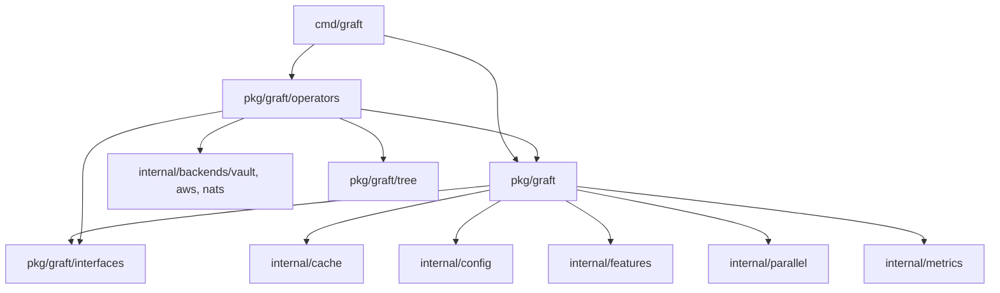
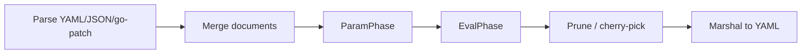

# Engine Overview

This page describes graft's package layout, dependency direction, engine
construction, and the merge/evaluation phases the engine runs a document
through. It reflects the code in `pkg/graft`, `pkg/graft/operators`, and
`internal/*` as currently implemented.

## Package layout

| Package | Responsibility |
|---|---|
| `cmd/graft` | CLI entry point (`main.go`): flag parsing, file loading, and calling into `pkg/graft`. |
| `pkg/graft` | Public engine and library API: engine construction, document model, evaluator, YAML compatibility layer, JSON conversion, diff, merge builder. |
| `pkg/graft/operators` | All operator implementations (`grab`, `vault`, arithmetic, comparison, array markers, and so on), registered via `init()` at package load time. |
| `pkg/graft/interfaces` | The `Operator` interface definition consumed by both `pkg/graft` and `pkg/graft/operators`. |
| `pkg/graft/merger` | The lower-level map/array merge engine (`Merge`, `MergeWithMetadata`, `MergeWithMemory`) that performs the actual document combination, including `(( prune ))` detection and array-marker handling. |
| `pkg/graft/tree` | Path/cursor utilities used by operators to resolve and reference locations in a document. |
| `internal/backends/{vault,aws,nats}` | External-system clients for each secrets/config backend, each with its own `config.go`, `cache.go`, and `client.go`. |
| `internal/cache` | LRU, disk-backed (L2), hierarchical, and sharded caching, plus cache analytics and warming. |
| `internal/config` | The `Config` struct, environment-variable overrides, file-based loader, validation, and an `fsnotify`-based watcher for live reload. |
| `internal/features` | The feature-flag system (env-derived flags and a flag registry). |
| `internal/metrics` | Counter/gauge/histogram registry with Prometheus, OpenTelemetry, JSON, and text exporters. |
| `internal/parallel` | The worker pool, DAG scheduler, rate limiter, and monitor used for concurrent operator evaluation. |
| `internal/pools` | Buffer and string-interning pools that reduce allocation pressure during parallel evaluation. |
| `internal/utils/ansi`, `internal/utils/netutil` | Colored-output helpers and networking utilities. |
| `log` | The package-level logger used throughout graft (`DEBUG`, `TRACE`, `PrintStdErrf`). |

## Dependency direction



`cmd/graft` imports `pkg/graft` for the engine API and blank-imports
`pkg/graft/operators` so operator `init()` functions register themselves
before any engine runs. `pkg/graft/operators` in turn imports `internal/backends/{vault,aws,nats}`
for the operators that talk to external systems (`vault`, `vault-try`,
`awsparam`, `awssecret`, `nats`). This is a one-directional, layered graph:
nothing under `internal/` imports `pkg/graft` or `pkg/graft/operators` back.

## Engine construction

A functional-options constructor, `graft.NewEngine(opts ...graft.EngineOption)`,
builds the engine. Each option mutates an `EngineOptions` struct before
construction. The CLI
(`cmd/graft/main.go`) applies a fixed cache option and a config-derived
dataflow-order option on every merge/fan invocation:

```go
graft.WithCache(true, 1000),
graft.WithDataflowOrder(dataflowOrder), // "alphabetical" unless --dataflow-order is set
```

Alongside those, `configEngineOpts` adds config-driven options built from
the `*config.Config` and `*features.FeatureFlags` resolved once per
invocation in `PersistentPreRunE` (see
[CLI reference: `--config` flag](../reference/cli.md#--config-flag)):
`graft.WithConfigInstance`, `graft.WithFeatureFlags`,
`graft.WithParallel(cfg.Parallel.Enabled)`, and
`graft.WithConcurrency(resolveConcurrency(cfg.Parallel))`. These apply
whether or not `--config` was passed, since the CLI always resolves a
config (an explicit file, or `config.DefaultConfig()`) and applies
`GRAFT_*` environment overrides on top before engine construction.

`graft vaultinfo` additionally passes `graft.WithSkipVault(true)` so the
merge runs without resolving any Vault secrets. `diff` and `json` don't
build an engine through this path at all, so none of the config-derived
options apply to them.

Beyond what the CLI wires today, `pkg/graft/api.go` exposes a broader set of
options for library consumers building their own engine, including:

| Option | Purpose |
|---|---|
| `WithLogger` | Supply a custom `Logger` implementation. |
| `WithVaultClient`, `WithVaultConfig`, `WithVaultSkipTLS` | Configure the Vault client directly, or by address/token, or disable TLS verification. |
| `WithAWSConfig`, `WithAWSRegion`, `WithAWSProfile` | Configure the AWS backend. |
| `WithSkipVault`, `WithSkipAws`, `WithSkipNats` | Skip resolution for a given backend entirely (used by `vaultinfo`). |
| `WithCache`, `WithCacheInstance`, `WithCaching` | Enable caching by size, supply a custom `cache.Cache` implementation, or toggle caching via feature flags. |
| `WithConcurrency`, `WithMaxWorkers`, `WithWorkerPool` | Control the size and implementation of the worker pool used for parallel evaluation. |
| `WithParallel` | Enable or disable parallel (copy-on-write) evaluation via feature flags. |
| `WithMemoryPools` | Enable buffer/string pooling from `internal/pools`. |
| `WithMetrics`, `WithMetricsRegistry` | Enable metrics collection, optionally with a custom registry. |
| `WithFeatureFlags` | Supply a full `features.FeatureFlags` set directly. |
| `WithConfigInstance` | Supply a `config.Config` built by a library consumer. |
| `WithCustomOperator` | Register an operator implementation under a given name at engine-construction time, in addition to the operators registered globally via `init()`. |
| `WithDataflowOrder` | Set output key ordering to `"alphabetical"` (default) or `"insertion"`. |
| `WithYAMLCompat` | Configure YAML-compatibility behavior (see the [YAML libraries](yaml-libraries.md) page). |
| `WithMemoryConfig` | Configure document-change-history tracking. |

`internal/config` and `internal/features` are fully built and consumable by
library callers through `WithConfigInstance`/`WithFeatureFlags`, and the
CLI wires them in the same way for its own `merge`/`fan`/`vaultinfo`
commands: `config.Load`/`config.ApplyEnv` and
`features.DefaultFlags().LoadFromEnv()` run once per invocation, so both
`--config` and the `GRAFT_*`/`GRAFT_FEATURE_*` environment variables
`internal/config/env.go` and `internal/features/env.go` understand affect
those three commands. See
[Configuration reference](../reference/config.md) for the full precedence
order and variable list.

## Merge and evaluation phases

A `graft merge` (or `fan`) run moves a document through three phases, in
this order:



- **Merge** combines the parsed documents using `pkg/graft/merger`'s map and
  array merge logic: this is where array markers (`append`, `replace`,
  `inline`, `merge`, `merge on <key>`, `prune`) and `(( inject ))` are
  applied. Operators whose `Phase()` returns `MergePhase` (`inject`, `sort`)
  run here.

- **ParamPhase** runs next and evaluates only `(( param ))` markers. Any
  unresolved `(( param "message" ))` produces an error immediately and
  aborts the run; `EvalPhase` never executes if a required parameter is
  missing, so a merge with an unresolved `param` never reaches operator
  evaluation errors for the rest of the document.

- **EvalPhase** runs every remaining operator (`grab`, `vault`, `concat`,
  arithmetic, comparison, boolean, and so on; the large majority of
  graft's 44 registered operators run in this phase). It also calls out to
  external backends (Vault, AWS, NATS).

Each operator declares its phase by implementing `Phase() graft.OperatorPhase`,
returning one of `graft.MergePhase`, `graft.EvalPhase`, or `graft.ParamPhase`
(`pkg/graft/interfaces.go`). See the [operator reference](../reference/operators.md)
for the phase of each registered operator.

## Parallel (copy-on-write) evaluation model

`pkg/graft/copy_on_write_tree.go` and `pkg/graft/cow_evaluator.go` implement
a copy-on-write document tree so that concurrent operator evaluation does
not require locking shared mutable state: each evaluation goroutine works
against its own view of the tree and writes are merged back rather than
applied in place. `internal/parallel/dag.go` builds a dependency graph from
each operator's declared `Dependencies()` and schedules independent
operators onto `internal/parallel`'s worker pool, while operators that
depend on each other's output are ordered accordingly. `internal/pools`
supplies buffer and string pooling to reduce garbage-collection pressure
under concurrent evaluation.

`graft.WithConcurrency`/`WithMaxWorkers` control concurrency; `graft.WithParallel`
opts into copy-on-write evaluation. The CLI
derives both from the resolved config on every `merge`/`fan`/`vaultinfo`
invocation, rather than using a fixed value: `WithParallel` follows
`cfg.Parallel.Enabled` (`true` by default), and `WithConcurrency` follows
`cfg.Parallel.MaxWorkers` when set, otherwise `runtime.NumCPU()` floored
at `1`. See the [parallel execution model](parallelism.md) page for the
worker-pool and batching design in more detail.

## Related documentation

- [Operator reference](../reference/operators.md)

  Full argument, phase, and error-behavior reference for every registered operator.

- [CLI reference](../reference/cli.md)

  Full command and flag reference for the `graft` binary.

- [Parallel execution model](parallelism.md)

  Worker-pool sizing, batching, and the DAG scheduler in more detail.

- [Backend architecture](backends.md)

  Connection pooling and caching for the Vault, AWS, and NATS backends.

- [YAML libraries](yaml-libraries.md)

  goccy/go-yaml usage and compatibility handling.
