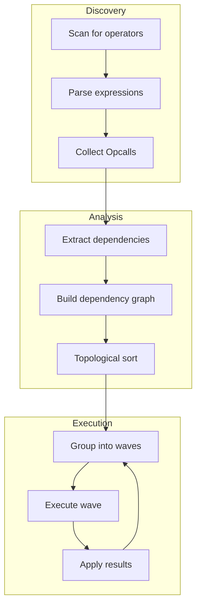
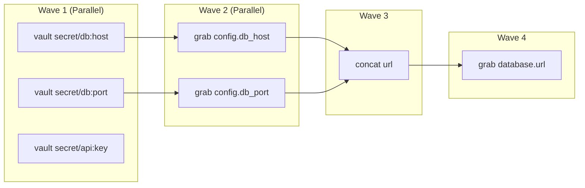

# Operator Evaluation

Graft evaluates operators using dependency analysis and wave-based execution. This design enables safe parallelization while maintaining correct evaluation order.

## Overview



## Dependency Analysis

### What Are Dependencies?

An operator depends on another operator if it references a path that the other operator will modify. For example:

```yaml
base_url: (( concat "https://" host ))     # Depends on: host
host: (( grab config.hostname ))           # Depends on: config.hostname
config:
  hostname: (( vault "secret/app:host" ))  # No internal dependencies
```

In this case:

- `config.hostname` has no internal dependencies (can evaluate first)

- `host` depends on `config.hostname`

- `base_url` depends on `host`

### Dependency Extraction

Each operator type knows how to report its dependencies:

```go
type Operator interface {
    // Dependencies returns paths this operator reads from
    Dependencies(args []*Expr, context *EvalContext) []*tree.Cursor

    // Other methods...
}
```

#### Example: grab Operator

```go
func (o *GrabOperator) Dependencies(args []*Expr, ctx *EvalContext) []*tree.Cursor {
    // First argument is the path to grab
    if len(args) > 0 {
        if ref, ok := args[0].(*Reference); ok {
            return []*tree.Cursor{ref.ToCursor()}
        }
    }
    return nil
}
```

#### Example: concat Operator

```go
func (o *ConcatOperator) Dependencies(args []*Expr, ctx *EvalContext) []*tree.Cursor {
    var deps []*tree.Cursor
    for _, arg := range args {
        // Recursively extract dependencies from nested expressions
        deps = append(deps, extractDependencies(arg, ctx)...)
    }
    return deps
}
```

### Dependency Graph Construction

```go
type DependencyGraph struct {
    nodes map[string]*OperatorNode   // Path -> Operator
    edges map[string][]string        // Path -> Dependencies
}

func BuildDependencyGraph(doc *Document) *DependencyGraph {
    graph := &DependencyGraph{
        nodes: make(map[string]*OperatorNode),
        edges: make(map[string][]string),
    }

    // Collect all operators with their paths
    walkDocument(doc, func(path string, node *OperatorNode) {
        graph.nodes[path] = node
    })

    // Extract dependencies for each operator
    for path, node := range graph.nodes {
        deps := node.Operator.Dependencies(node.Args, ctx)
        for _, dep := range deps {
            depPath := dep.String()
            // Only track dependencies on other operators
            if _, isOperator := graph.nodes[depPath]; isOperator {
                graph.edges[path] = append(graph.edges[path], depPath)
            }
        }
    }

    return graph
}
```

### Cycle Detection

Circular dependencies are detected during graph construction:

```go
func (g *DependencyGraph) DetectCycles() [][]string {
    var cycles [][]string
    visited := make(map[string]bool)
    recStack := make(map[string]bool)

    var dfs func(node string, path []string) bool
    dfs = func(node string, path []string) bool {
        visited[node] = true
        recStack[node] = true
        path = append(path, node)

        for _, dep := range g.edges[node] {
            if !visited[dep] {
                if dfs(dep, path) {
                    return true
                }
            } else if recStack[dep] {
                // Found cycle - extract it
                cycleStart := indexOf(path, dep)
                cycles = append(cycles, path[cycleStart:])
                return true
            }
        }

        recStack[node] = false
        return false
    }

    for node := range g.nodes {
        if !visited[node] {
            dfs(node, nil)
        }
    }

    return cycles
}
```

## Wave-Based Execution

### Wave Definition

A wave is a set of operators that can be executed in parallel because they have no dependencies on each other and all their dependencies have been resolved.

```go
type EvalWave struct {
    Operators []OperatorRef
}

type OperatorRef struct {
    Path     string
    Node     *OperatorNode
    Priority int  // For ordering within wave
}
```

### Wave Planning

```go
func BuildEvalPlan(graph *DependencyGraph) []EvalWave {
    var waves []EvalWave
    remaining := copyMap(graph.nodes)
    resolved := make(map[string]bool)

    for len(remaining) > 0 {
        wave := EvalWave{}

        // Find operators with all dependencies resolved
        for path, node := range remaining {
            deps := graph.edges[path]
            allResolved := true
            for _, dep := range deps {
                if !resolved[dep] {
                    allResolved = false
                    break
                }
            }

            if allResolved {
                wave.Operators = append(wave.Operators, OperatorRef{
                    Path: path,
                    Node: node,
                })
            }
        }

        if len(wave.Operators) == 0 {
            // This shouldn't happen if cycle detection works
            panic("no progress - circular dependency?")
        }

        // Sort operators within wave for determinism
        sort.Slice(wave.Operators, func(i, j int) bool {
            return wave.Operators[i].Path < wave.Operators[j].Path
        })

        // Mark as resolved and remove from remaining
        for _, op := range wave.Operators {
            resolved[op.Path] = true
            delete(remaining, op.Path)
        }

        waves = append(waves, wave)
    }

    return waves
}
```

### Example Wave Plan

```yaml
# Input document
config:
  db_host: (( vault "secret/db:host" ))           # Wave 1
  db_port: (( vault "secret/db:port" ))           # Wave 1
  api_key: (( vault "secret/api:key" ))           # Wave 1

database:
  host: (( grab config.db_host ))                 # Wave 2
  port: (( grab config.db_port ))                 # Wave 2
  url: (( concat "postgres://" host ":" port ))   # Wave 3

output:
  connection: (( grab database.url ))             # Wave 4
```

Visual representation:



## Parallel Execution

### Wave Execution

```go
func EvaluateParallel(doc *Document, waves []EvalWave, config PipelineConfig) error {
    for waveNum, wave := range waves {
        // Create worker pool for this wave
        sem := make(chan struct{}, config.EvalParallelism)
        var wg sync.WaitGroup
        errCh := make(chan error, len(wave.Operators))

        for _, op := range wave.Operators {
            wg.Add(1)
            sem <- struct{}{} // Acquire semaphore

            go func(op OperatorRef) {
                defer wg.Done()
                defer func() { <-sem }() // Release semaphore

                result, err := evaluateOperator(doc, op)
                if err != nil {
                    errCh <- fmt.Errorf("wave %d, %s: %w", waveNum, op.Path, err)
                    return
                }

                // Apply result to document (thread-safe)
                applyResult(doc, op.Path, result)
            }(op)
        }

        wg.Wait()
        close(errCh)

        // Check for errors
        for err := range errCh {
            return err // Return first error
        }
    }

    return nil
}
```

### Thread-Safe Result Application

```go
func applyResult(doc *Document, path string, result interface{}) {
    doc.mu.Lock()
    defer doc.mu.Unlock()

    cursor := tree.ParseCursor(path)
    cursor.Set(doc.Root, result)
}
```

## Operator Interface

### Complete Interface

```go
type Operator interface {
    // Name returns the operator name (e.g., "grab", "vault")
    Name() string

    // Setup performs one-time initialization
    Setup() error

    // Phase returns when this operator should run
    Phase() OperatorPhase

    // Run executes the operator
    Run(ev *Evaluator, args []*Expr) (*Response, error)

    // Dependencies returns paths this operator reads
    Dependencies(args []*Expr, ctx *EvalContext) []*tree.Cursor
}

type OperatorPhase int

const (
    // MergePhase - runs during merge (e.g., array operators)
    MergePhase OperatorPhase = iota

    // EvalPhase - runs during evaluation (most operators)
    EvalPhase

    // PostPhase - runs during post-processing
    PostPhase
)
```

### Response Types

```go
type Response struct {
    Type  ResponseType
    Value interface{}
}

type ResponseType int

const (
    // Replace - replace the operator node with the value
    Replace ResponseType = iota

    // Delete - remove the key from the parent
    Delete

    // Defer - re-evaluate in a later wave
    Defer

    // Error - operator failed
    Error
)
```

## Evaluator Context

### Context Structure

```go
type EvalContext struct {
    // Document state
    Document *Document
    Path     string

    // Engine reference for backends
    Engine *Engine

    // Recursion tracking
    RecursionDepth int
    MaxRecursion   int
    VisitedPaths   map[string]bool

    // Metrics
    Metrics *EvalMetrics
}
```

### Recursive Evaluation

Some operators need to evaluate nested expressions:

```go
func (e *Evaluator) EvaluateExpression(expr Expression, ctx *EvalContext) (interface{}, error) {
    // Check recursion depth
    if ctx.RecursionDepth > ctx.MaxRecursion {
        return nil, ErrMaxRecursionExceeded
    }

    ctx.RecursionDepth++
    defer func() { ctx.RecursionDepth-- }()

    switch node := expr.(type) {
    case *Literal:
        return node.Value, nil

    case *Reference:
        return e.resolveReference(node, ctx)

    case *OperatorCall:
        return e.executeOperator(node, ctx)

    case *BinaryOp:
        return e.evaluateBinary(node, ctx)

    case *TernaryOp:
        return e.evaluateTernary(node, ctx)

    default:
        return nil, fmt.Errorf("unknown expression type: %T", expr)
    }
}
```

## Special Cases

### Deferred Evaluation

Some operators cannot evaluate immediately and must defer:

```go
func (o *GrabOperator) Run(ev *Evaluator, args []*Expr) (*Response, error) {
    path := args[0].(*Reference)
    value, err := ev.ResolveReference(path)

    if err == ErrUnresolvedReference {
        // Target not yet evaluated - defer to later wave
        return &Response{Type: Defer}, nil
    }

    if err != nil {
        return nil, err
    }

    return &Response{Type: Replace, Value: value}, nil
}
```

### Fallback Values

The `||` operator provides fallback values:

```go
func (o *OrElseOperator) Run(ev *Evaluator, args []*Expr) (*Response, error) {
    // Try left side first
    leftResult, leftErr := ev.EvaluateExpression(args[0])

    if leftErr == nil && !isEmpty(leftResult) {
        return &Response{Type: Replace, Value: leftResult}, nil
    }

    // Fall back to right side
    rightResult, rightErr := ev.EvaluateExpression(args[1])

    if rightErr != nil {
        // Both sides failed - return original error
        if leftErr != nil {
            return nil, leftErr
        }
        return nil, rightErr
    }

    return &Response{Type: Replace, Value: rightResult}, nil
}
```

### Conditional Evaluation

Ternary expressions only evaluate the taken branch:

```go
func (e *Evaluator) evaluateTernary(node *TernaryOp, ctx *EvalContext) (interface{}, error) {
    // Evaluate condition
    condition, err := e.EvaluateExpression(node.Condition, ctx)
    if err != nil {
        return nil, err
    }

    // Only evaluate the branch we need
    if isTruthy(condition) {
        return e.EvaluateExpression(node.TrueExpr, ctx)
    }
    return e.EvaluateExpression(node.FalseExpr, ctx)
}
```

## Error Handling

### Evaluation Errors

```go
type EvaluationError struct {
    Operator   string
    Path       string
    Arguments  []interface{}
    Position   Position
    Cause      error
    Hint       string
}

func (e *EvaluationError) Error() string {
    return fmt.Sprintf("evaluation failed at %s: %s %v: %v",
        e.Path, e.Operator, e.Arguments, e.Cause)
}
```

### Error Context

```go
func wrapEvalError(op OperatorRef, err error) error {
    return &EvaluationError{
        Operator:  op.Node.Operator.Name(),
        Path:      op.Path,
        Arguments: extractArgs(op.Node.Args),
        Position:  op.Node.Pos.Start,
        Cause:     err,
        Hint:      generateHint(op, err),
    }
}
```

## Performance Considerations

### Caching Resolved Values

```go
type EvalCache struct {
    values map[string]interface{}
    mu     sync.RWMutex
}

func (c *EvalCache) Get(path string) (interface{}, bool) {
    c.mu.RLock()
    defer c.mu.RUnlock()
    v, ok := c.values[path]
    return v, ok
}

func (c *EvalCache) Set(path string, value interface{}) {
    c.mu.Lock()
    defer c.mu.Unlock()
    c.values[path] = value
}
```

### Batching External Calls

When a wave contains multiple external calls to the same backend, they are batched:

```go
func batchExternalCalls(wave EvalWave) map[string][]OperatorRef {
    batches := make(map[string][]OperatorRef)

    for _, op := range wave.Operators {
        if backend := getBackendName(op); backend != "" {
            batches[backend] = append(batches[backend], op)
        }
    }

    return batches
}
```

See [Parallel Execution Model](parallelism.md) for more details on batching.

### Metrics Collection

```go
type EvalMetrics struct {
    WaveCount      int
    OperatorCounts map[string]int
    WaveDurations  []time.Duration
    TotalDuration  time.Duration

    mu sync.Mutex
}

func (m *EvalMetrics) RecordWave(waveNum int, ops []OperatorRef, duration time.Duration) {
    m.mu.Lock()
    defer m.mu.Unlock()

    m.WaveCount = waveNum + 1
    m.WaveDurations = append(m.WaveDurations, duration)

    for _, op := range ops {
        m.OperatorCounts[op.Node.Operator.Name()]++
    }
}
```
