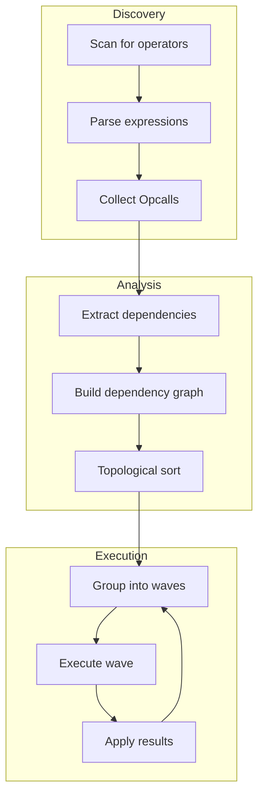
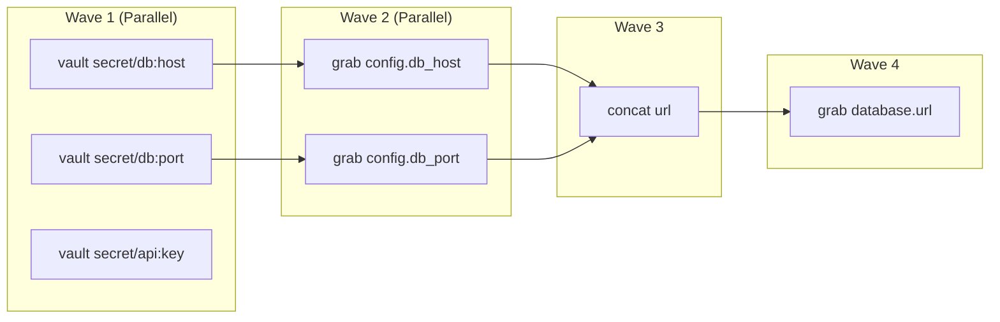

# Operator Evaluation

Graft evaluates operators using dependency analysis and wave-based execution. This design enables safe parallelization while maintaining correct evaluation order.

## Overview



## Dependency Analysis

### What Are Dependencies?

An operator depends on another operator if it references a path that the other operator will modify. For example:

```yaml
base_url: (( concat "https://" host ))     # Depends on: host
host: (( grab config.hostname ))           # Depends on: config.hostname
config:
  hostname: (( vault "secret/app:host" ))  # No internal dependencies
```

In this case:

- `config.hostname` has no internal dependencies (can evaluate first)

- `host` depends on `config.hostname`

- `base_url` depends on `host`

### Dependency Extraction

Each operator type knows how to report its dependencies, via the `Operator` interface's `Dependencies` method (`pkg/graft/interfaces.go`):

```go
type Operator interface {
    Setup() error
    Run(ev *Evaluator, args []*Expr) (*Response, error)
    Dependencies(ev *Evaluator, args []*Expr, locs []*tree.Cursor, auto []*tree.Cursor) []*tree.Cursor
    Phase() OperatorPhase
}
```

`locs` is every operator call location found so far in the current phase; `auto` is a starting set of dependency cursors `Opcall.Dependencies` has already collected from the call's own argument expressions (each `*Expr`'s own `Dependencies` walks references, nested operator calls, and binary/unary operands recursively) before handing off to the operator's own method.

#### Example: grab Operator

```go
func (GrabOperator) Dependencies(ev *Evaluator, args []*Expr, locs []*tree.Cursor, auto []*tree.Cursor) []*tree.Cursor {
    deps := make([]*tree.Cursor, 0, len(auto))
    deps = append(deps, auto...)
    for _, arg := range args {
        if arg != nil {
            deps = append(deps, arg.Dependencies(ev, locs)...)
        }
    }
    return deps
}
```

`grab`'s own contribution is nothing beyond `auto` and each argument's own `Dependencies` - the reference itself, resolved to a cursor, is what `Expr.Dependencies` already added to `auto` for a plain `(( grab some.path ))`.

### Dependency Graph Construction

The dependency machinery genuinely exists, but not as a document AST: `DependencyGraph` is a read-only snapshot built from the exact tree walk and edge computation the sequential evaluator's own `DataFlow` uses internally (`Evaluator.computeDataFlowGraph`), not a second, independently maintained graph implementation. Build one with `(*DefaultEngine).BuildDependencyGraph` (a method, not a free function, because operator registration is engine-local - `WithCustomOperator` - so the same document can report a different operator set depending on which engine built the graph):

```go
type OperatorRef struct {
    Path     string        // canonical cursor path, e.g. "jobs.0.name"
    Operator string        // operator name as written, e.g. "grab", "vault"
    Args     []*graft.Expr // parsed argument expressions
    Phase    graft.OperatorPhase
}

type DependencyGraph struct { /* unexported */ }

func (e *graft.DefaultEngine) BuildDependencyGraph(doc graft.Document, phase graft.OperatorPhase) (*DependencyGraph, error)

func (g *DependencyGraph) Nodes() []OperatorRef
func (g *DependencyGraph) Dependencies(path string) []string // sorted paths that must run first
func (g *DependencyGraph) Dependents(path string) []string   // sorted paths that must run after
func (g *DependencyGraph) DetectCycles() [][]string
func (g *DependencyGraph) TopologicalSort() ([]OperatorRef, error)
func (g *DependencyGraph) ToDOT() string
```

A `DependencyGraph` reflects `doc`'s operator calls at the moment it was built. It does not run any operator and does not update itself if `doc` changes afterward - call `BuildDependencyGraph` again for a fresh snapshot.

### Cycle Detection

`DetectCycles` walks the graph's dependency edges and returns every elementary cycle found, each as an ordered slice of canonical paths. `TopologicalSort` returns `ErrDependencyCycle` (wrapping the detected cycle detail) instead of a flattened order when the graph is cyclic - the same class of failure `Evaluator.DataFlow`'s `kahnSort` reports as `"cycle detected in operator data-flow graph"`, surfaced from the public API as a typed error rather than a hang or a panic.

## Wave-Based Execution

### Wave Definition

A wave is a set of operator calls with no dependency relationship to each other and every dependency already satisfied by an earlier wave - the unit the live parallel scheduler dispatches concurrently.

```go
type EvalWave struct {
    Operators []OperatorRef
}
```

### Wave Planning

```go
func BuildEvalPlan(g *DependencyGraph) []EvalWave
```

`BuildEvalPlan` does not reimplement wave computation: it feeds `g`'s edges into `internal/parallel.Scheduler`, the exact scheduler type `runOpsWithScheduler` builds from live operator calls for `RunPhaseParallel` (see [Parallel Execution](#parallel-execution) below). Two operator calls land in the same wave here under precisely the condition the live parallel path would place them in the same wave. Each wave's `Operators` are sorted by `Path` for a reproducible result across calls, matching the tie-break `runOpsWithScheduler` applies when it later applies that wave's results to the tree.

A cyclic graph makes `BuildEvalPlan` return `nil` rather than panic or hang; use `DetectCycles` or `TopologicalSort` for cycle detail.

### Evaluating a plan in parallel

```go
func (e *graft.DefaultEngine) EvaluateParallel(ctx context.Context, doc graft.Document, waves []EvalWave) (graft.Document, error)
```

`EvaluateParallel` evaluates `doc` using the engine's real parallel execution path (`Evaluator.RunPhaseParallel`) forced on for every phase, rather than only when the engine happens to be configured for it. It requires a `WorkerPool` (`WithParallel(true)` or `WithWorkerPool`) and returns `ErrNoWorkerPool` if none is configured - `RunPhaseParallel` would otherwise silently fall back to sequential execution, which is exactly the "documented as parallel, secretly sequential" gap this API exists to avoid repeating.

`waves` documents the caller's expected plan - typically `BuildDependencyGraph(doc, phase)` piped through `BuildEvalPlan` - and is validated against `doc`'s live dependency graph before anything runs: if it orders any operator call at or before a dependency the live path requires to run first, `EvaluateParallel` returns `ErrInvalidEvalPlan` without evaluating `doc`. Validation checks every phase, regardless of what `waves`' own `OperatorRef.Phase` fields say - a hand-built plan that leaves `Phase` unset is checked exactly as strictly as one that sets it. `waves`' own wave grouping does not drive execution - `RunPhaseParallel` computes and schedules its own waves internally - so `EvaluateParallel` stays a verified, read-only projection onto the one live execution path rather than a second, independently maintained one. A nil or empty `waves` skips validation.

### Example Wave Plan

```yaml
# Input document
config:
  db_host: (( vault "secret/db:host" ))           # Wave 1
  db_port: (( vault "secret/db:port" ))           # Wave 1
  api_key: (( vault "secret/api:key" ))           # Wave 1

database:
  host: (( grab config.db_host ))                 # Wave 2
  port: (( grab config.db_port ))                 # Wave 2
  url: (( concat "postgres://" host ":" port ))   # Wave 3

output:
  connection: (( grab database.url ))             # Wave 4
```

Visual representation:



## Parallel Execution

### Wave Execution

`runOpsWithScheduler` (`pkg/graft/evaluator_parallel.go`) dispatches each wave in two phases, not one: compute each operator's result concurrently (a goroutine per operator, submitted to the engine's worker pool), then apply every result to the document tree serially, in a fixed order sorted by path rather than completion order. Splitting it this way means the concurrent phase — which is where any Vault/AWS/NATS network call happens — never has to synchronize on anything: no goroutine writes to the document tree until every goroutine in the wave has finished computing.

```go
// pkg/graft/evaluator_parallel.go (abridged)
results := make([]computeResult, len(concurrent))
var wg sync.WaitGroup
wg.Add(len(concurrent))
for i, task := range concurrent {
    idx, op := i, opByID[task.ID]
    pool.SubmitContext(ctx, func(context.Context) error {
        defer wg.Done()
        resp, oldValue, err := ev.computeOp(op) // reads the tree, may call a backend; never writes
        results[idx] = computeResult{op: op, resp: resp, oldValue: oldValue, err: err}
        return err
    })
}
wg.Wait()

for _, r := range results { // fixed order (sorted by path), not completion order
    treeMu.Lock()
    ev.applyResponse(r.op, r.resp, r.oldValue)
    treeMu.Unlock()
}
```

A handful of operators — currently only `static_ips`, which claims from a shared address pool — implement an `OrderSensitive` interface and are excluded from the concurrent phase, running one at a time instead, since their outcome depends on relative execution order in a way no dependency edge captures. Errors from every operator in the wave are collected and reported together, not just the first one encountered.

### Thread Safety

Applying a result is a plain Go map/slice write (`op.where.Set`-equivalent logic inside `applyResponse`), and Go's map type is not safe for concurrent access even across disjoint keys of the same map — so every apply, across the whole wave, goes through one mutex. The concurrent compute phase above needs no locking of its own because nothing writes to the tree while it runs; the only other per-call state an operator's `Run` method can observe (`Evaluator.Here`/`Evaluator.Target`, i.e. "which operator call is this") is a shallow copy made fresh for each `computeOp` call rather than shared mutable state on one `*Evaluator`.

See [Parallel Execution Model](parallelism.md) for the full design, including backend request dedup and the determinism guarantee this all rests on.

## Operator Interface

### Complete Interface

```go
type Operator interface {
    // Name returns the operator name (e.g., "grab", "vault")
    Name() string

    // Setup performs one-time initialization
    Setup() error

    // Phase returns when this operator should run
    Phase() OperatorPhase

    // Run executes the operator
    Run(ev *Evaluator, args []*Expr) (*Response, error)

    // Dependencies returns paths this operator reads
    Dependencies(args []*Expr, ctx *EvalContext) []*tree.Cursor
}

type OperatorPhase int

const (
    // MergePhase - runs during merge (e.g., array operators)
    MergePhase OperatorPhase = iota

    // EvalPhase - runs during evaluation (most operators)
    EvalPhase

    // PostPhase - runs during post-processing
    PostPhase
)
```

### Response Types

```go
type Response struct {
    Type  ResponseType
    Value interface{}
}

type ResponseType int

const (
    // Replace - replace the operator node with the value
    Replace ResponseType = iota

    // Delete - remove the key from the parent
    Delete

    // Defer - re-evaluate in a later wave
    Defer

    // Error - operator failed
    Error
)
```

## Evaluator Context

### Context Structure

```go
type EvalContext struct {
    // Document state
    Document *Document
    Path     string

    // Engine reference for backends
    Engine *Engine

    // Recursion tracking
    RecursionDepth int
    MaxRecursion   int
    VisitedPaths   map[string]bool

    // Metrics
    Metrics *EvalMetrics
}
```

### Recursive Evaluation

Some operators need to evaluate nested expressions:

```go
func (e *Evaluator) EvaluateExpression(expr Expression, ctx *EvalContext) (interface{}, error) {
    // Check recursion depth
    if ctx.RecursionDepth > ctx.MaxRecursion {
        return nil, ErrMaxRecursionExceeded
    }

    ctx.RecursionDepth++
    defer func() { ctx.RecursionDepth-- }()

    switch node := expr.(type) {
    case *Literal:
        return node.Value, nil

    case *Reference:
        return e.resolveReference(node, ctx)

    case *OperatorCall:
        return e.executeOperator(node, ctx)

    case *BinaryOp:
        return e.evaluateBinary(node, ctx)

    case *TernaryOp:
        return e.evaluateTernary(node, ctx)

    default:
        return nil, fmt.Errorf("unknown expression type: %T", expr)
    }
}
```

## Special Cases

### Deferred Evaluation

Some operators cannot evaluate immediately and must defer:

```go
func (o *GrabOperator) Run(ev *Evaluator, args []*Expr) (*Response, error) {
    path := args[0].(*Reference)
    value, err := ev.ResolveReference(path)

    if err == ErrUnresolvedReference {
        // Target not yet evaluated - defer to later wave
        return &Response{Type: Defer}, nil
    }

    if err != nil {
        return nil, err
    }

    return &Response{Type: Replace, Value: value}, nil
}
```

### Fallback Values

The `||` operator provides fallback values:

```go
func (o *OrElseOperator) Run(ev *Evaluator, args []*Expr) (*Response, error) {
    // Try left side first
    leftResult, leftErr := ev.EvaluateExpression(args[0])

    if leftErr == nil && !isEmpty(leftResult) {
        return &Response{Type: Replace, Value: leftResult}, nil
    }

    // Fall back to right side
    rightResult, rightErr := ev.EvaluateExpression(args[1])

    if rightErr != nil {
        // Both sides failed - return original error
        if leftErr != nil {
            return nil, leftErr
        }
        return nil, rightErr
    }

    return &Response{Type: Replace, Value: rightResult}, nil
}
```

### Conditional Evaluation

Ternary expressions only evaluate the taken branch:

```go
func (e *Evaluator) evaluateTernary(node *TernaryOp, ctx *EvalContext) (interface{}, error) {
    // Evaluate condition
    condition, err := e.EvaluateExpression(node.Condition, ctx)
    if err != nil {
        return nil, err
    }

    // Only evaluate the branch we need
    if isTruthy(condition) {
        return e.EvaluateExpression(node.TrueExpr, ctx)
    }
    return e.EvaluateExpression(node.FalseExpr, ctx)
}
```

## Error Handling

### Evaluation Errors

```go
type EvaluationError struct {
    Operator   string
    Path       string
    Arguments  []interface{}
    Position   Position
    Cause      error
    Hint       string
}

func (e *EvaluationError) Error() string {
    return fmt.Sprintf("evaluation failed at %s: %s %v: %v",
        e.Path, e.Operator, e.Arguments, e.Cause)
}
```

### Error Context

```go
func wrapEvalError(op OperatorRef, err error) error {
    return &EvaluationError{
        Operator:  op.Node.Operator.Name(),
        Path:      op.Path,
        Arguments: extractArgs(op.Node.Args),
        Position:  op.Node.Pos.Start,
        Cause:     err,
        Hint:      generateHint(op, err),
    }
}
```

## Performance Considerations

### Caching Backend Lookups

There is no general result cache keyed by document path — evaluating the same `(( grab ... ))` twice runs it twice. What is cached is each external backend's own response, per target and path, inside that backend's package (`internal/backends/vault`, `internal/backends/aws`, `internal/backends/nats`): two operators resolving the same Vault path, AWS parameter, AWS secret, or NATS key against the same target share one backend response instead of each fetching it independently.

### Deduplicating Concurrent External Calls

A wave's concurrent compute phase (see [Parallel Execution](#parallel-execution) above) can contain several operators resolving to the *identical* backend request — same target, same path. Each backend's cache coalesces concurrent requests for that exact key through a `singleflight`-based group (`internal/backends/reqdedup`): the first caller triggers the real backend call, and every other concurrent caller for that key waits on and shares its result rather than firing its own. Requests for *different* targets or paths are never grouped together — each is its own backend call, run concurrently with the rest of the wave, not aggregated into fewer calls.

See [Parallel Execution Model](parallelism.md#level-3-backend-request-dedup) for the full design.

### Metrics Collection

```go
type EvalMetrics struct {
    WaveCount      int
    OperatorCounts map[string]int
    WaveDurations  []time.Duration
    TotalDuration  time.Duration

    mu sync.Mutex
}

func (m *EvalMetrics) RecordWave(waveNum int, ops []OperatorRef, duration time.Duration) {
    m.mu.Lock()
    defer m.mu.Unlock()

    m.WaveCount = waveNum + 1
    m.WaveDurations = append(m.WaveDurations, duration)

    for _, op := range ops {
        m.OperatorCounts[op.Node.Operator.Name()]++
    }
}
```
