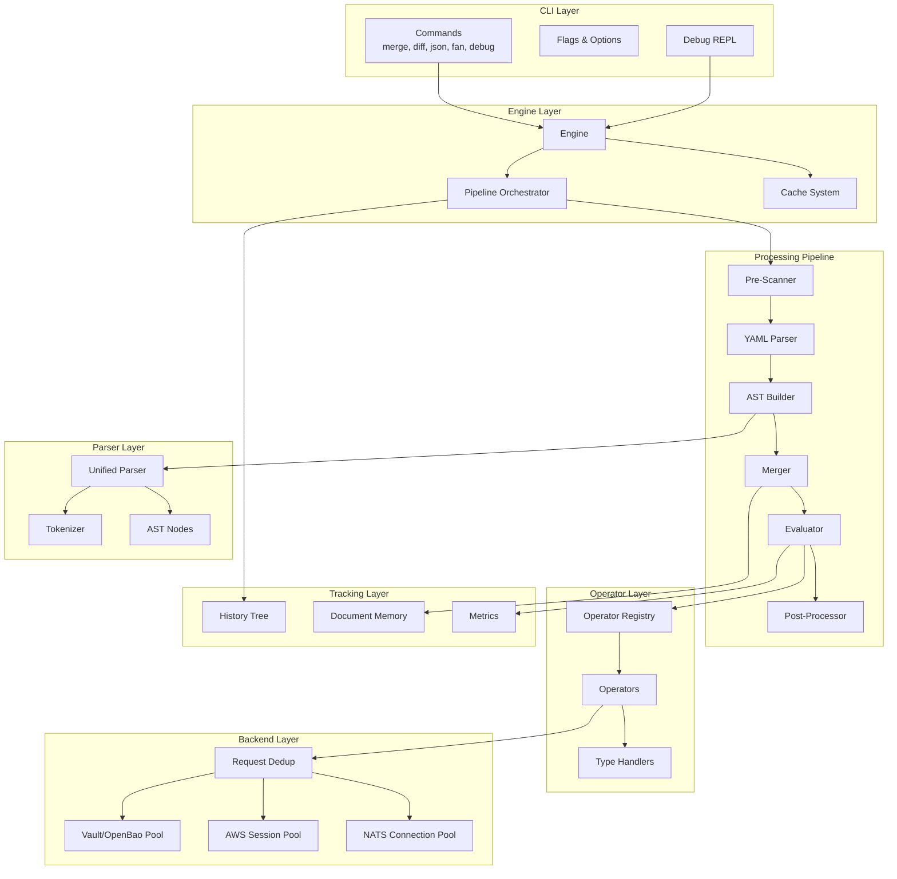
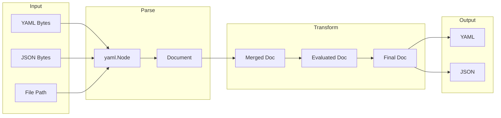

# Graft Architecture Overview

Graft is a YAML/JSON templating engine designed as an embeddable Go library with a CLI interface. The architecture follows a layered pipeline model with clear separation of concerns, supporting parallel processing at multiple levels.

## Design Principles

- **Library-First**

  All functionality is accessible via the Go API before the CLI. The `pkg/graft` package is the primary interface.

- **Pipeline Architecture**

  Clear stages with well-defined inputs and outputs enable composability and testability.

- **Parallel by Default**

  Wave-based evaluation, pooled backend connections, and deduplication of
  concurrent identical backend requests reduce wall-clock time without
  changing output — see [Parallel Execution Model](parallelism.md).

- **Fail-Fast with Context**

  Rich error messages include source positions, hints, and suggestions for resolution.

- **Extensible**

  Custom operators, backends, and post-processors can be registered without modifying core code.

## System Architecture



## Component Inventory

### Engine Layer

| Component | Responsibility |
|-----------|----------------|
| `Engine` | Main entry point; manages configuration, operators, and state |
| `EngineConfig` | Configuration for backends, parallelism, and caching |
| `MergeBuilder` | Fluent API for merge operations |
| `Cache` | LRU cache for external lookups |

### Pipeline Layer

| Component | Responsibility |
|-----------|----------------|
| `PreScanner` | Extract operator locations before YAML parsing |
| `Engine.ParseYAML` / `ParseYAML11CompatAware` | Parse YAML bytes into generic Go values (goccy/go-yaml, with YAML 1.1 boolean compat) |
| `Merger` | Deep merge documents with array operators |
| `Evaluator` | Execute operators in dependency order |
| `PostProcessor` | Prune, cherry-pick, sort, and validate |

There is no separate AST-building stage: a merged document stays a plain
`map[string]interface{}`/`[]interface{}` tree throughout, not a typed AST.
Only individual `(( ... ))` operator-call strings get parsed into an
expression tree (see Parser Layer below), not the document as a whole.

### Parser Layer

| Component | Responsibility |
|-----------|----------------|
| `Parser` | Recursive descent parser for `(( ... ))` expressions (`pkg/graft/parser.go`) |
| `Tokenizer` | Lexical analysis with position tracking |
| `AST Nodes` | Expression tree with visitor pattern |
| `OperatorRegistry` | Metadata for precedence, arguments, and phase |

### Operator Layer

| Component | Responsibility |
|-----------|----------------|
| `UnifiedOperatorRegistry` | Combined metadata and implementations |
| `Operator` interface | Contract: Setup, Run, Dependencies, Phase |
| `TypeRegistry` | Polymorphic type operations (`pkg/graft/operators/type_handlers.go`) |

### Backend Layer

| Component | Responsibility |
|-----------|----------------|
| `vault.ClientPool` | Vault client connection pooling per target |
| `aws.ClientPool` | AWS session/client pooling per target |
| `nats.ClientPool`, `nats.ConnectionPool` | NATS connection pooling per target, and the underlying pooled-connection tracking it uses |
| `reqdedup.Group` | Coalesces concurrent identical backend requests into one call (dedup, not batching — see [Parallel Execution Model](parallelism.md#level-3-backend-request-dedup)) |

### Tracking Layer

| Component | Responsibility |
|-----------|----------------|
| `DocumentMemory` | Change history per path |
| `History` | Public API for history queries |
| `Metrics` | Performance counters |

## Data Flow Overview



## Extension Points

Graft provides several extension points for customization:

### Custom Operators

```go
engine.RegisterOperator("myop", &MyOperator{})

type MyOperator struct{}

func (o *MyOperator) Setup() error { return nil }
func (o *MyOperator) Phase() OperatorPhase { return EvalPhase }
func (o *MyOperator) Run(ev *Evaluator, args []*Expr) (*Response, error) {
    return &Response{Type: Replace, Value: result}, nil
}
func (o *MyOperator) Dependencies(...) []*tree.Cursor {
    return auto
}
```

### Custom Backends

```go
engine := graft.NewEngine(
    graft.WithVaultClient(&MyVaultClient{}),
    graft.WithAWSConfig(&graft.AWSConfig{
        Endpoint: "http://localhost:4566", // LocalStack
    }),
)
```

### Custom Post-Processors

```go
type PostProcessor interface {
    Name() string
    Phase() PostProcessPhase
    Process(ctx context.Context, doc *Document, meta *Metadata) error
}

engine := graft.NewEngine(
    graft.WithPostProcessors(
        &SchemaValidator{schema: mySchema},
        &SecretDetector{patterns: patterns},
    ),
)
```

## Error Handling

Graft provides a rich error hierarchy with contextual information:

```mermaid
classDiagram
    class GraftError {
        +Code ErrorCode
        +Message string
        +Position Position
        +Path string
        +Cause error
    }

    class ParseError {
        +Source string
        +Line int
        +Column int
        +Hint string
    }

    class EvaluationError {
        +Operator string
        +Arguments []interface{}
    }

    class MergeError {
        +SourceA string
        +SourceB string
    }

    class BackendError {
        +Backend string
        +Target string
    }

    GraftError <|-- ParseError
    GraftError <|-- EvaluationError
    GraftError <|-- MergeError
    GraftError <|-- BackendError
```

### Example Error Output

```
Error at config.yml:15:34
  database:
    password: (( vault "secret/db:pass" || ))
                                         ^^
Expected: expression after '||' operator
Found: '))'

Hint: The '||' operator requires a default value.
Example: (( vault "path:key" || "default" ))
```

## Performance Expectations

No fixed speedup numbers are published here — they depend heavily on backend network latency, document shape, and host CPU count, and a fabricated table would be actively misleading. Parallel evaluation helps most for documents with several independent external-backend lookups (network latency dominates, and independent lookups overlap) or many independent operators of any kind; it does not help a single long dependency chain, since each step's wave then contains exactly one operator. See [Parallel Execution Model](parallelism.md#when-parallel-evaluation-helps) for the full breakdown, or measure `time graft merge ...` under `GRAFT_PARALLEL_ENABLED=true`/`=false` against your own workload.

## Related Documentation

- [Processing Pipeline](pipeline.md)

  Detailed walkthrough of the six-stage pipeline

- [Parser Design](parser.md)

  Unified recursive descent parser, tokenizer, and AST

- [Operator Evaluation](evaluation.md)

  Dependency analysis and wave-based execution

- [Parallel Execution Model](parallelism.md)

  File processing, evaluation waves, and backend request deduplication

- [Backend Architecture](backends.md)

  Connection pooling, request deduplication, and caching
