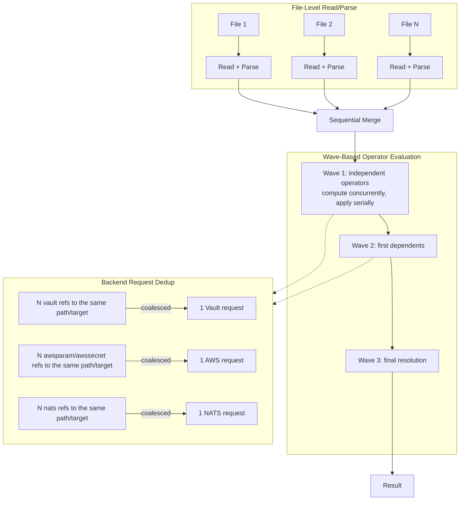

# Parallel Execution Model

Graft parallelizes two independent stages of a merge — reading/parsing input files, and evaluating independent operators — and deduplicates concurrent identical backend requests within a wave. This page describes what actually runs concurrently, what stays serialized and why, and the determinism guarantee that makes turning parallelism on or off a pure speed change, never an output change.

## Levels of Parallelism



## Level 1: File Read/Parse

`buildEngineAndDocs` (`cmd/graft/main.go`) reads and parses every input file (or stdin) concurrently, one goroutine per file, before the sequential merge stage begins:

```go
results := make([]fileParseResult, len(files))
var wg sync.WaitGroup
for i := range files {
    wg.Add(1)
    idx := i
    fileCopy := files[idx]
    go func() {
        defer wg.Done()
        results[idx] = parseOneYamlFile(engine, fileCopy, options)
    }()
}
wg.Wait()
```

Reading bytes and parsing them into a `graft.Document` has no side effects and does not depend on any other file, so this is safe with no locking. `engine.ParseYAML` does not write to engine state, so every goroutine shares one `*DefaultEngine` safely.

Results are collected back into `results[idx]`, indexed by each file's original position, not by completion order — so the *code path taken* afterward (which file's error is reported first, the order documents are merged in) is identical to a purely sequential read loop, even though the reads themselves overlap in time. If two files fail to parse, the earliest-indexed one's error is what's reported, exactly as a sequential loop that stopped at the first failure would report.

This is unconditional — there is no flag to disable it — since it can only ever change how long file I/O takes, never what any file parses to.

## Level 2: Wave-Based Operator Evaluation

The evaluator computes a dependency graph over every `(( ... ))` operator call in the merged document (`Evaluator.DataFlow`) and groups operators with no unmet dependency into waves. Waves run in order; within a wave, `runOpsWithScheduler` (`pkg/graft/evaluator_parallel.go`) splits dispatch into two phases:

1. **Compute, concurrently.** For every operator in the wave except the order-sensitive ones (below), `computeOp` — which runs the operator itself, including any Vault/AWS/NATS network call — is submitted to the engine's worker pool and runs on its own goroutine, overlapping with the rest of the wave's compute phase. `computeOp` only reads the document tree (to resolve references like `(( grab other.path ))`) and never writes to it, so nothing in this phase requires synchronizing tree access; correctness here rests on `computeOp` capturing a per-call, goroutine-local copy of the evaluator's ambient `Here`/`Target` state before calling the operator's `Run` method — the tree, dependency map, and engine reference are shared (they're reference types set once before evaluation begins), only the ambient "which operator call is this" state needs to be goroutine-local.

2. **Apply, serially.** Once every goroutine in the compute phase has returned, each result is applied to the document tree in a fixed order — sorted by the operator's path, not by which goroutine finished first — under a single mutex. Applying a result is a plain Go map/slice write, which is not safe for concurrent access even across disjoint keys of the same map, so this step is never parallelized.

```go
// pkg/graft/evaluator_parallel.go (abridged)
results := make([]computeResult, len(concurrent))
var wg sync.WaitGroup
wg.Add(len(concurrent))
for i, task := range concurrent {
    idx, op := i, opByID[task.ID]
    pool.SubmitContext(ctx, func(context.Context) error {
        defer wg.Done()
        resp, oldValue, err := ev.computeOp(op)
        results[idx] = computeResult{op: op, resp: resp, oldValue: oldValue, err: err}
        return err
    })
}
wg.Wait()

for _, r := range results { // fixed order, not completion order
    treeMu.Lock()
    ev.applyResponse(r.op, r.resp, r.oldValue)
    treeMu.Unlock()
}
```

### Order-sensitive operators

A same-wave dependency-free pair of operators can still share state a `DataFlow` edge does not capture — `static_ips` is the one example in graft today, since two unrelated `(( static_ips ... ))` calls claim from the same engine-wide used-IP pool, and which one wins a duplicate-claim error depends on which ran first. An operator opts out of concurrent dispatch by implementing:

```go
type OrderSensitive interface {
    OrderSensitive() bool
}
```

`static_ips` returns `true`. The scheduler partitions each wave into an order-sensitive group (dispatched one at a time, compute-and-apply fused under the tree mutex, exactly as it ran before wave-level concurrency existed) and a concurrent group (the two-phase path above); the order-sensitive group always runs to completion first, so it never overlaps with the concurrent group's tree reads either.

## Level 3: Backend Request Dedup

Within a wave's compute phase, multiple operators can resolve to the *same* backend request — the same secret path in the same Vault target, the same NATS KV key in the same target, and so on. Each backend package caches results keyed by `target + path` (never colliding two different targets' identical paths) and, on a cache miss, coalesces concurrent identical requests through a `singleflight`-based group (`internal/backends/reqdedup`) so the first caller triggers the real backend call and every other concurrent caller for that exact key waits on and shares its result, rather than each independently missing the cache and firing its own request:

```go
// internal/backends/vault/cache.go (abridged)
func (c *secretCache) GetOrFetch(path string, fetch func() (map[string]interface{}, error)) (map[string]interface{}, error) {
    if v, ok := c.Get(path); ok {
        return v, nil
    }
    v, err := c.group.Do(path, fetch) // coalesces concurrent identical-key callers
    if err != nil {
        return nil, err
    }
    c.Set(path, v)
    return v, nil
}
```

The same pattern backs `awsparam`/`awssecret` (`internal/backends/aws/cache.go`) and `nats` (`internal/backends/nats/cached_fetch.go`).

This is deduplication of identical requests, not batching of distinct ones into fewer round trips. A document with ten different `(( vault "secret/db:X" ))`/`(( vault "secret/api:Y" ))` calls still makes ten Vault requests — dedup only collapses references to the *same* path down to one. AWS's SSM `GetParameters` (batch reads of up to ten distinct parameter names in one call) and Secrets Manager's `BatchGetSecretValue` are real AWS APIs that could reduce that further for the AWS backends specifically, but graft does not use them today; each `awsparam`/`awssecret` call still issues its own `GetParameter`/`GetSecretValue` request. Vault's KV API and the NATS KV/Object APIs graft uses have no equivalent multi-key batch read to fall back on.

## Thread Safety

| Component | Synchronization | Notes |
|---|---|---|
| Document tree (`ev.Tree`) | Single mutex around every apply | Read concurrently during a wave's compute phase, which is safe because nothing writes to it then; every write goes through the apply mutex — see Level 2 |
| Evaluator's `Here`/`Target` | Per-call shallow copy, not shared state | See Level 2's compute phase |
| `vault.ClientPool`, `aws.ClientPool`, `nats.ClientPool` | `sync.RWMutex` per pool | Guards the target→client/session/connection maps. Once a target's entry exists every caller reuses it. Concurrent *first* callers for a not-yet-cached target are not coalesced, so several may build a client before one wins the store: `vault.ClientPool` re-checks under the write lock and discards the losers' clients, `aws.ClientPool` and `nats.ClientPool` do not |
| `vault.SecretCache`, AWS secret/param caches, `nats.Cache` | `sync.RWMutex` plus a `reqdedup.Group` per cache | See Level 3 |
| Engine's used-IP pool, prune list, sort list, Vault-reference tracking | Dedicated `sync.RWMutex` per concern on `DefaultEngine` | Pre-existing, unrelated to the parallel scheduler itself |

## Determinism

Turning parallel evaluation on, or changing the worker count, never changes what a merge outputs — only how long it takes. This holds because:

- Wave contents and wave order come from the dependency graph alone, independent of goroutine scheduling.

- Within a wave, results are applied in a fixed order (sorted by path), not completion order.

- Order-sensitive operators (`static_ips`) never run concurrently with each other.

- Backend request dedup only ever changes *how many* requests are made for an identical key, never *what* any request returns.

`scripts/check-parallel-determinism.sh` enforces this empirically: it runs representative multi-doc, operator-heavy fixtures (array-merge markers, the `sort` operator, a `grab`/`calc` dependency chain) through a built `graft` binary 40 times each and diffs every run's stdout against the first, failing on any byte divergence. `pkg/graft/parallel_determinism_test.go` and `pkg/graft/evaluator_parallel_test.go` cover the same property (plus the order-sensitive partitioning and a timing-based proof that independent operators do overlap) at the Go test level, including under `-race`.

## Configuration

Parallel evaluation is controlled entirely by the `parallel.*` config section and its `GRAFT_PARALLEL_*` environment variables — there is no separate batching or dedup configuration, since request dedup is unconditional. See [Configuration Reference](../reference/config.md) for the full field table; in short:

```bash
# Default: parallel evaluation on, worker count derived from runtime.NumCPU().
graft merge base.yml overlay.yml

# Explicit worker ceiling.
GRAFT_PARALLEL_MAX_WORKERS=4 graft merge base.yml overlay.yml

# Sequential mode, for debugging or reproducing spruce's exact evaluation order.
GRAFT_PARALLEL_ENABLED=false graft merge base.yml overlay.yml
```

## When Parallel Evaluation Helps

- **Documents with several independent external-backend lookups** (multiple distinct Vault/AWS/NATS targets or paths) benefit the most: network latency is the dominant cost, and Level 2's compute phase overlaps it across the whole wave.

- **Documents with many independent, dependency-free operators of any kind** (a wide, shallow dependency graph) benefit from concurrent compute even without any backend I/O, since Go's own scheduling overhead for launching a modest number of goroutines is small next to typical operator work.

- **A single long dependency chain** (`grab a` → `grab b` → `grab c` → ...) does not benefit: each step's wave contains exactly one operator, so there is nothing to run concurrently with it. This is inherent to the chain, not a scheduler limitation.

- **Many input files, each small** benefits from Level 1's concurrent read/parse regardless of what Level 2 does afterward.

No benchmark numbers are published here: they would depend heavily on backend network latency, document shape, and host CPU count, and a fabricated table would be actively misleading. Measure your own workload with `time graft merge ...` under `GRAFT_PARALLEL_ENABLED=true` and `=false` if you need a number for your specific case.

## See Also

- [Processing Pipeline](pipeline.md) — where evaluation fits among the other four pipeline stages

- [Extras Beyond Spruce](../features/extras.md#parallel-evaluation) — the CLI-facing summary of this page

- [Configuration Reference](../reference/config.md) — the full `parallel.*` field and environment-variable table
