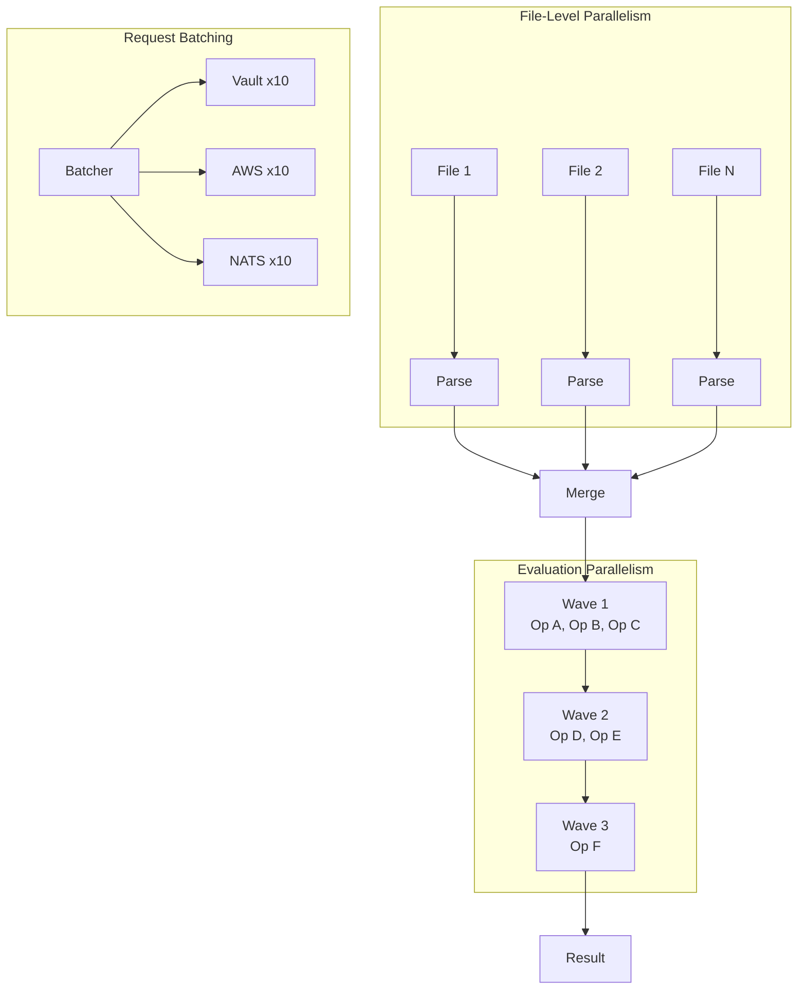
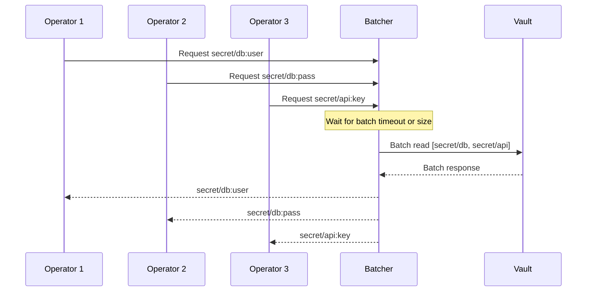
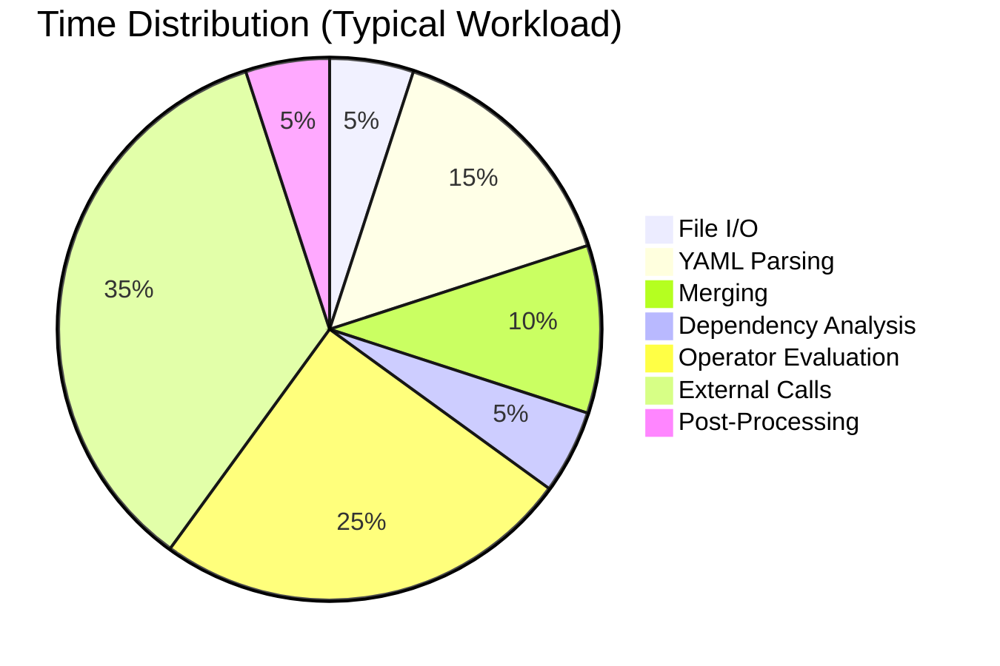

# Parallel Execution Model

Graft implements parallelism at multiple levels to maximize throughput while maintaining correctness. This document describes the parallel execution model, its configuration, and thread safety guarantees.

## Parallelism Levels



## Level 1: File Processing

Multiple input files are processed in parallel through the first three pipeline stages (pre-scan, YAML parse, AST build).

### Implementation

```go
func ProcessFiles(files []string, config PipelineConfig) ([]*Document, error) {
    docs := make([]*Document, len(files))
    errors := make([]error, len(files))

    sem := make(chan struct{}, config.FileParallelism)
    var wg sync.WaitGroup

    for i, file := range files {
        wg.Add(1)
        sem <- struct{}{} // Acquire semaphore

        go func(idx int, path string) {
            defer wg.Done()
            defer func() { <-sem }() // Release semaphore

            doc, err := processFile(path)
            docs[idx] = doc
            errors[idx] = err
        }(i, file)
    }

    wg.Wait()

    // Check for errors
    for i, err := range errors {
        if err != nil {
            return nil, fmt.Errorf("file %s: %w", files[i], err)
        }
    }

    return docs, nil
}
```

### Design Decisions

- File order is preserved despite parallel processing

- Errors from one file do not stop processing of others

- Memory is bounded by limiting concurrent file processing

### When to Use

File-level parallelism is most effective when:

- Processing many files (5+)

- Files are of similar size

- I/O is not the bottleneck (files cached or on SSD)

## Level 2: Wave Evaluation

Within the evaluation stage, operators are grouped into waves based on dependency analysis. All operators in a wave execute in parallel.

### Wave Execution

```go
func EvaluateWaves(doc *Document, waves []EvalWave, config PipelineConfig) error {
    for waveNum, wave := range waves {
        startTime := time.Now()

        if err := executeWave(doc, wave, config); err != nil {
            return fmt.Errorf("wave %d: %w", waveNum, err)
        }

        metrics.RecordWaveDuration(waveNum, time.Since(startTime))
    }

    return nil
}

func executeWave(doc *Document, wave EvalWave, config PipelineConfig) error {
    // Limit concurrent operators
    sem := make(chan struct{}, config.EvalParallelism)
    var wg sync.WaitGroup
    var firstErr error
    var errOnce sync.Once

    for _, op := range wave.Operators {
        wg.Add(1)
        sem <- struct{}{}

        go func(op OperatorRef) {
            defer wg.Done()
            defer func() { <-sem }()

            result, err := evaluateOperator(doc, op)
            if err != nil {
                errOnce.Do(func() {
                    firstErr = fmt.Errorf("%s: %w", op.Path, err)
                })
                return
            }

            applyResult(doc, op.Path, result)
        }(op)
    }

    wg.Wait()
    return firstErr
}
```

### Wave Size Optimization

Larger waves provide more parallelism but may increase memory pressure. The system optimizes wave sizes:

```go
func optimizeWaves(waves []EvalWave, config PipelineConfig) []EvalWave {
    var optimized []EvalWave

    for _, wave := range waves {
        if len(wave.Operators) > config.MaxWaveSize {
            // Split large waves
            for i := 0; i < len(wave.Operators); i += config.MaxWaveSize {
                end := min(i+config.MaxWaveSize, len(wave.Operators))
                optimized = append(optimized, EvalWave{
                    Operators: wave.Operators[i:end],
                })
            }
        } else {
            optimized = append(optimized, wave)
        }
    }

    return optimized
}
```

## Level 3: Request Batching

External backend calls are batched to reduce network overhead and take advantage of batch APIs.

### Batching Strategy



### Batcher Implementation

```go
type RequestBatcher struct {
    pending    map[string][]pendingRequest
    mu         sync.Mutex
    batchSize  int
    timeout    time.Duration
    timer      *time.Timer
}

type pendingRequest struct {
    path     string
    key      string
    resultCh chan interface{}
    errorCh  chan error
}

func (b *RequestBatcher) Request(target, path, key string) (interface{}, error) {
    req := pendingRequest{
        path:     path,
        key:      key,
        resultCh: make(chan interface{}, 1),
        errorCh:  make(chan error, 1),
    }

    b.mu.Lock()
    if b.pending[target] == nil {
        b.pending[target] = make([]pendingRequest, 0)
    }
    b.pending[target] = append(b.pending[target], req)

    // Start timer if first request
    if len(b.pending[target]) == 1 {
        b.timer = time.AfterFunc(b.timeout, func() {
            b.flush(target)
        })
    }

    // Flush if batch is full
    if len(b.pending[target]) >= b.batchSize {
        b.flush(target)
    }
    b.mu.Unlock()

    // Wait for result
    select {
    case result := <-req.resultCh:
        return result, nil
    case err := <-req.errorCh:
        return nil, err
    }
}

func (b *RequestBatcher) flush(target string) {
    b.mu.Lock()
    requests := b.pending[target]
    b.pending[target] = nil
    if b.timer != nil {
        b.timer.Stop()
    }
    b.mu.Unlock()

    if len(requests) == 0 {
        return
    }

    // Group by path for efficiency
    byPath := make(map[string][]pendingRequest)
    for _, req := range requests {
        byPath[req.path] = append(byPath[req.path], req)
    }

    // Execute batch request
    results, err := b.executeBatch(target, byPath)

    // Distribute results
    for _, req := range requests {
        if err != nil {
            req.errorCh <- err
        } else if result, ok := results[req.path+":"+req.key]; ok {
            req.resultCh <- result
        } else {
            req.errorCh <- fmt.Errorf("key not found: %s:%s", req.path, req.key)
        }
    }
}
```

### Batching Configuration

```go
type BatchConfig struct {
    // Maximum requests before forcing a flush
    BatchSize int

    // Maximum time to wait before flushing partial batch
    BatchTimeout time.Duration

    // Per-backend settings
    VaultBatchSize int
    AWSBatchSize   int
    NATSBatchSize  int
}

// Default configuration
var DefaultBatchConfig = BatchConfig{
    BatchSize:      20,
    BatchTimeout:   100 * time.Millisecond,
    VaultBatchSize: 10, // Vault has per-path limits
    AWSBatchSize:   10, // SSM GetParameters limit
    NATSBatchSize:  50, // NATS is very fast
}
```

## Configuration

### Pipeline Configuration

```go
type PipelineConfig struct {
    // File-level parallelism
    FileParallelism     int           // default: runtime.NumCPU()

    // Evaluation parallelism
    EvalParallelism     int           // default: 16

    // Sub-tree parallelism
    SubtreeParallelism  bool          // default: true
    SubtreeThreshold    int           // default: 100

    // External calls
    ExternalParallelism int           // default: 32
    BatchSize           int           // default: 20
    BatchTimeout        time.Duration // default: 100ms

    // Connection pools
    VaultPoolSize       int           // default: 5
    AWSPoolSize         int           // default: 5
    NATSPoolSize        int           // default: 3
}
```

### Configuration Presets

```go
// PipelineSequential - for debugging and testing
var PipelineSequential = PipelineConfig{
    FileParallelism:     1,
    EvalParallelism:     1,
    SubtreeParallelism:  false,
    ExternalParallelism: 1,
    BatchSize:           1,
}

// PipelineBalanced - default for most workloads
var PipelineBalanced = PipelineConfig{
    FileParallelism:     runtime.NumCPU(),
    EvalParallelism:     16,
    SubtreeParallelism:  true,
    SubtreeThreshold:    100,
    ExternalParallelism: 32,
    BatchSize:           20,
    BatchTimeout:        100 * time.Millisecond,
    VaultPoolSize:       5,
    AWSPoolSize:         5,
    NATSPoolSize:        3,
}

// PipelineHighThroughput - for large batch jobs
var PipelineHighThroughput = PipelineConfig{
    FileParallelism:     runtime.NumCPU() * 2,
    EvalParallelism:     64,
    SubtreeParallelism:  true,
    SubtreeThreshold:    50,
    ExternalParallelism: 128,
    BatchSize:           50,
    BatchTimeout:        200 * time.Millisecond,
    VaultPoolSize:       10,
    AWSPoolSize:         10,
    NATSPoolSize:        5,
}
```

## Thread Safety

### Shared Component Synchronization

All shared components use appropriate synchronization:

| Component | Synchronization | Notes |
|-----------|-----------------|-------|
| `Engine` | `sync.RWMutex` | Operator registry reads are concurrent |
| `Cache` | `sync.Map` or sharded locks | High read concurrency |
| `ConnectionPool` | Channel-based semaphore | Limits concurrent connections |
| `DocumentMemory` | `sync.RWMutex` per path | Fine-grained locking |
| `Metrics` | `sync.Mutex` | Writes are infrequent |

### Document Thread Safety

The document is modified only during result application, which is serialized per path:

```go
type Document struct {
    Root    interface{}
    pathMu  sync.Map // map[string]*sync.Mutex - per-path locks
    globalMu sync.RWMutex
}

func (d *Document) SetPath(path string, value interface{}) {
    // Get or create per-path lock
    lock, _ := d.pathMu.LoadOrStore(path, &sync.Mutex{})
    mu := lock.(*sync.Mutex)

    mu.Lock()
    defer mu.Unlock()

    cursor := tree.ParseCursor(path)
    cursor.Set(d.Root, value)
}

func (d *Document) GetPath(path string) (interface{}, bool) {
    d.globalMu.RLock()
    defer d.globalMu.RUnlock()

    cursor := tree.ParseCursor(path)
    return cursor.Get(d.Root)
}
```

### Connection Pool Thread Safety

```go
type ConnectionPool struct {
    connections chan *Connection
    factory     func() (*Connection, error)
    maxSize     int
}

func NewConnectionPool(maxSize int, factory func() (*Connection, error)) *ConnectionPool {
    return &ConnectionPool{
        connections: make(chan *Connection, maxSize),
        factory:     factory,
        maxSize:     maxSize,
    }
}

func (p *ConnectionPool) Get() (*Connection, error) {
    select {
    case conn := <-p.connections:
        if conn.IsHealthy() {
            return conn, nil
        }
        // Connection unhealthy, create new one
        return p.factory()
    default:
        // Pool empty, create new connection
        return p.factory()
    }
}

func (p *ConnectionPool) Put(conn *Connection) {
    select {
    case p.connections <- conn:
        // Returned to pool
    default:
        // Pool full, close connection
        conn.Close()
    }
}
```

## Memory Management

### Object Pooling

Frequently allocated objects are pooled to reduce GC pressure:

```go
var exprPool = sync.Pool{
    New: func() interface{} {
        return &Expr{}
    },
}

var cursorPool = sync.Pool{
    New: func() interface{} {
        return &tree.Cursor{}
    },
}

// Get from pool
func getExpr() *Expr {
    return exprPool.Get().(*Expr)
}

// Return to pool
func putExpr(e *Expr) {
    e.Reset()
    exprPool.Put(e)
}

// Buffer pool for serialization
var bufferPool = sync.Pool{
    New: func() interface{} {
        return bytes.NewBuffer(make([]byte, 0, 4096))
    },
}
```

### Memory Bounds

Memory usage is bounded through configuration:

```go
type ResourceLimits struct {
    // Maximum document size
    MaxDocumentSize int64 // default: 100 MB

    // Maximum concurrent goroutines
    MaxGoroutines int // default: 1000

    // Maximum pending requests per batcher
    MaxPendingRequests int // default: 10000
}

func (l *ResourceLimits) CheckGoroutines(current int) error {
    if current > l.MaxGoroutines {
        return ErrTooManyGoroutines
    }
    return nil
}
```

## Performance Characteristics

### Expected Speedups

| Scenario | Sequential | Parallel | Speedup |
|----------|------------|----------|---------|
| 10 files, 100 keys each, no external | 200ms | 50ms | 4x |
| 10 files, 50 vault calls | 5s | 300ms | 16x |
| 1 file, 10,000 keys | 800ms | 250ms | 3x |
| 20 files, 300 external calls | 30s | 1.5s | 20x |

### Bottleneck Analysis



### Optimization Guidelines

- **Many files, few operators**

  Increase FileParallelism

- **Few files, many operators**

  Increase EvalParallelism

- **Many external calls**

  Increase BatchSize, ExternalParallelism

- **Memory constrained**

  Reduce all parallelism settings

## Debugging Parallel Execution

### Sequential Mode

For debugging, run in sequential mode:

```go
engine := graft.NewEngine(
    graft.WithPipelineConfig(graft.PipelineSequential),
)
```

### Tracing

Enable execution tracing:

```go
engine := graft.NewEngine(
    graft.WithTracing(true),
)

// Trace output shows:
// - Wave boundaries
// - Operator start/end times
// - Batch flush events
// - Connection pool activity
```

### Metrics

Collect parallel execution metrics:

```go
result, err := engine.Merge(files...)
if err != nil {
    return err
}

metrics := result.Metrics()
fmt.Printf("Waves: %d\n", metrics.WaveCount)
fmt.Printf("Max wave parallelism: %d\n", metrics.MaxWaveSize)
fmt.Printf("Batched requests: %d\n", metrics.BatchedRequests)
fmt.Printf("Cache hits: %d\n", metrics.CacheHits)
```
