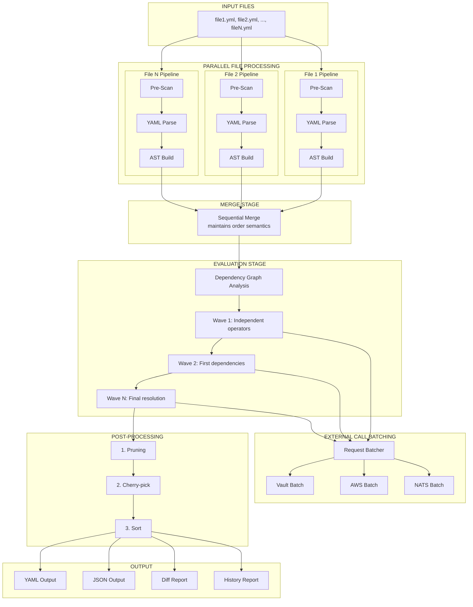
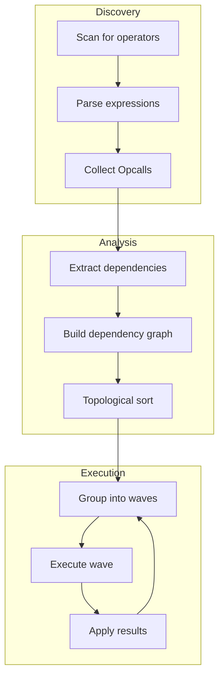

# Processing Pipeline

Graft processes YAML documents through a six-stage pipeline. Each stage has well-defined inputs and outputs, enabling composability, testability, and parallel execution where appropriate.

## Pipeline Overview



## Stage 1: Pre-Scanning

The pre-scanner extracts `(( ... ))` operator expressions and control flow constructs before YAML parsing. This enables accurate position tracking and handles operators that span multiple lines.

### Purpose

- Extract operator locations with precise line/column positions

- Identify control flow blocks (if/fi, for/done, case/esac)

- Handle multi-line operators correctly

- Distinguish operators from quoted strings

### Interface

```go
type OperatorLocation struct {
    StartLine   int
    StartColumn int
    EndLine     int
    EndColumn   int
    RawText     string           // Full "(( ... ))" text
    InnerText   string           // Just the "..." part
    Type        OperatorType     // Standard, ControlFlow
}

type OperatorType int

const (
    OperatorTypeStandard OperatorType = iota
    OperatorTypeIf
    OperatorTypeElse
    OperatorTypeElseIf
    OperatorTypeEndIf
    OperatorTypeFor
    OperatorTypeWhile
    OperatorTypeEndLoop
    OperatorTypeCase
    OperatorTypeWhen
    OperatorTypeDefault
    OperatorTypeEndCase
)

func PreScanOperators(source []byte) ([]OperatorLocation, error)
```

### Algorithm

The pre-scanner performs a single pass through the source:

1. Track line and column positions as it scans

2. Look for `((` sequences that start operators

3. Find the matching `))` handling nested parentheses

4. Classify the operator type based on the first keyword

5. Record the location for later correlation with YAML nodes

### Design Decision

Pre-scanning before YAML parsing (rather than during or after) ensures:

- Multi-line operators are captured correctly

- Nested parentheses within operators work properly

- YAML parser sees operators as opaque strings

- Position mapping is accurate for error reporting

## Stage 2: YAML Parsing

YAML parsing uses the yaml.v3 library with the Node API to preserve line and column information.

### Purpose

- Parse YAML into a node tree with position information

- Handle all YAML constructs (maps, arrays, scalars, anchors)

- Support both YAML and JSON input formats

### Interface

```go
func ParseYAMLWithPositions(source []byte) (*yaml.Node, error) {
    var node yaml.Node
    err := yaml.Unmarshal(source, &node)
    return &node, err
}
```

### Design Decision

Using yaml.v3's Node API (rather than unmarshaling directly to Go types) provides:

- Line and column information on every node

- Ability to preserve comments

- Support for YAML anchors and aliases

- Round-trip capability

## Stage 3: AST Construction

The AST builder converts YAML nodes into Graft's internal AST, parsing operator expressions encountered in string values.

### Purpose

- Convert yaml.Node tree to Graft AST

- Parse operator expressions using the unified parser

- Correlate operator locations from pre-scan with YAML positions

- Build a traversable structure for merging and evaluation

### Interface

```go
func BuildAST(yamlNode *yaml.Node, operators []OperatorLocation) (*GraftNode, error)
```

### Process

1. Walk the yaml.Node tree recursively

2. For each string value, check if it matches an operator location

3. If operator, parse the expression and create an OperatorNode

4. Otherwise, create a literal ValueNode

5. Build the complete document tree

### Data Structures

```go
type GraftNode interface {
    Position() Range
    Accept(Visitor) interface{}
}

type DocumentNode struct {
    Root GraftNode
    Meta *Metadata
}

type MapNode struct {
    Entries []MapEntry
    Pos     Range
}

type ArrayNode struct {
    Items []GraftNode
    Pos   Range
}

type OperatorNode struct {
    Expression Expression  // Parsed operator expression
    Raw        string      // Original text for error messages
    Pos        Range
}

type ValueNode struct {
    Value interface{}
    Pos   Range
}
```

## Stage 4: Merging

The merger combines multiple documents into one, respecting array operators and maintaining document order.

### Purpose

- Deep merge multiple YAML documents

- Handle array manipulation operators ((append), (prepend), (replace), etc.)

- Maintain deterministic merge order

- Track merge history for debugging

### Interface

```go
type MergeConfig struct {
    ArrayStrategy ArrayMergeStrategy
    TrackHistory  bool
}

func Merge(docs []*Document, config MergeConfig) (*Document, error)
```

### Merge Semantics

- Maps are merged recursively (later values override earlier)

- Arrays use the specified array operator or default strategy

- Scalars are replaced by later values

- Null values can prune keys (configurable)

### Array Operators

| Operator | Behavior |
|----------|----------|
| `(( append ))` | Append items to existing array |
| `(( prepend ))` | Prepend items to existing array |
| `(( replace ))` | Replace entire array |
| `(( inline ))` | Merge array items by position |
| `(( merge ))` | Merge arrays by key field |

### Sequential Execution

Merging must be sequential (not parallel) because:

- Document order affects the final result

- Array operators reference the accumulated state

- History tracking requires ordered operations

## Stage 5: Evaluation

The evaluator executes operators in dependency order using wave-based parallel execution.

### Purpose

- Resolve operator expressions to concrete values

- Execute in correct dependency order

- Parallelize independent operations

- Batch external backend calls

### Interface

```go
type EvalWave struct {
    Operators []OperatorRef
}

func BuildEvalPlan(doc *Document) []EvalWave
func EvaluateParallel(doc *Document, waves []EvalWave) error
```

### Wave-Based Execution



### Detailed Process

1. **Discovery**

   Scan the merged document for all operator nodes

2. **Dependency Analysis**

   For each operator, determine what references it needs resolved

3. **Graph Construction**

   Build a directed acyclic graph (DAG) of dependencies

4. **Topological Sort**

   Order operators so dependencies are evaluated first

5. **Wave Grouping**

   Group operators with no unmet dependencies into waves

6. **Parallel Execution**

   Execute all operators in a wave concurrently

7. **Result Application**

   Apply results to the document and update dependency tracking

8. **Iterate**

   Continue with next wave until all operators are evaluated

See [Operator Evaluation](evaluation.md) for detailed documentation.

## Stage 6: Post-Processing

Post-processing applies final transformations to the evaluated document.

### Purpose

- Prune meta-keys and temporary values

- Cherry-pick specific paths for output

- Sort keys for deterministic output

- Validate against schemas

### Interface

```go
type PostProcessor interface {
    Name() string
    Phase() PostProcessPhase
    Process(ctx context.Context, doc *Document, meta *Metadata) error
}

type PostProcessPhase int

const (
    PhasePrePrune PostProcessPhase = iota
    PhasePrune
    PhasePostPrune
    PhaseValidate
    PhaseFormat
)
```

### Built-in Post-Processors

| Processor | Phase | Purpose |
|-----------|-------|---------|
| MetaKeyPruner | PhasePrune | Remove keys starting with `_` |
| NullPruner | PhasePrune | Remove null values (optional) |
| CherryPicker | PhasePostPrune | Select specific paths for output |
| KeySorter | PhaseFormat | Sort map keys alphabetically |
| SchemaValidator | PhaseValidate | Validate against JSON Schema |

### Execution Order

Post-processors execute in phase order, and within a phase, in registration order:

```go
// Sort processors by phase
sort.Slice(processors, func(i, j int) bool {
    return processors[i].Phase() < processors[j].Phase()
})

// Execute in order
for _, p := range processors {
    if err := p.Process(ctx, doc, meta); err != nil {
        return err
    }
}
```

## Pipeline Configuration

```go
type PipelineConfig struct {
    // File-level parallelism
    FileParallelism     int           // Files processed in parallel

    // Evaluation parallelism
    EvalParallelism     int           // Operators per wave

    // Sub-tree parallelism
    SubtreeParallelism  bool          // Enable sub-tree merge
    SubtreeThreshold    int           // Min keys to trigger

    // External call optimization
    ExternalParallelism int           // Max concurrent external calls
    BatchSize           int           // Requests per batch
    BatchTimeout        time.Duration // Max wait before partial batch

    // Per-backend pool sizes
    VaultPoolSize       int
    AWSPoolSize         int
    NATSPoolSize        int
}
```

### Configuration Presets

| Preset | Use Case | Characteristics |
|--------|----------|-----------------|
| `PipelineSequential` | Debugging | Single-threaded, deterministic |
| `PipelineBalanced` | Default | Moderate parallelism, good throughput |
| `PipelineHighThroughput` | Large jobs | Maximum parallelism, aggressive batching |

## Error Handling

Each pipeline stage can produce errors with full context:

```go
type PipelineError struct {
    Stage    string      // Which stage failed
    File     string      // Source file (if applicable)
    Position Position    // Source position
    Message  string      // Human-readable message
    Cause    error       // Underlying error
    Hint     string      // Suggestion for resolution
}
```

### Error Propagation

- Parsing errors stop processing of that file but allow others to continue

- Merge errors are fatal (documents cannot be merged)

- Evaluation errors can be fatal or produce warnings (configurable)

- Post-processing errors are typically fatal

## Performance Considerations

### Stage Performance Characteristics

| Stage | Time Complexity | Parallelizable | I/O Bound |
|-------|-----------------|----------------|-----------|
| Pre-scan | O(n) | Per-file | No |
| YAML Parse | O(n) | Per-file | No |
| AST Build | O(n) | Per-file | No |
| Merge | O(n*m) | No | No |
| Evaluate | O(v+e) | Per-wave | Yes (backends) |
| Post-process | O(n) | No | No |

Where:
- n = document size
- m = number of documents
- v = number of operators
- e = number of dependencies

### Optimization Strategies

- **File-level parallelism**

  Parse multiple files concurrently in stages 1-3

- **Wave-based evaluation**

  Execute independent operators in parallel

- **Request batching**

  Group backend calls by path for efficiency

- **Connection pooling**

  Reuse backend connections across requests

- **Result caching**

  Cache backend responses with configurable TTL
