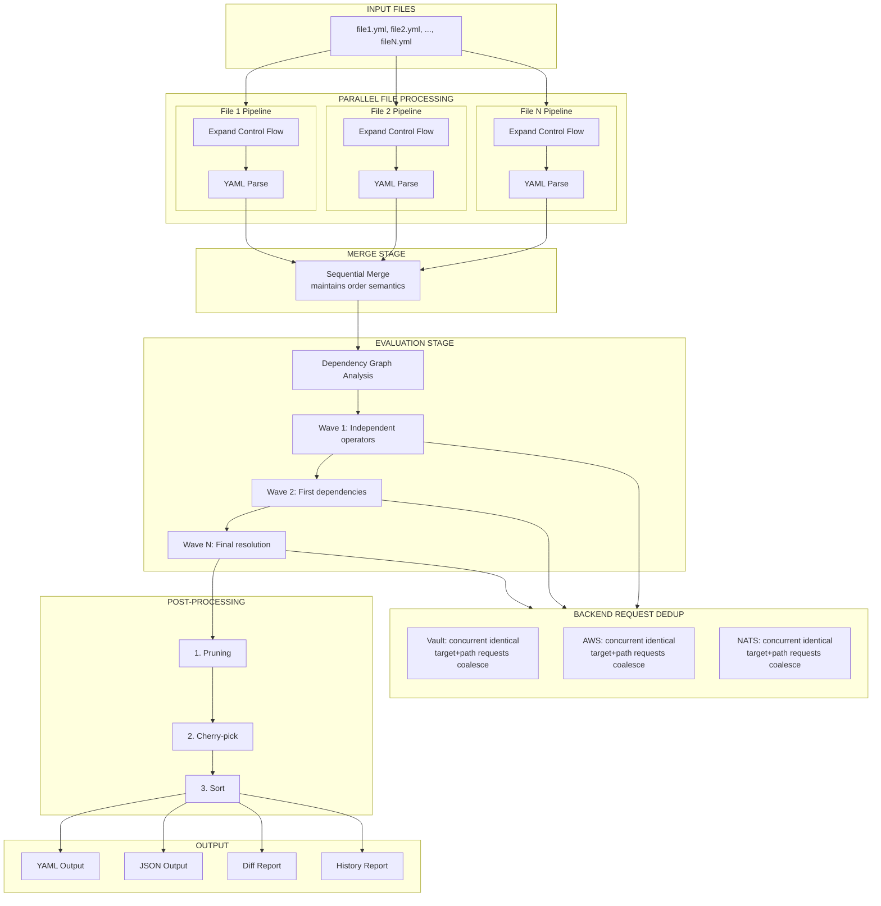
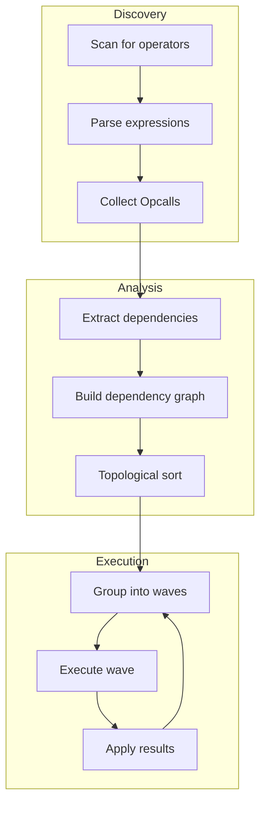

# Processing Pipeline

Graft processes YAML documents through a five-stage pipeline. Each stage has well-defined inputs and outputs, enabling composability, testability, and parallel execution where appropriate.

The order matters more than it looks. Control-flow expansion runs on raw
bytes, per file, before anything else — which is why a loop can only iterate
over data defined in its own file. Operator expressions, by contrast, are
parsed and run at the far end, after every document has been merged, which is
why a `grab` can reach a value another file contributed.

## Pipeline Overview



## Stage 1: Control-Flow Expansion

`(( if ))`, `(( for ))`, `(( while ))`, and `(( case ))` blocks are rewritten
into plain YAML before anything parses the document. They have to be: a
marker occupies a whole line rather than a value position, its body is raw
YAML rather than an expression, and two branches of the same `if` may legally
define the same key — none of which survives a YAML parse.

### Purpose

- Turn each control-flow block into the lines its selected branch or its loop
  iterations produce

- Leave every other line byte-identical

- Report structural errors — unclosed blocks, stray closers, clause
  misordering, nesting beyond 64 levels — before the YAML parser can report
  something less useful about the same text

### Interface

`pkg/graft` exposes a hook rather than importing the implementation:

```go
// pkg/graft/controlflow_hook.go
var ControlFlowExpander func(source []byte) ([]byte, error)
```

`pkg/graft/controlflow` assigns it in `init()`. The dependency can only run
that way: the expander needs `Evaluator` and `Engine` from `pkg/graft` to
resolve conditions and iterables. A consumer opts in with a blank import,
exactly as it does for `pkg/graft/operators`:

```go
import (
    _ "github.com/fivetwenty-io/graft/pkg/graft/controlflow"
    _ "github.com/fivetwenty-io/graft/pkg/graft/operators"
)
```

With no consumer, the hook stays nil and parsing behaves as it did before
control flow existed. A document with no markers is returned byte-identical
either way.

### Algorithm

1. Split the source into lines and classify each one as a marker or as body
   text, skipping anything inside a `|` or `>` block scalar

2. Parse the classified lines into a tree of blocks and verbatim runs

3. Evaluate each condition, iterable, and `case` subject against a scope
   built from the same file

4. Emit the selected branches and loop iterations, discarding marker
   indentation and keeping body indentation verbatim

### Design Decision

Expanding per file, before the merge, is what makes conditions and iterables
resolve against the file they are written in. A loop whose iterable is
defined only in another merged file fails at expansion time rather than
silently picking the value up later:

```
loop.yml: parse_error: control flow expansion failed: $.controlflow.for.L2: unable to resolve `svcs`: `$.svcs` could not be found in the datastructure
```

Loop bindings are materialised under a reserved top-level key,
`__graft_loop`, and pruned before output. Under `--skip-eval` the bindings
survive into the intermediate document alongside the unevaluated references,
so the intermediate can be fed back through graft.

## Stage 2: YAML Parsing

YAML parsing uses goccy/go-yaml, which reports line and column detail on
failure.

### Purpose

- Parse the expanded bytes into Go maps, slices, and scalars

- Handle all YAML constructs (maps, arrays, scalars, anchors)

- Support both YAML and JSON input formats

### Process

`Engine.ParseYAML` runs the expander, then a short series of compatibility
passes, then the parse:

1. Expand control flow, if the hook is registered

2. Sanitize a bare `-` sequence terminator followed by a sibling map key,
   working around a parser bug in the YAML library

3. Quote `<<<:` inject keys so the library accepts them

4. Parse, tagging quoted YAML 1.1 boolean lookalikes (`"yes"`, `'On'`,
   `"OFF"`) so the conversion below leaves them alone

5. Convert unquoted YAML 1.1 booleans, matching spruce

The root of the document must be a map; anything else is rejected with
`root of YAML document is not a hash/map`.

### Design Decision

Operator expressions are opaque strings at this point. They are not parsed
here, and nothing tries to give them meaning until the evaluator reaches
them, which is what lets a merge overwrite an expression with a plain value —
or with another expression — without either side ever being evaluated.

## Stage 3: Merging

The merger combines multiple documents into one, respecting array operators and maintaining document order.

### Purpose

- Deep merge multiple YAML documents

- Handle array manipulation operators ((append), (prepend), (replace), etc.)

- Maintain deterministic merge order

### Interface

```go
result, err := engine.Merge(ctx, base, overlay).
    WithPrune("meta").
    WithCherryPick("database").
    Execute()
```

### Merge Semantics

- Maps are merged recursively (later values override earlier)

- Arrays use the array-merge marker in the incoming document, or the default
  strategy — key merge, then inline — when none is given

- Scalars are replaced by later values

- Operator expressions are still opaque text here; a later document
  overwrites an earlier one's expression without either being evaluated

### Array-Merge Markers

These are applied by `pkg/graft/merger` while documents are combined, not by
the operator registry, so they are not among the 47 registered operators:

| Marker | Behavior |
|----------|----------|
| `(( append ))` | Append items to existing array |
| `(( prepend ))` | Prepend items to existing array |
| `(( replace ))` | Replace entire array |
| `(( inline ))` | Merge array items by position |
| `(( merge ))` / `(( merge on <key> ))` | Merge arrays by key field |
| `(( delete ... ))` | Remove a matching entry |

`(( inject ))` also runs at merge time, but it *is* a registered operator —
it runs in MergePhase and deep-merges a resolved map into the parent
structure.

### Sequential Execution

Merging must be sequential (not parallel) because:

- Document order affects the final result

- Array markers reference the accumulated state

- `calc`'s leading-operator form reads the prior value recorded for the same
  path by the previous file

## Stage 4: Evaluation

The evaluator executes operators in dependency order using wave-based parallel execution. This is also where each `(( ... ))` string is first parsed as an expression: `ParseOpcall` runs when the evaluator reaches a scalar, not when the file was read.

### Purpose

- Parse and resolve operator expressions to concrete values

- Execute in correct dependency order

- Parallelize independent operations

- Deduplicate concurrent identical external-backend requests within a wave

### Operator Phases

Not every operator runs in the same pass:

- **MergePhase** — runs while documents are combined, before any EvalPhase
  operator. `inject` and `sort` register here.

- **ParamPhase** — runs next. An unresolved `(( param ))` aborts the run
  before evaluation starts, so `param` failures and evaluation failures never
  appear in the same output.

- **EvalPhase** — the main pass, where the large majority of operators,
  including every external-backend lookup, execute.

### Wave-Based Execution



### Detailed Process

1. **Discovery**

   Scan the merged document for all operator nodes

2. **Dependency Analysis**

   For each operator, determine what references it needs resolved

3. **Graph Construction**

   Build a directed acyclic graph (DAG) of dependencies

4. **Topological Sort**

   Order operators so dependencies are evaluated first

5. **Wave Grouping**

   Group operators with no unmet dependencies into waves

6. **Parallel Execution**

   Execute all operators in a wave concurrently

7. **Result Application**

   Apply results to the document and update dependency tracking

8. **Iterate**

   Continue with next wave until all operators are evaluated

See [Operator Evaluation](evaluation.md) for detailed documentation.

## Stage 5: Post-Processing

Post-processing applies final transformations to the evaluated document.

### Purpose

- Remove paths marked by `(( prune ))` and by `--prune`

- Cherry-pick specific paths for output

- Sort keys for deterministic output

### Interface

```go
type Processor interface {
    Name() string
    Phase() Phase
    Process(ctx context.Context, doc interface{}, meta *Metadata) (interface{}, error)
}

type Phase int

const (
    PhaseEarly Phase = iota  // immediately after evaluation
    PhaseNormal              // standard post-processing
    PhaseLate                // just before output
)
```

### Built-in Processors

| Processor | Phase | Purpose |
|-----------|-------|---------|
| `PruneProcessor` | PhaseEarly | Remove paths marked by `(( prune ))` |
| `InjectProcessor` | PhaseEarly | Apply deferred `(( inject ))` merges |
| `PathPruner` | PhaseLate | Remove the paths named by `--prune` |
| `CherryPickProcessor` | PhaseLate | Keep only the paths named by `--cherry-pick` |
| `KeySorter` | PhaseLate | Sort map keys alphabetically |

Both `PathPruner` and `CherryPickProcessor` accept a `field=value` predicate
in place of a path segment, in the dotted spelling: `servers.name=primary`.
The bracketed spelling works in expressions but not in these flags.

### Execution Order

Post-processors execute in phase order, and within a phase, in registration order:

```go
// Sort processors by phase
sort.Slice(processors, func(i, j int) bool {
    return processors[i].Phase() < processors[j].Phase()
})

// Execute in order
for _, p := range processors {
    if err := p.Process(ctx, doc, meta); err != nil {
        return err
    }
}
```

## Pipeline Configuration

The pipeline is configured through engine options and environment variables
rather than through a single configuration struct:

```go
engine, _ := graft.NewEngine(
    graft.WithParallel(true),
    graft.WithMaxWorkers(8),
    graft.WithCache(true, 1000),
)
```

| Setting | Environment variable | Effect |
|---------|----------------------|--------|
| Parallel evaluation | `GRAFT_PARALLEL_ENABLED` | Turn wave-based parallel evaluation on or off |
| Worker count | `GRAFT_PARALLEL_MAX_WORKERS`, `GRAFT_PARALLEL_MIN_WORKERS` | Bound the worker pool |
| Document cache | `GRAFT_CACHE_ENABLED`, `GRAFT_CACHE_MAX_SIZE`, `GRAFT_CACHE_TTL` | Cache behavior (see [Configuration Reference](../reference/config.md) for which of these the CLI actually reads today) |
| Loop cap | `GRAFT_MAX_LOOP_ITERATIONS` | `(( while ))` iteration limit; `--max-loop-iterations` wins over it |

There is no separate expression-parse cache or `GRAFT_EXPRESSION_CACHE_SIZE`
variable; parsed expressions are not cached independently of the operator
result cache above.

## Error Handling

Errors carry the stage they came from in their prefix, and graft aggregates
per-path failures so one run reports all of them:

- **Control-flow expansion** failures are reported as parse errors, with the
  file name and a synthetic path naming the construct and its source line:
  `loop.yml: parse_error: control flow expansion failed:
  $.controlflow.for.L2: ...`

- **YAML parse** failures keep the library's line and column detail:
  `config.yml: parse_error: failed to parse YAML: [15:14] mapping value is
  not allowed in this context`

- **Merge** failures are fatal; the documents cannot be combined

- **Evaluation** failures are collected and reported together, each against
  the path that produced it:

  ```
  2 error(s) detected:
   - $.database.port: too few arguments supplied to (( split ... ))
   - $.database.url: concat operator requires at least two arguments
  ```

Any of these exits 2.

## Performance Considerations

### Stage Performance Characteristics

| Stage | Time Complexity | Parallelizable | I/O Bound |
|-------|-----------------|----------------|-----------|
| Expand control flow | O(n) | Per-file | No |
| YAML Parse | O(n) | Per-file | No |
| Merge | O(n*m) | No | No |
| Evaluate | O(v+e) | Per-wave | Yes (backends) |
| Post-process | O(n) | No | No |

Where:
- n = document size
- m = number of documents
- v = number of operators
- e = number of dependencies

### Optimization Strategies

- **File-level parallelism**

  Expand and parse multiple files concurrently

- **Wave-based evaluation**

  Execute independent operators in parallel

- **Request dedup**

  Coalesce concurrent identical backend requests (same target and path) into one

- **Connection pooling**

  Reuse backend connections across requests

- **Result caching**

  Cache backend responses per target and path (permanent for the run's lifetime for Vault/AWS; TTL-bounded for NATS)
