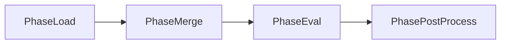

# History Interface

The `History` interface tracks changes to a document through merge and evaluation operations. It provides methods to query the history timeline, filter by path or operation, and serialize for auditing.

## Interface Definition

```go
type History interface {
    // Path enumeration
    AllPaths() []string
    ChangedPaths() []string

    // Path-specific history
    ForPath(path string) []HistoryEntry

    // Queries
    Query(filter HistoryFilter) []HistoryEntry

    // Timeline
    Timeline() []HistoryEntry
    TimelineAfter(t time.Time) []HistoryEntry
    TimelineBefore(t time.Time) []HistoryEntry

    // Serialization
    ToJSON() ([]byte, error)
    ToYAML() ([]byte, error)
}
```

## Types

### HistoryEntry

Represents a single change in the document history.

```go
type HistoryEntry struct {
    Index     int
    Path      string
    Source    string
    Line      int
    Phase     HistoryPhase
    Operation HistoryOperation
    OldValue  interface{}
    NewValue  interface{}
    Operator  string
    Evaluated interface{}
    Timestamp time.Time
    Metadata  map[string]interface{}
}
```

| Field | Type | Description |
|-------|------|-------------|
| `Index` | `int` | Sequential index of this entry |
| `Path` | `string` | Dot-notation path that changed |
| `Source` | `string` | Source file or identifier |
| `Line` | `int` | Line number in source |
| `Phase` | `HistoryPhase` | When the change occurred |
| `Operation` | `HistoryOperation` | Type of operation |
| `OldValue` | `interface{}` | Previous value (nil for new) |
| `NewValue` | `interface{}` | New value (nil for delete) |
| `Operator` | `string` | Operator name (if evaluation phase) |
| `Evaluated` | `interface{}` | Result of operator evaluation |
| `Timestamp` | `time.Time` | When the change was recorded |
| `Metadata` | `map[string]interface{}` | Additional context |

### HistoryPhase

Indicates when in the processing pipeline a change occurred.

```go
type HistoryPhase int

const (
    PhaseLoad HistoryPhase = iota
    PhaseMerge
    PhaseEval
    PhasePostProcess
)
```

| Constant | Value | Description |
|----------|-------|-------------|
| `PhaseLoad` | 0 | During initial document loading |
| `PhaseMerge` | 1 | During document merging |
| `PhaseEval` | 2 | During operator evaluation |
| `PhasePostProcess` | 3 | During post-processing |



### HistoryOperation

Indicates the type of change.

```go
type HistoryOperation int

const (
    HistorySet HistoryOperation = iota
    HistoryMerge
    HistoryOverwrite
    HistoryDelete
    HistoryTransform
    HistoryPrune
)
```

| Constant | Value | Description |
|----------|-------|-------------|
| `HistorySet` | 0 | Value was set (new path) |
| `HistoryMerge` | 1 | Values were merged |
| `HistoryOverwrite` | 2 | Value was overwritten |
| `HistoryDelete` | 3 | Value was deleted |
| `HistoryTransform` | 4 | Value was transformed by operator |
| `HistoryPrune` | 5 | Value was pruned from output |

### HistoryFilter

Filter criteria for querying history.

```go
type HistoryFilter struct {
    Path      string
    Phase     *HistoryPhase
    Operation *HistoryOperation
    Source    string
    After     *time.Time
    Before    *time.Time
    Limit     int
}
```

| Field | Type | Description |
|-------|------|-------------|
| `Path` | `string` | Filter by path prefix |
| `Phase` | `*HistoryPhase` | Filter by phase (nil for any) |
| `Operation` | `*HistoryOperation` | Filter by operation (nil for any) |
| `Source` | `string` | Filter by source file |
| `After` | `*time.Time` | Only entries after this time |
| `Before` | `*time.Time` | Only entries before this time |
| `Limit` | `int` | Maximum entries to return (0 for unlimited) |

## Enabling History Tracking

History tracking must be explicitly enabled:

```go
// Via engine options
engine, _ := graft.NewEngine(
    graft.WithHistoryTracking(true),
)

// Via merge builder
result, err := engine.Merge(ctx, base, overlay).
    TrackHistory().
    Execute()

// Access history from result
history := result.History()
```

## Path Methods

### AllPaths

Returns all paths that appear in the document.

```go
func (h *History) AllPaths() []string
```

**Returns:**

- `[]string` - All paths in the document

**Example:**

```go
history := result.History()
paths := history.AllPaths()
for _, path := range paths {
    fmt.Println(path)
}
```

### ChangedPaths

Returns paths that were modified during processing.

```go
func (h *History) ChangedPaths() []string
```

**Returns:**

- `[]string` - Paths with at least one history entry

**Example:**

```go
history := result.History()
changed := history.ChangedPaths()

fmt.Printf("%d paths were modified:\n", len(changed))
for _, path := range changed {
    entries := history.ForPath(path)
    fmt.Printf("  %s (%d changes)\n", path, len(entries))
}
```

## Path-Specific Methods

### ForPath

Returns all history entries for a specific path.

```go
func (h *History) ForPath(path string) []HistoryEntry
```

**Parameters:**

- `path` - Dot-notation path

**Returns:**

- `[]HistoryEntry` - All entries for this path, chronologically ordered

**Example:**

```go
history := result.History()

entries := history.ForPath("database.host")
for _, entry := range entries {
    fmt.Printf("[%s] %s:%d\n", entry.Phase, entry.Source, entry.Line)
    fmt.Printf("  %v -> %v\n", entry.OldValue, entry.NewValue)
    if entry.Operator != "" {
        fmt.Printf("  operator: %s\n", entry.Operator)
    }
}
```

**Output:**

```
[PhaseMerge] defaults.yml:5
  <nil> -> localhost
[PhaseMerge] production.yml:3
  localhost -> (( vault "secret/db:host" ))
[PhaseEval] production.yml:3
  (( vault "secret/db:host" )) -> db.prod.example.com
  operator: vault
```

## Query Methods

### Query

Returns history entries matching the filter criteria.

```go
func (h *History) Query(filter HistoryFilter) []HistoryEntry
```

**Parameters:**

- `filter` - Filter criteria

**Returns:**

- `[]HistoryEntry` - Matching entries

**Example:**

```go
history := result.History()

// Find all vault evaluations
evalPhase := graft.PhaseEval
entries := history.Query(graft.HistoryFilter{
    Phase: &evalPhase,
})

for _, entry := range entries {
    if entry.Operator == "vault" {
        fmt.Printf("Vault lookup at %s: %v\n", entry.Path, entry.Evaluated)
    }
}

// Find all overwrites in production.yml
overwriteOp := graft.HistoryOverwrite
entries = history.Query(graft.HistoryFilter{
    Source:    "production.yml",
    Operation: &overwriteOp,
})

for _, entry := range entries {
    fmt.Printf("Overwritten: %s (was %v, now %v)\n",
        entry.Path, entry.OldValue, entry.NewValue)
}

// Find database changes during merge
mergePhase := graft.PhaseMerge
entries = history.Query(graft.HistoryFilter{
    Path:  "database",
    Phase: &mergePhase,
    Limit: 10,
})
```

## Timeline Methods

### Timeline

Returns all history entries in chronological order.

```go
func (h *History) Timeline() []HistoryEntry
```

**Returns:**

- `[]HistoryEntry` - All entries, ordered by timestamp and index

**Example:**

```go
history := result.History()

fmt.Println("Processing timeline:")
for _, entry := range history.Timeline() {
    fmt.Printf("[%d] %s %s at %s\n",
        entry.Index, entry.Phase, entry.Operation, entry.Path)
}
```

### TimelineAfter

Returns entries occurring after a specific time.

```go
func (h *History) TimelineAfter(t time.Time) []HistoryEntry
```

**Parameters:**

- `t` - Cutoff time (exclusive)

**Returns:**

- `[]HistoryEntry` - Entries after the specified time

**Example:**

```go
history := result.History()

// Get entries from the last hour
cutoff := time.Now().Add(-1 * time.Hour)
recentEntries := history.TimelineAfter(cutoff)

fmt.Printf("%d changes in the last hour\n", len(recentEntries))
```

### TimelineBefore

Returns entries occurring before a specific time.

```go
func (h *History) TimelineBefore(t time.Time) []HistoryEntry
```

**Parameters:**

- `t` - Cutoff time (exclusive)

**Returns:**

- `[]HistoryEntry` - Entries before the specified time

**Example:**

```go
history := result.History()

// Get entries before today
midnight := time.Now().Truncate(24 * time.Hour)
olderEntries := history.TimelineBefore(midnight)
```

## Serialization Methods

### ToJSON

Serializes the history to JSON format.

```go
func (h *History) ToJSON() ([]byte, error)
```

**Returns:**

- `[]byte` - JSON representation

- `error` - Non-nil if serialization fails

**Example:**

```go
history := result.History()

json, err := history.ToJSON()
if err != nil {
    return err
}

// Write to audit log
os.WriteFile("audit.json", json, 0644)
```

**Output:**

```json
{
  "entries": [
    {
      "index": 0,
      "path": "database.host",
      "source": "defaults.yml",
      "line": 5,
      "phase": "load",
      "operation": "set",
      "new_value": "localhost",
      "timestamp": "2024-01-15T10:30:00Z"
    },
    {
      "index": 1,
      "path": "database.host",
      "source": "production.yml",
      "line": 3,
      "phase": "merge",
      "operation": "overwrite",
      "old_value": "localhost",
      "new_value": "db.prod.example.com",
      "timestamp": "2024-01-15T10:30:00Z"
    }
  ],
  "summary": {
    "total_entries": 2,
    "changed_paths": 1,
    "by_phase": {
      "load": 1,
      "merge": 1
    }
  }
}
```

### ToYAML

Serializes the history to YAML format.

```go
func (h *History) ToYAML() ([]byte, error)
```

**Returns:**

- `[]byte` - YAML representation

- `error` - Non-nil if serialization fails

**Example:**

```go
history := result.History()

yaml, err := history.ToYAML()
if err != nil {
    return err
}

fmt.Println(string(yaml))
```

## Complete Examples

### Audit Trail

```go
func generateAuditTrail(result graft.Document) (*AuditTrail, error) {
    history := result.History()
    if history == nil {
        return nil, fmt.Errorf("history tracking not enabled")
    }

    trail := &AuditTrail{
        GeneratedAt: time.Now(),
        Entries:     make([]AuditEntry, 0),
    }

    for _, entry := range history.Timeline() {
        audit := AuditEntry{
            Timestamp: entry.Timestamp,
            Path:      entry.Path,
            Source:    fmt.Sprintf("%s:%d", entry.Source, entry.Line),
            Phase:     phaseString(entry.Phase),
            Operation: operationString(entry.Operation),
        }

        if entry.OldValue != nil {
            audit.OldValue = fmt.Sprintf("%v", entry.OldValue)
        }
        if entry.NewValue != nil {
            audit.NewValue = fmt.Sprintf("%v", entry.NewValue)
        }
        if entry.Operator != "" {
            audit.Operator = entry.Operator
        }

        trail.Entries = append(trail.Entries, audit)
    }

    return trail, nil
}
```

### Debugging Merge Issues

```go
func debugMerge(base, overlay graft.Document) {
    engine, _ := graft.NewEngine()

    result, err := engine.Merge(context.Background(), base, overlay).
        TrackHistory().
        Execute()
    if err != nil {
        log.Fatal(err)
    }

    history := result.History()

    // Show what happened to each changed path
    for _, path := range history.ChangedPaths() {
        fmt.Printf("\n=== %s ===\n", path)

        entries := history.ForPath(path)
        for i, entry := range entries {
            fmt.Printf("%d. [%s] %s\n", i+1, entry.Phase, entry.Operation)
            fmt.Printf("   Source: %s:%d\n", entry.Source, entry.Line)

            if entry.OldValue != nil {
                fmt.Printf("   From: %v\n", entry.OldValue)
            }
            if entry.NewValue != nil {
                fmt.Printf("   To: %v\n", entry.NewValue)
            }
            if entry.Operator != "" {
                fmt.Printf("   Operator: %s -> %v\n", entry.Operator, entry.Evaluated)
            }
        }
    }
}
```

### Tracking Sensitive Changes

```go
func trackSensitiveChanges(result graft.Document) []SecurityEvent {
    history := result.History()
    if history == nil {
        return nil
    }

    sensitivePatterns := []string{
        "password",
        "secret",
        "token",
        "api_key",
        "credentials",
    }

    events := []SecurityEvent{}

    for _, entry := range history.Timeline() {
        for _, pattern := range sensitivePatterns {
            if strings.Contains(strings.ToLower(entry.Path), pattern) {
                events = append(events, SecurityEvent{
                    Timestamp: entry.Timestamp,
                    Path:      entry.Path,
                    Source:    entry.Source,
                    Operation: operationString(entry.Operation),
                    Operator:  entry.Operator,
                })
                break
            }
        }
    }

    return events
}
```

### Value Provenance

```go
func traceValueOrigin(result graft.Document, path string) (*ValueProvenance, error) {
    history := result.History()
    if history == nil {
        return nil, fmt.Errorf("history tracking not enabled")
    }

    entries := history.ForPath(path)
    if len(entries) == 0 {
        return nil, fmt.Errorf("no history for path: %s", path)
    }

    provenance := &ValueProvenance{
        Path:         path,
        CurrentValue: result.String(path),
        Origin:       entries[0].Source,
        OriginLine:   entries[0].Line,
        Transformations: make([]Transformation, 0),
    }

    for i := 1; i < len(entries); i++ {
        entry := entries[i]
        transform := Transformation{
            Source:    entry.Source,
            Line:      entry.Line,
            Phase:     phaseString(entry.Phase),
            Operation: operationString(entry.Operation),
            Before:    entry.OldValue,
            After:     entry.NewValue,
        }
        if entry.Operator != "" {
            transform.Operator = entry.Operator
        }
        provenance.Transformations = append(provenance.Transformations, transform)
    }

    return provenance, nil
}
```

### Comparing History Across Merges

```go
func compareHistories(result1, result2 graft.Document) {
    h1 := result1.History()
    h2 := result2.History()

    paths1 := make(map[string]bool)
    for _, p := range h1.ChangedPaths() {
        paths1[p] = true
    }

    paths2 := make(map[string]bool)
    for _, p := range h2.ChangedPaths() {
        paths2[p] = true
    }

    fmt.Println("Paths changed in first but not second:")
    for p := range paths1 {
        if !paths2[p] {
            fmt.Printf("  %s\n", p)
        }
    }

    fmt.Println("Paths changed in second but not first:")
    for p := range paths2 {
        if !paths1[p] {
            fmt.Printf("  %s\n", p)
        }
    }

    fmt.Println("Paths changed in both:")
    for p := range paths1 {
        if paths2[p] {
            e1 := h1.ForPath(p)
            e2 := h2.ForPath(p)
            fmt.Printf("  %s: %d vs %d changes\n", p, len(e1), len(e2))
        }
    }
}
```

## Performance Considerations

History tracking adds memory and processing overhead:

- Each change creates a `HistoryEntry` object

- Entry values are stored (increases memory usage)

- Timestamps are recorded for each entry

**Best Practices:**

- Enable history only when needed (debugging, auditing)

- Use filters to limit query results

- Consider disabling for high-volume production scenarios

```go
// Production: no history
engine, _ := graft.NewEngine()
result, _ := engine.Merge(ctx, base, overlay).Execute()

// Development/debugging: with history
engine, _ := graft.NewEngine(graft.WithHistoryTracking(true))
result, _ := engine.Merge(ctx, base, overlay).TrackHistory().Execute()
```

## Thread Safety

The History interface is thread-safe for concurrent reads. Multiple goroutines can safely:

- Query history entries

- Access the timeline

- Serialize to JSON/YAML

## Related Documentation

- [Engine Interface](engine.md) - Enabling history tracking

- [MergeBuilder API](merge-builder.md) - Per-merge history tracking

- [Document Interface](document.md) - Accessing history from documents

- [Diff Interface](diff-api.md) - Comparing documents
