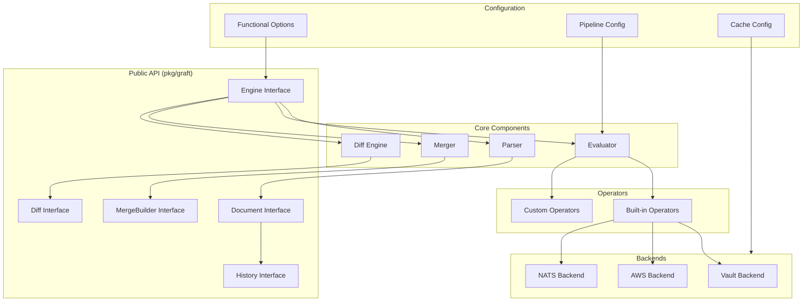
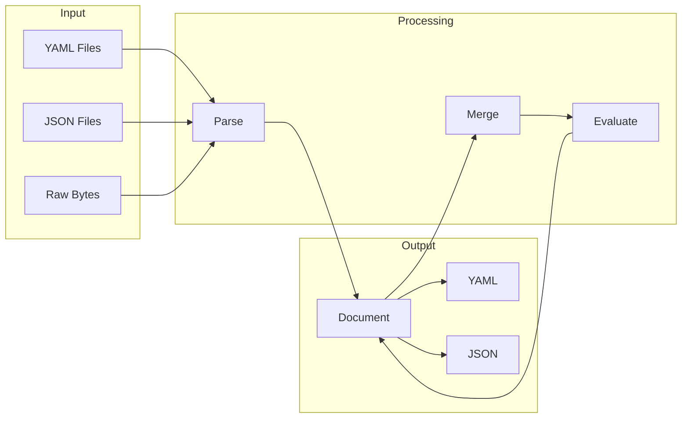

# Library API Overview

The Graft library provides a clean, well-documented Go API for YAML/JSON document processing, merging, and transformation. This overview covers the architecture, core interfaces, and getting started with the library.

## Architecture

The following diagram illustrates the high-level architecture of the Graft library:



## Core Interfaces

| Interface | Purpose | Documentation |
|-----------|---------|---------------|
| `Engine` | Main entry point for all operations | [engine.md](engine.md) |
| `Document` | Represents a parsed YAML/JSON document | [document.md](document.md) |
| `MergeBuilder` | Fluent API for merge operations | [merge-builder.md](merge-builder.md) |
| `Diff` | Represents differences between documents | [diff-api.md](diff-api.md) |
| `History` | Tracks changes through operations | [history-api.md](history-api.md) |

## Data Flow



## Quick Start

### Creating an Engine

```go
import "github.com/fivetwenty/graft"

// Basic engine with defaults
engine, err := graft.NewEngine()

// Engine with custom configuration
engine, err := graft.NewEngine(
    graft.WithCacheSize(1000),
    graft.WithCacheTTL(5 * time.Minute),
    graft.WithHistoryTracking(true),
)
```

### Parsing Documents

```go
// From YAML bytes
doc, err := engine.ParseYAML(yamlBytes)

// From JSON bytes
doc, err := engine.ParseJSON(jsonBytes)

// From file (auto-detects format)
doc, err := engine.ParseFile("config.yml")

// From io.Reader
doc, err := engine.ParseReader(reader)
```

### Merging Documents

```go
// Simple merge
result, err := engine.Merge(ctx, base, overlay).Execute()

// Merge with options
result, err := engine.Merge(ctx, base, overlay).
    Prune("internal", "meta").
    CherryPick("database", "server").
    TrackHistory().
    Execute()
```

### Accessing Values

```go
// Type-safe getters (return error if not found or wrong type)
host, err := doc.GetString("database.host")
port, err := doc.GetInt("database.port")
enabled, err := doc.GetBool("features.debug")

// Checked getters (return zero value if not found)
host := doc.String("database.host")
port := doc.Int("database.port")
enabled := doc.Bool("features.debug")
```

### Comparing Documents

```go
diff := engine.Diff(doc1, doc2)

if diff.HasChanges() {
    for _, change := range diff.Changes() {
        fmt.Printf("%s: %v -> %v\n",
            change.Path, change.OldValue, change.NewValue)
    }
}
```

## Error Handling

Graft uses structured errors that provide detailed context:

```go
result, err := engine.Merge(ctx, base, overlay).Execute()
if err != nil {
    var evalErr *graft.EvaluationError
    if errors.As(err, &evalErr) {
        fmt.Printf("Evaluation failed at %s: %s\n",
            evalErr.Path, evalErr.Message)
        fmt.Printf("Operator: %s\n", evalErr.Operator)
    }

    var backendErr *graft.BackendError
    if errors.As(err, &backendErr) {
        fmt.Printf("Backend %s failed: %s\n",
            backendErr.Backend, backendErr.Cause)
    }
}
```

See the individual interface documentation for complete error handling patterns.

## Thread Safety

The Graft library provides specific thread safety guarantees:

| Component | Thread Safe | Notes |
|-----------|-------------|-------|
| `Engine` | Yes | Safe for concurrent use |
| `Document` | Read-only | Not safe for concurrent modification |
| `MergeBuilder` | No | Single-use, create per operation |
| `Diff` | Yes | Safe for concurrent reads |
| `History` | Yes | Safe for concurrent reads |

### Concurrent Document Access

```go
// Clone documents for concurrent modification
doc, _ := engine.ParseFile("config.yml")

var wg sync.WaitGroup
for _, env := range environments {
    wg.Add(1)
    go func(env string) {
        defer wg.Done()
        clone := doc.Clone()
        // Safe to modify clone
        clone.Set("environment", env)
    }(env)
}
wg.Wait()
```

### Concurrent Merges

```go
// Same engine can be used concurrently
var results []graft.Document
var mu sync.Mutex

for _, config := range configs {
    go func(cfg ConfigPair) {
        result, _ := engine.Merge(ctx, cfg.Base, cfg.Overlay).Execute()
        mu.Lock()
        results = append(results, result)
        mu.Unlock()
    }(config)
}
```

## API Reference

- [Engine Interface](engine.md) - Core operations: parsing, merging, diffing, evaluation

- [Document Interface](document.md) - Document access, mutation, and serialization

- [MergeBuilder API](merge-builder.md) - Fluent merge configuration

- [Diff Interface](diff-api.md) - Change tracking and formatting

- [History Interface](history-api.md) - Operation history and timeline

- [Configuration Options](options.md) - Functional options for customization
