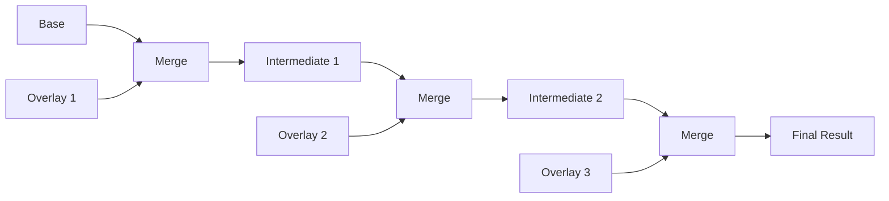

# MergeBuilder API

The `MergeBuilder` interface provides a fluent API for configuring and executing document merge operations. It allows you to specify documents, configure merge behavior, and control post-processing.

## Interface Definition

```go
type MergeBuilder interface {
    // Document sources
    Base(doc Document) MergeBuilder
    Overlay(docs ...Document) MergeBuilder
    OverlayFile(paths ...string) MergeBuilder

    // Options
    WithPrune(keys ...string) MergeBuilder
    WithCherryPick(keys ...string) MergeBuilder
    WithArrayMergeStrategy(strategy ArrayMergeStrategy) MergeBuilder
    SkipEvaluation() MergeBuilder
    FallbackAppend() MergeBuilder
    EnableGoPatch() MergeBuilder

    // WithPostProcessors appends processors that run after evaluation,
    // pruning, and cherry-picking; see custom-post-processors.md.
    WithPostProcessors(procs ...PostProcessor) MergeBuilder

    // History
    TrackHistory() MergeBuilder

    // Execution
    Execute() (Document, error)
}
```

## Creating a MergeBuilder

MergeBuilder instances are created via the Engine's `Merge` method:

```go
engine, _ := graft.NewEngine()

// Create builder with initial documents
builder := engine.Merge(ctx, base, overlay)

// Or start with just context and add documents
builder := engine.Merge(ctx).Base(baseDoc).Overlay(overlayDoc)
```

## Document Source Methods

### Base

Sets the base document for the merge — position 0 in the builder's document
list. Calling `Base` more than once on the same chain replaces the previous
base rather than accumulating; it does not mutate the receiver, so each call
returns an independent builder.

```go
func (b *MergeBuilder) Base(doc Document) MergeBuilder
```

**Parameters:**

- `doc` - The base document (values are overwritten by overlays)

**Returns:**

- `MergeBuilder` - A new builder for method chaining

**Example:**

```go
base, _ := engine.ParseFile("defaults.yml")
overlay, _ := engine.ParseFile("production.yml")

result, err := engine.Merge(ctx).
    Base(base).
    Overlay(overlay).
    Execute()
```

**Note:** If documents are passed to `engine.Merge(ctx, docs...)`, the first
document is used as the base; a later `Base` call replaces it.

**Note:** `doc` is not nil-checked; a nil document panics inside
`Execute()` later, the same pre-existing hazard as passing a nil
`Document` to `engine.Merge(ctx, docs...)` directly.

### Overlay

Appends one or more documents to be merged, in call order, on top of the
base and any earlier overlays.

```go
func (b *MergeBuilder) Overlay(docs ...Document) MergeBuilder
```

**Parameters:**

- `docs` - One or more documents to merge (applied in order)

**Returns:**

- `MergeBuilder` - A new builder for method chaining

**Example:**

```go
// Single overlay
result, err := engine.Merge(ctx).
    Base(base).
    Overlay(production).
    Execute()

// Multiple overlays (applied left to right)
result, err := engine.Merge(ctx).
    Base(base).
    Overlay(defaults, environment, overrides).
    Execute()

// Equivalent to:
// base + defaults -> intermediate1
// intermediate1 + environment -> intermediate2
// intermediate2 + overrides -> result
```

**Merge Order:**



Precedence composes with documents passed directly to `engine.Merge(ctx,
docs...)`: those documents come first, in the order given, with the first
occupying position 0 (the base) — `Base` replaces that position, and
`Overlay`/`OverlayFile` append after it, in the order the methods are
called, not the order arguments appear across separate calls.

**Note:** `docs` entries are not nil-checked; a nil document panics inside
`Execute()` later, the same pre-existing hazard `Base` carries (see its
own note above).

### OverlayFile

Loads one or more documents from file paths via the engine's `ParseFile`
(the same extension-based YAML/JSON/go-patch auto-detection, and `"-"` for
STDIN, that `ParseFile` documents) and appends them as overlays, in path
order.

```go
func (b *MergeBuilder) OverlayFile(paths ...string) MergeBuilder
```

**Parameters:**

- `paths` - One or more file paths to load as overlays

**Returns:**

- `MergeBuilder` - A new builder for method chaining

**Example:**

```go
result, err := engine.Merge(ctx).
    Base(base).
    OverlayFile(
        "defaults.yml",
        "environments/production.yml",
        "overrides.yml",
    ).
    Execute()
```

**Error Handling:**

A load failure does not panic and does not return an unusable builder — it
is captured on the builder and reported by `Execute()`, the same
error-carrying-builder convention `Engine.MergeFiles`/`MergeReaders` use:

```go
result, err := engine.Merge(ctx).
    Base(base).
    OverlayFile("missing.yml").
    Execute()
// err: failed to load overlay file: open missing.yml: no such file or directory
```

Every later builder call in the chain (further `Base`/`Overlay`/
`OverlayFile` calls, `WithPrune`, and so on) propagates that same error
instead of overwriting it, so the failure surfaces from `Execute()` exactly
as if `OverlayFile` had been the last call before it.

## Option Methods

### WithPrune

Removes specified top-level keys from the final result.

```go
func (b *MergeBuilder) WithPrune(keys ...string) MergeBuilder
```

**Parameters:**

- `keys` - Top-level keys to remove from the result

**Returns:**

- `MergeBuilder` - The builder for method chaining

**Example:**

```go
// Remove internal and debug sections
result, err := engine.Merge(ctx, base, overlay).
    WithPrune("internal", "debug", "metadata").
    Execute()

// These keys won't appear in result
fmt.Println(result.Has("internal")) // false
fmt.Println(result.Has("debug"))    // false
```

**Use Cases:**

- Removing build-time metadata

- Stripping debug configuration for production

- Excluding internal-only sections

### WithCherryPick

Keeps only specified top-level keys in the final result.

```go
func (b *MergeBuilder) WithCherryPick(keys ...string) MergeBuilder
```

**Parameters:**

- `keys` - Top-level keys to keep in the result

**Returns:**

- `MergeBuilder` - The builder for method chaining

**Example:**

```go
// Extract only database and server configuration
result, err := engine.Merge(ctx, base, overlay).
    WithCherryPick("database", "server").
    Execute()

// Only these keys appear in result
fmt.Println(result.Keys()) // ["database", "server"]
```

**Combining with WithPrune:**

```go
// Cherry-pick first, then prune nested sections
result, err := engine.Merge(ctx, base, overlay).
    WithCherryPick("database", "server", "auth").
    WithPrune("secrets").
    Execute()
```

### SkipEvaluation

Skips operator evaluation, leaving operator expressions unevaluated.

```go
func (b *MergeBuilder) SkipEvaluation() MergeBuilder
```

**Returns:**

- `MergeBuilder` - The builder for method chaining

**Example:**

```go
// Merge without evaluating operators
result, err := engine.Merge(ctx, base, overlay).
    SkipEvaluation().
    Execute()

// Operator expressions remain as-is
password, _ := result.GetString("database.password")
fmt.Println(password) // (( vault "secret/db:password" ))
```

**Use Cases:**

- Template generation

- Inspecting merged structure before evaluation

- Two-phase processing (merge then evaluate separately)

- Testing merge behavior without external dependencies

### FallbackAppend

Changes array merge behavior to append by default (instead of replace).

```go
func (b *MergeBuilder) FallbackAppend() MergeBuilder
```

**Returns:**

- `MergeBuilder` - The builder for method chaining

**Example:**

```go
// Without FallbackAppend (default: replace)
base := parseYAML(`
packages:
  - git
  - vim
`)
overlay := parseYAML(`
packages:
  - nginx
`)
result, _ := engine.Merge(ctx, base, overlay).Execute()
// result.packages = [nginx]  (overlay replaced base)

// With FallbackAppend
result, _ := engine.Merge(ctx, base, overlay).
    FallbackAppend().
    Execute()
// result.packages = [git, vim, nginx]  (overlay appended)
```

**Note:** Explicit array operators (`(( append ))`, `(( replace ))`, etc.) override this setting.

### EnableGoPatch

Enables go-patch compatibility mode for merge operations.

```go
func (b *MergeBuilder) EnableGoPatch() MergeBuilder
```

**Returns:**

- `MergeBuilder` - The builder for method chaining

**Example:**

```go
// Enable go-patch style operations
result, err := engine.Merge(ctx, base, overlay).
    EnableGoPatch().
    Execute()
```

**Go-Patch Operations:**

When enabled, the overlay can use go-patch style operations:

```yaml
# Overlay with go-patch operations
- type: replace
  path: /database/host
  value: newhost.example.com

- type: remove
  path: /debug

- type: replace
  path: /servers/-
  value:
    name: web3
    port: 8082
```

## History Methods

### TrackHistory

Activates document-memory tracking for this merge chain, lazily enabling
it on the engine if it is not already active (only possible when the
underlying `Engine` is `*DefaultEngine`; a no-op otherwise). Full details,
including exactly what gets recorded and its known gaps, are in the
[History Interface](history-api.md) page - this section covers only the
builder method itself.

```go
func (b *MergeBuilder) TrackHistory() MergeBuilder
```

**Returns:**

- `MergeBuilder` - The builder for method chaining

**Example:**

```go
result, err := engine.Merge(ctx, base, overlay).
    TrackHistory().
    Execute()

// Access merge history
history := result.History()
for _, entry := range history.Timeline() {
    fmt.Printf("[%s] %s: %v -> %v\n",
        entry.Phase, entry.Path, entry.OldValue, entry.NewValue)
}

// Get history for a specific path
for _, entry := range history.ForPath("database.host") {
    fmt.Printf("  %s -> %v\n", entry.Operator, entry.NewValue)
}
```

`Document.History()` never returns a nil interface: a `Document` produced
without tracking active returns an empty, valid `History`. Recording is
also engine-wide, not per merge - if tracking stays active across more
than one `Execute()` call on the same engine, later merges' history
includes earlier ones' recorded changes too. See
[History Interface](history-api.md) for the full scope, recording-gap
list, and `WithHistoryTracking`/`WithHistoryConfig` engine options.

**Performance Note:** History tracking adds overhead and is off by
default; enable only when needed for debugging or auditing.

## Execution Methods

### Execute

Executes the merge operation and returns the result.

```go
func (b *MergeBuilder) Execute() (Document, error)
```

**Returns:**

- `Document` - The merged and (unless SkipEvaluation) evaluated document

- `error` - Non-nil if merge or evaluation fails

**Example:**

```go
result, err := engine.Merge(ctx, base, overlay).
    WithPrune("internal").
    TrackHistory().
    Execute()

if err != nil {
    var evalErr *graft.EvaluationError
    if errors.As(err, &evalErr) {
        fmt.Printf("Evaluation failed at %s: %s\n",
            evalErr.Path, evalErr.Message)
    }
    return err
}

// Use result
yaml, _ := result.ToYAML()
fmt.Println(string(yaml))
```

## Complete Examples

### Basic Configuration Merge

```go
func mergeConfigs(baseFile, envFile string) (graft.Document, error) {
    engine, err := graft.NewEngine()
    if err != nil {
        return nil, err
    }

    base, err := engine.ParseFile(baseFile)
    if err != nil {
        return nil, fmt.Errorf("parse base: %w", err)
    }

    env, err := engine.ParseFile(envFile)
    if err != nil {
        return nil, fmt.Errorf("parse env: %w", err)
    }

    return engine.Merge(context.Background(), base, env).Execute()
}
```

### Multi-Environment Pipeline

```go
func buildConfig(env string) (graft.Document, error) {
    engine, err := graft.NewEngine()
    if err != nil {
        return nil, err
    }

    ctx := context.Background()

    // Load base configuration
    base, _ := engine.ParseFile("config/base.yml")

    // Build overlay chain
    builder := engine.Merge(ctx, base).
        OverlayFile("config/defaults.yml")

    // Add environment-specific overlay
    envFile := fmt.Sprintf("config/environments/%s.yml", env)
    if _, err := os.Stat(envFile); err == nil {
        builder = builder.OverlayFile(envFile)
    }

    // Add local overrides if present
    if _, err := os.Stat("config/local.yml"); err == nil {
        builder = builder.OverlayFile("config/local.yml")
    }

    // Execute with production settings
    return builder.
        WithPrune("debug", "testing").
        Execute()
}
```

### Template Generation

```go
func generateTemplate(components []string) ([]byte, error) {
    engine, _ := graft.NewEngine()
    ctx := context.Background()

    // Start with template base
    base, _ := engine.ParseFile("templates/base.yml")

    // Add selected components
    builder := engine.Merge(ctx, base)
    for _, component := range components {
        componentFile := fmt.Sprintf("templates/components/%s.yml", component)
        builder = builder.OverlayFile(componentFile)
    }

    // Skip evaluation to keep operators as template expressions
    result, err := builder.
        SkipEvaluation().
        Execute()
    if err != nil {
        return nil, err
    }

    return result.ToYAML()
}
```

### Audited Configuration Merge

```go
func mergeWithAudit(base, overlay graft.Document) (graft.Document, *AuditReport, error) {
    engine, _ := graft.NewEngine()

    result, err := engine.Merge(context.Background(), base, overlay).
        TrackHistory().
        Execute()
    if err != nil {
        return nil, nil, err
    }

    // Build audit report from history
    report := &AuditReport{
        Timestamp: time.Now(),
        Changes:   []ChangeRecord{},
    }

    // entry.Source is always "" in this release (see history-api.md);
    // entry.Operator carries the raw merge verb DocumentMemory recorded
    // ("merge", "add", or "delete" for a merge-phase entry).
    history := result.History()
    for _, entry := range history.Timeline() {
        if entry.Phase == graft.PhaseMerge {
            report.Changes = append(report.Changes, ChangeRecord{
                Path:     entry.Path,
                OldValue: entry.OldValue,
                NewValue: entry.NewValue,
                Verb:     entry.Operator,
            })
        }
    }

    return result, report, nil
}
```

## Error Handling

MergeBuilder captures errors and returns them from `Execute()`, as a single
`*graft.GraftError` type with a `Type` field to distinguish failure
categories — not one Go type per category. Switch on `Type`, not on
distinct error types; see [Error Handling](engine.md#error-handling) for
the full `GraftError` shape and every `ErrorType` value:

```go
result, err := engine.Merge(ctx, base, overlay).
    OverlayFile("nonexistent.yml").
    Execute()

if err != nil {
    var graftErr *graft.GraftError
    if errors.As(err, &graftErr) {
        switch graftErr.Type {
        case graft.ParseError:
            log.Printf("Parse error: %s", graftErr.Message)

        case graft.EvaluationError:
            log.Printf("Evaluation failed at %s: %s", graftErr.Path, graftErr.Message)

        case graft.MergeError:
            log.Printf("Merge conflict: %s", graftErr.Message)

        case graft.ExternalError:
            log.Printf("Backend failed: %s", graftErr.Message)

        default:
            log.Printf("%s: %s", graftErr.Type, graftErr.Message)
        }
        return nil, err
    }
    log.Printf("Merge failed: %v", err)
}
```

## Thread Safety

MergeBuilder instances are NOT thread-safe. Each goroutine should create its own builder:

```go
// Correct: separate builder per goroutine
var wg sync.WaitGroup
for _, env := range environments {
    wg.Add(1)
    go func(environment string) {
        defer wg.Done()
        // Create new builder for each goroutine
        result, _ := engine.Merge(ctx, base, overlay).
            OverlayFile(fmt.Sprintf("env/%s.yml", environment)).
            Execute()
        processResult(environment, result)
    }(env)
}
wg.Wait()

// WRONG: sharing builder across goroutines
builder := engine.Merge(ctx, base, overlay)
for _, env := range environments {
    go func(environment string) {
        // Race condition - builder is shared!
        builder.OverlayFile(fmt.Sprintf("env/%s.yml", environment))
    }(env)
}
```

## Related Documentation

- [Engine Interface](engine.md) - Creating the engine and parsing documents

- [Document Interface](document.md) - Working with merged results

- [History Interface](history-api.md) - Understanding merge history

- [Configuration Options](options.md) - Engine configuration
