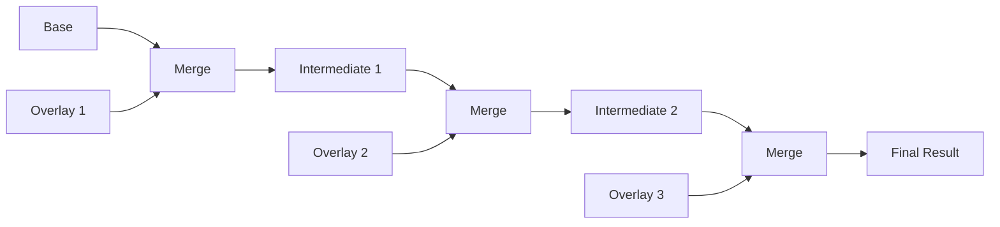

# MergeBuilder API

The `MergeBuilder` interface provides a fluent API for configuring and executing document merge operations. It allows you to specify documents, configure merge behavior, and control post-processing.

## Interface Definition

```go
type MergeBuilder interface {
    // Document sources
    Base(doc Document) MergeBuilder
    Overlay(docs ...Document) MergeBuilder
    OverlayFile(paths ...string) MergeBuilder

    // Options
    Prune(keys ...string) MergeBuilder
    CherryPick(keys ...string) MergeBuilder
    SkipEval() MergeBuilder
    FallbackAppend() MergeBuilder
    EnableGoPatch() MergeBuilder

    // History
    TrackHistory() MergeBuilder

    // Execution
    Execute() (Document, error)
}
```

## Creating a MergeBuilder

MergeBuilder instances are created via the Engine's `Merge` method:

```go
engine, _ := graft.NewEngine()

// Create builder with initial documents
builder := engine.Merge(ctx, base, overlay)

// Or start with just context and add documents
builder := engine.Merge(ctx).Base(baseDoc).Overlay(overlayDoc)
```

## Document Source Methods

### Base

Sets the base document for the merge operation.

```go
func (b *MergeBuilder) Base(doc Document) MergeBuilder
```

**Parameters:**

- `doc` - The base document (values are overwritten by overlays)

**Returns:**

- `MergeBuilder` - The builder for method chaining

**Example:**

```go
base, _ := engine.ParseFile("defaults.yml")
overlay, _ := engine.ParseFile("production.yml")

result, err := engine.Merge(ctx).
    Base(base).
    Overlay(overlay).
    Execute()
```

**Note:** If documents are passed to `engine.Merge(ctx, docs...)`, the first document is automatically used as the base.

### Overlay

Adds one or more overlay documents to be merged onto the base.

```go
func (b *MergeBuilder) Overlay(docs ...Document) MergeBuilder
```

**Parameters:**

- `docs` - One or more documents to merge (applied in order)

**Returns:**

- `MergeBuilder` - The builder for method chaining

**Example:**

```go
// Single overlay
result, err := engine.Merge(ctx).
    Base(base).
    Overlay(production).
    Execute()

// Multiple overlays (applied left to right)
result, err := engine.Merge(ctx).
    Base(base).
    Overlay(defaults, environment, overrides).
    Execute()

// Equivalent to:
// base + defaults -> intermediate1
// intermediate1 + environment -> intermediate2
// intermediate2 + overrides -> result
```

**Merge Order:**



### OverlayFile

Loads and adds overlay documents from file paths.

```go
func (b *MergeBuilder) OverlayFile(paths ...string) MergeBuilder
```

**Parameters:**

- `paths` - One or more file paths to load as overlays

**Returns:**

- `MergeBuilder` - The builder for method chaining

**Example:**

```go
result, err := engine.Merge(ctx).
    Base(base).
    OverlayFile(
        "defaults.yml",
        "environments/production.yml",
        "overrides.yml",
    ).
    Execute()
```

**Error Handling:**

If a file cannot be loaded, the error is returned from `Execute()`:

```go
result, err := engine.Merge(ctx).
    Base(base).
    OverlayFile("missing.yml").
    Execute()
// err: failed to load overlay file: open missing.yml: no such file
```

## Option Methods

### Prune

Removes specified top-level keys from the final result.

```go
func (b *MergeBuilder) Prune(keys ...string) MergeBuilder
```

**Parameters:**

- `keys` - Top-level keys to remove from the result

**Returns:**

- `MergeBuilder` - The builder for method chaining

**Example:**

```go
// Remove internal and debug sections
result, err := engine.Merge(ctx, base, overlay).
    Prune("internal", "debug", "metadata").
    Execute()

// These keys won't appear in result
fmt.Println(result.Has("internal")) // false
fmt.Println(result.Has("debug"))    // false
```

**Use Cases:**

- Removing build-time metadata

- Stripping debug configuration for production

- Excluding internal-only sections

### CherryPick

Keeps only specified top-level keys in the final result.

```go
func (b *MergeBuilder) CherryPick(keys ...string) MergeBuilder
```

**Parameters:**

- `keys` - Top-level keys to keep in the result

**Returns:**

- `MergeBuilder` - The builder for method chaining

**Example:**

```go
// Extract only database and server configuration
result, err := engine.Merge(ctx, base, overlay).
    CherryPick("database", "server").
    Execute()

// Only these keys appear in result
fmt.Println(result.Keys()) // ["database", "server"]
```

**Combining with Prune:**

```go
// Cherry-pick first, then prune nested sections
result, err := engine.Merge(ctx, base, overlay).
    CherryPick("database", "server", "auth").
    Prune("secrets").
    Execute()
```

### SkipEval

Skips operator evaluation, leaving operator expressions unevaluated.

```go
func (b *MergeBuilder) SkipEval() MergeBuilder
```

**Returns:**

- `MergeBuilder` - The builder for method chaining

**Example:**

```go
// Merge without evaluating operators
result, err := engine.Merge(ctx, base, overlay).
    SkipEval().
    Execute()

// Operator expressions remain as-is
password, _ := result.GetString("database.password")
fmt.Println(password) // (( vault "secret/db:password" ))
```

**Use Cases:**

- Template generation

- Inspecting merged structure before evaluation

- Two-phase processing (merge then evaluate separately)

- Testing merge behavior without external dependencies

### FallbackAppend

Changes array merge behavior to append by default (instead of replace).

```go
func (b *MergeBuilder) FallbackAppend() MergeBuilder
```

**Returns:**

- `MergeBuilder` - The builder for method chaining

**Example:**

```go
// Without FallbackAppend (default: replace)
base := parseYAML(`
packages:
  - git
  - vim
`)
overlay := parseYAML(`
packages:
  - nginx
`)
result, _ := engine.Merge(ctx, base, overlay).Execute()
// result.packages = [nginx]  (overlay replaced base)

// With FallbackAppend
result, _ := engine.Merge(ctx, base, overlay).
    FallbackAppend().
    Execute()
// result.packages = [git, vim, nginx]  (overlay appended)
```

**Note:** Explicit array operators (`(( append ))`, `(( replace ))`, etc.) override this setting.

### EnableGoPatch

Enables go-patch compatibility mode for merge operations.

```go
func (b *MergeBuilder) EnableGoPatch() MergeBuilder
```

**Returns:**

- `MergeBuilder` - The builder for method chaining

**Example:**

```go
// Enable go-patch style operations
result, err := engine.Merge(ctx, base, overlay).
    EnableGoPatch().
    Execute()
```

**Go-Patch Operations:**

When enabled, the overlay can use go-patch style operations:

```yaml
# Overlay with go-patch operations
- type: replace
  path: /database/host
  value: newhost.example.com

- type: remove
  path: /debug

- type: replace
  path: /servers/-
  value:
    name: web3
    port: 8082
```

## History Methods

### TrackHistory

Enables history tracking for the merge operation.

```go
func (b *MergeBuilder) TrackHistory() MergeBuilder
```

**Returns:**

- `MergeBuilder` - The builder for method chaining

**Example:**

```go
result, err := engine.Merge(ctx, base, overlay).
    TrackHistory().
    Execute()

// Access merge history
history := result.History()
for _, entry := range history.Timeline() {
    fmt.Printf("[%s] %s: %v -> %v\n",
        entry.Phase, entry.Path, entry.OldValue, entry.NewValue)
}

// Get history for specific path
entries := history.ForPath("database.host")
for _, entry := range entries {
    fmt.Printf("  from %s:%d\n", entry.Source, entry.Line)
}
```

**Performance Note:** History tracking adds overhead. Enable only when needed for debugging or auditing.

## Execution Methods

### Execute

Executes the merge operation and returns the result.

```go
func (b *MergeBuilder) Execute() (Document, error)
```

**Returns:**

- `Document` - The merged and (unless SkipEval) evaluated document

- `error` - Non-nil if merge or evaluation fails

**Example:**

```go
result, err := engine.Merge(ctx, base, overlay).
    Prune("internal").
    TrackHistory().
    Execute()

if err != nil {
    var evalErr *graft.EvaluationError
    if errors.As(err, &evalErr) {
        fmt.Printf("Evaluation failed at %s: %s\n",
            evalErr.Path, evalErr.Message)
    }
    return err
}

// Use result
yaml, _ := result.ToYAML()
fmt.Println(string(yaml))
```

## Complete Examples

### Basic Configuration Merge

```go
func mergeConfigs(baseFile, envFile string) (graft.Document, error) {
    engine, err := graft.NewEngine()
    if err != nil {
        return nil, err
    }

    base, err := engine.ParseFile(baseFile)
    if err != nil {
        return nil, fmt.Errorf("parse base: %w", err)
    }

    env, err := engine.ParseFile(envFile)
    if err != nil {
        return nil, fmt.Errorf("parse env: %w", err)
    }

    return engine.Merge(context.Background(), base, env).Execute()
}
```

### Multi-Environment Pipeline

```go
func buildConfig(env string) (graft.Document, error) {
    engine, err := graft.NewEngine(
        graft.WithVault(vaultConfig),
    )
    if err != nil {
        return nil, err
    }

    ctx := context.Background()

    // Load base configuration
    base, _ := engine.ParseFile("config/base.yml")

    // Build overlay chain
    builder := engine.Merge(ctx, base).
        OverlayFile("config/defaults.yml")

    // Add environment-specific overlay
    envFile := fmt.Sprintf("config/environments/%s.yml", env)
    if _, err := os.Stat(envFile); err == nil {
        builder = builder.OverlayFile(envFile)
    }

    // Add local overrides if present
    if _, err := os.Stat("config/local.yml"); err == nil {
        builder = builder.OverlayFile("config/local.yml")
    }

    // Execute with production settings
    return builder.
        Prune("debug", "testing").
        Execute()
}
```

### Template Generation

```go
func generateTemplate(components []string) ([]byte, error) {
    engine, _ := graft.NewEngine()
    ctx := context.Background()

    // Start with template base
    base, _ := engine.ParseFile("templates/base.yml")

    // Add selected components
    builder := engine.Merge(ctx, base)
    for _, component := range components {
        componentFile := fmt.Sprintf("templates/components/%s.yml", component)
        builder = builder.OverlayFile(componentFile)
    }

    // Skip evaluation to keep operators as template expressions
    result, err := builder.
        SkipEval().
        Execute()
    if err != nil {
        return nil, err
    }

    return result.ToYAML()
}
```

### Audited Configuration Merge

```go
func mergeWithAudit(base, overlay graft.Document) (graft.Document, *AuditReport, error) {
    engine, _ := graft.NewEngine()

    result, err := engine.Merge(context.Background(), base, overlay).
        TrackHistory().
        Execute()
    if err != nil {
        return nil, nil, err
    }

    // Build audit report from history
    report := &AuditReport{
        Timestamp: time.Now(),
        Changes:   []ChangeRecord{},
    }

    history := result.History()
    for _, entry := range history.Timeline() {
        if entry.Phase == graft.PhaseMerge {
            report.Changes = append(report.Changes, ChangeRecord{
                Path:     entry.Path,
                OldValue: entry.OldValue,
                NewValue: entry.NewValue,
                Source:   entry.Source,
            })
        }
    }

    return result, report, nil
}
```

## Error Handling

MergeBuilder captures errors and returns them from `Execute()`:

```go
result, err := engine.Merge(ctx, base, overlay).
    OverlayFile("nonexistent.yml").
    Execute()

if err != nil {
    // Check error types
    var parseErr *graft.ParseError
    var evalErr *graft.EvaluationError
    var mergeErr *graft.MergeError
    var backendErr *graft.BackendError

    switch {
    case errors.As(err, &parseErr):
        log.Printf("Parse error in %s: %s", parseErr.Source, parseErr.Message)

    case errors.As(err, &evalErr):
        log.Printf("Evaluation failed at %s: %s", evalErr.Path, evalErr.Message)

    case errors.As(err, &mergeErr):
        log.Printf("Merge conflict at %s", mergeErr.Path)

    case errors.As(err, &backendErr):
        log.Printf("Backend %s failed: %v", backendErr.Backend, backendErr.Cause)

    default:
        log.Printf("Merge failed: %v", err)
    }
}
```

## Thread Safety

MergeBuilder instances are NOT thread-safe. Each goroutine should create its own builder:

```go
// Correct: separate builder per goroutine
var wg sync.WaitGroup
for _, env := range environments {
    wg.Add(1)
    go func(environment string) {
        defer wg.Done()
        // Create new builder for each goroutine
        result, _ := engine.Merge(ctx, base, overlay).
            OverlayFile(fmt.Sprintf("env/%s.yml", environment)).
            Execute()
        processResult(environment, result)
    }(env)
}
wg.Wait()

// WRONG: sharing builder across goroutines
builder := engine.Merge(ctx, base, overlay)
for _, env := range environments {
    go func(environment string) {
        // Race condition - builder is shared!
        builder.OverlayFile(fmt.Sprintf("env/%s.yml", environment))
    }(env)
}
```

## Related Documentation

- [Engine Interface](engine.md) - Creating the engine and parsing documents

- [Document Interface](document.md) - Working with merged results

- [History Interface](history-api.md) - Understanding merge history

- [Configuration Options](options.md) - Engine configuration
