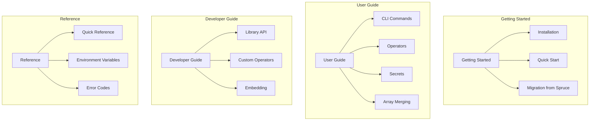

# Graft Documentation

Welcome to the Graft documentation. Graft is a next-generation YAML/JSON configuration merging tool designed for enterprise configuration management.

## Quick Navigation

## Documentation Sections

### [Getting Started](getting-started/)

New to Graft? Start here.

- [Installation](getting-started/installation.md)

  Install Graft on your system

- [Quick Start](getting-started/quick-start.md)

  Get up and running in 5 minutes

- [Migration from Spruce](getting-started/migration-from-spruce.md)

  Transitioning from Spruce to Graft

### [User Guide](user-guide/)

Learn how to use Graft effectively.

- [CLI Commands](user-guide/cli/)

  Complete CLI reference including merge, diff, json, and debug commands

- [Operators](user-guide/operators/)

  All 50+ operators for data manipulation, control flow, arithmetic, and more

- [Array Merging](user-guide/array-merging.md)

  Strategies for merging arrays: append, prepend, merge, replace

- [Secrets Management](user-guide/secrets/)

  Integrate with Vault, AWS Parameter Store, AWS Secrets Manager, NATS

- [Diff & History](user-guide/diffing.md)

  Rich diff output formats and merge history tracking

- [Configuration](user-guide/configuration.md)

  Environment variables and configuration options

### [Developer Guide](developer-guide/)

Embed Graft in your applications.

- [Library API](developer-guide/library-api/)

  Full reference for the `pkg/graft` Go library

- [Custom Operators](developer-guide/custom-operators.md)

  Create your own operators

- [Custom Backends](developer-guide/custom-backends.md)

  Integrate with additional secrets backends

- [Embedding](developer-guide/embedding.md)

  Embed Graft in web services and applications

- [Testing](developer-guide/testing.md)

  Test your code with mock engine

### [Architecture](architecture/)

Understand how Graft works.

- [Architecture Overview](architecture/index.md)

  High-level system design

- [Processing Pipeline](architecture/pipeline.md)

  Pre-scan, parse, merge, evaluate, post-process

- [Parser Design](architecture/parser.md)

  Unified recursive descent parser

- [Parallel Execution](architecture/parallelism.md)

  Wave-based evaluation and connection pooling

### [Examples](examples/)

Practical examples for common use cases.

- [Basic Merging](examples/basic-merging.md)

  Simple merge operations

- [Conditional Configs](examples/conditional-configs.md)

  Using if/else and case statements

- [Multi-Environment](examples/multi-environment.md)

  Managing dev, staging, and production configurations

- [Secrets Management](examples/secrets-management.md)

  Working with Vault and AWS secrets

- [CI/CD Integration](examples/ci-cd-integration.md)

  Using Graft in CI/CD pipelines

- [Web Service Embedding](examples/web-service-embedding.md)

  Embedding Graft in a web service

### [Reference](reference/)

Quick lookups and detailed specifications.

- [Operator Quick Reference](reference/operator-quick-reference.md)

  All operators at a glance

- [CLI Quick Reference](reference/cli-quick-reference.md)

  All commands and flags

- [Environment Variables](reference/environment-variables.md)

  Complete list of environment variables

- [Error Codes](reference/error-codes.md)

  Error codes and troubleshooting

- [Glossary](reference/glossary.md)

  Terms and definitions

### [Contributing](contributing.md)

Help improve Graft.

## Key Features

| Feature | Description |
|---------|-------------|
| **Spruce Compatible** | Drop-in replacement for Spruce |
| **50+ Operators** | Rich operator set for data manipulation |
| **Control Flow** | if/elif/else, for/while, case/when |
| **Secrets Management** | Vault, AWS, NATS integration |
| **Rich Diff Output** | Side-by-side, unified, change lists |
| **History Tracking** | Complete merge traceability |
| **Interactive REPL** | Debug complex merges step-by-step |
| **Go Library** | Embed in your applications |
| **Parallel Execution** | Wave-based evaluation for performance |

## Getting Help

- **GitHub Issues**

  [Report bugs or request features](https://github.com/wayneeseguin/graft/issues)

- **Examples**

  [Browse practical examples](examples/)

- **Error Reference**

  [Troubleshoot common errors](reference/error-codes.md)
