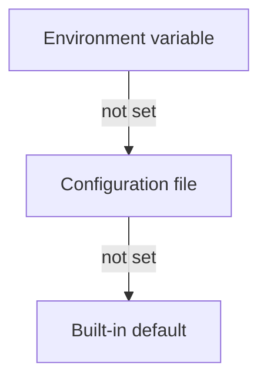

# Configuration Reference

Graft's configuration system controls engine, cache, parallel-processing, metrics, and logging settings through a unified `Config` structure. Three sources feed that structure, and each source can override the ones below it: environment variables, a configuration file, and built-in defaults.

This page documents the `--config` flag, the config file format, the `GRAFT_*` environment variables, feature flags, and the precedence order graft applies when the same setting is specified more than once. It also covers, because this matters for getting real results and not just a valid config file, which of these settings actually change what a `graft merge`, `graft fan`, or `graft vaultinfo` run does.

## Precedence Order

Graft resolves each setting independently, in this order, from highest to lowest priority:

1. Environment variable (`GRAFT_*`)

2. Configuration file (loaded via `--config` or discovered by search)

3. Built-in default

There is no setting-specific CLI flag tier above environment variables. `--config <path>` is the only configuration-related flag graft has, and it doesn't set individual values itself; it selects which file participates in the configuration-file tier below. A setting specified at a higher tier always wins over the same setting specified at a lower tier. A setting left unspecified at a tier falls through to the next tier down.



## The `--config` Flag

```bash
graft --config /etc/graft/config.yaml merge base.yml overlay.yml
```

`--config <path>` points graft at a YAML configuration file. The path accepts `~` for the user's home directory and expands environment variables (for example, `$HOME/graft.yaml`).

If `--config` is omitted, graft searches these locations in order and loads the first file found:

1. `./graft.yaml` (current directory)

2. `$HOME/.graft/config.yaml` (user config directory)

3. `/etc/graft/config.yaml` (system config, Unix-like systems only)

If no file is found at `--config` or in the search path, graft proceeds with built-in defaults; a missing config file is not an error. If `--config` names a file that does exist but can't be read or fails to parse as YAML, graft exits with an error rather than silently falling back to defaults.

## Configuration File Format

The configuration file is YAML with five top-level sections, matching the `Config` struct:

```yaml
engine:
  strict_mode: false
  max_recursion: 100
  timeout: 30s

cache:
  enabled: true
  max_size: 10000
  ttl: 5m
  l2_enabled: false
  l2_path: ""

parallel:
  enabled: true
  min_workers: 1
  max_workers: 0

metrics:
  enabled: false
  format: prometheus
  endpoint: /metrics

logging:
  level: info
  format: text
```

A sixth, `ui`, section exists alongside these five, but it is read by a
separate, narrower mechanism, not by `internal/config`:

```yaml
ui:
  theme: dark
```

`ui.theme` sets the `graft debug`/`graft merge --interactive` color theme
(`auto`, `dark`, `light`, or `mono`). It follows the same three search
paths as `--config`'s discovery order above, but a standalone reader
decodes only this one key; it never loads, validates, or activates any
of the five sections above, and does not go through `--config` at all
(naming a file with `--config` does not change where `ui.theme` is
read from). Precedence for the theme specifically is `--theme` flag,
then `GRAFT_THEME`, then `ui.theme`, then `auto` — one tier richer than
the five sections above, since theme has a flag tier the others don't.
See [`graft debug`'s Colors and Themes
section](../user-guide/cli/debug.md#colors-and-themes) for the full
behavior, including how an invalid `ui.theme` value is handled.

A partial file is valid. Any field not present in the file keeps its built-in default (or its environment-variable override, applied after the file loads; see [Precedence Order](#precedence-order)). Fields set to invalid values (an unrecognized `metrics.format`, a negative `cache.max_size`, and so on) cause graft to reject the file with a validation error rather than silently ignoring the bad value.

## Configuration Fields and Defaults

| Section | Field | YAML key | Type | Default | Description |
|---|---|---|---|---|---|
| Engine | StrictMode | `engine.strict_mode` | bool | `false` | Enables strict validation of graft operations. |
| Engine | MaxRecursion | `engine.max_recursion` | int | `100` | Maximum recursion depth for nested operations (0–10000). |
| Engine | Timeout | `engine.timeout` | duration | `30s` | Maximum duration for an operation (0–24h). |
| Cache | Enabled | `cache.enabled` | bool | `true` | Enables the in-memory (L1) cache. |
| Cache | MaxSize | `cache.max_size` | int | `10000` | Maximum number of entries in the cache. |
| Cache | TTL | `cache.ttl` | duration | `5m` | Time-to-live for a cache entry. |
| Cache | L2Enabled | `cache.l2_enabled` | bool | `false` | Enables the persistent (disk-backed) merge cache. |
| Cache | L2Path | `cache.l2_path` | string | `""` | Directory for the persistent merge cache; empty means the OS user cache directory (e.g. `~/.cache/graft`). |
| Parallel | Enabled | `parallel.enabled` | bool | `true` | Enables parallel evaluation of independent operations. |
| Parallel | MinWorkers | `parallel.min_workers` | int | `1` | Minimum number of worker goroutines. |
| Parallel | MaxWorkers | `parallel.max_workers` | int | `0` | Maximum number of worker goroutines; `0` auto-detects from the number of logical CPUs. |
| Metrics | Enabled | `metrics.enabled` | bool | `false` | Enables metrics collection. |
| Metrics | Format | `metrics.format` | string | `prometheus` | Metrics output format: `prometheus`, `json`, or `text`. |
| Metrics | Endpoint | `metrics.endpoint` | string | `/metrics` | HTTP path metrics are exposed on; required when `enabled` is `true` and must start with `/`. |
| Logging | Level | `logging.level` | string | `info` | Log level: `debug`, `info`, `warn`, or `error`. |
| Logging | Format | `logging.format` | string | `text` | Log output format: `json` or `text`. |

`parallel.max_workers: 0` is not "unlimited": graft normalizes it to `runtime.NumCPU()` (the number of logical CPUs on the host) before the engine starts.

## Which Settings Actually Affect a Merge

Every field in the table above is parsed from the config file, overridden by its `GRAFT_*` environment variable, and validated on every graft invocation, but not every field is wired into the CLI's engine construction yet. Today:

- The **Parallel** section (`parallel.enabled`, `parallel.min_workers`, `parallel.max_workers`) is fully wired: it drives whether `graft merge`, `graft fan`, and `graft vaultinfo` evaluate independent operations concurrently and how many worker goroutines they use. Changing it produces an observable difference in how a merge runs (though never in what it outputs — see [Parallel Evaluation](../features/extras.md#parallel-evaluation) for the determinism guarantee).

- `cache.l2_enabled` and `cache.l2_path` (and their `GRAFT_CACHE_L2_*` environment variables) are wired: they enable and locate the [persistent merge cache](../features/extras.md#caching), which lets a repeat invocation replay a previous run's output or skip re-parsing unchanged documents. The `graft cache stats` and `graft cache clear` subcommands read the same settings.

- The rest of the **Cache** section, and the **Engine**, **Metrics**, and **Logging** sections, are loaded and validated, but the CLI's `merge`/`fan`/`vaultinfo` commands don't currently read them when building the engine. Concretely: in-memory caching is always attempted with a fixed 1000-entry cache regardless of `cache.enabled` or `cache.max_size`, and is turned on or off solely by the `caching` feature flag (see [Feature Flags](#feature-flags) below). `cache.ttl` has no effect through the CLI. `engine.max_recursion` is not consulted — the CLI's own cycle check uses a fixed depth of 4096, independent of this field. `engine.strict_mode` and `engine.timeout` aren't read. No CLI command ever requests metrics collection, so `metrics.enabled`, `GRAFT_METRICS_ENABLED`, and the `metrics` feature flag currently have no observable effect either.

Setting any of these fields is not an error. The file loads, the environment variable applies, and `graft --config path.yaml merge ...` runs normally, but expect no change in behavior beyond the Parallel section and the persistent merge cache until they're wired up. This page still documents every field's YAML key, environment variable, and validation rule for completeness and for programmatic use of the `internal/config` package outside the CLI.

## Environment Variables

Every configuration field above has a matching `GRAFT_*` environment variable, and each one is parsed, validated, and applied on every invocation. Environment variables override the configuration file, per the [precedence order](#precedence-order) above. Whether overriding a given field changes actual merge behavior depends on which field it is; see [Which Settings Actually Affect a Merge](#which-settings-actually-affect-a-merge).

| Variable | Overrides | Accepted values |
|---|---|---|
| `GRAFT_ENGINE_STRICT_MODE` | `engine.strict_mode` | `true`/`1`/`yes`/`on`, `false`/`0`/`no`/`off` |
| `GRAFT_ENGINE_MAX_RECURSION` | `engine.max_recursion` | integer |
| `GRAFT_ENGINE_TIMEOUT` | `engine.timeout` | Go duration string (e.g., `30s`, `1m`) |
| `GRAFT_CACHE_ENABLED` | `cache.enabled` | `true`/`1`/`yes`/`on`, `false`/`0`/`no`/`off` |
| `GRAFT_CACHE_MAX_SIZE` | `cache.max_size` | integer |
| `GRAFT_CACHE_TTL` | `cache.ttl` | Go duration string (e.g., `5m`, `1h`) |
| `GRAFT_CACHE_L2_ENABLED` | `cache.l2_enabled` | `true`/`1`/`yes`/`on`, `false`/`0`/`no`/`off` |
| `GRAFT_CACHE_L2_PATH` | `cache.l2_path` | filesystem path |
| `GRAFT_PARALLEL_ENABLED` | `parallel.enabled` | `true`/`1`/`yes`/`on`, `false`/`0`/`no`/`off` |
| `GRAFT_PARALLEL_MIN_WORKERS` | `parallel.min_workers` | integer |
| `GRAFT_PARALLEL_MAX_WORKERS` | `parallel.max_workers` | integer (`0` = auto) |
| `GRAFT_METRICS_ENABLED` | `metrics.enabled` | `true`/`1`/`yes`/`on`, `false`/`0`/`no`/`off` |
| `GRAFT_METRICS_FORMAT` | `metrics.format` | `prometheus`, `json`, `text` |
| `GRAFT_METRICS_ENDPOINT` | `metrics.endpoint` | HTTP path starting with `/` |
| `GRAFT_LOGGING_LEVEL` | `logging.level` | `debug`, `info`, `warn`, `error` |
| `GRAFT_LOGGING_FORMAT` | `logging.format` | `json`, `text` |

An empty or unset environment variable is ignored; the file value or default remains in effect. A boolean variable set to a value graft does not recognize (anything other than the accepted values above) is also ignored rather than treated as `false`.

These `GRAFT_*` configuration variables are distinct from the per-command variables (`NO_COLOR`/`TERM`/`--color`, `DEBUG`, `TRACE`) and the backend credentials (`VAULT_*`, `AWS_*`, `NATS_*`) covered in [Environment Variables](environment-variables.md). This page covers only the unified `Config` system; see that page for the rest of graft's environment surface.

## Feature Flags

Feature flags are a second, independent on/off registry, separate from the `Config` struct above. Graft resolves all six on every invocation (library defaults, then any `GRAFT_FEATURE_*` overrides), but today only one of them, `caching`, changes what the CLI's `merge`, `fan`, and `vaultinfo` commands actually do.

| Flag | Environment variable | Default | Purpose | Effect through the CLI |
|---|---|---|---|---|
| `parallel_evaluation` | `GRAFT_FEATURE_PARALLEL` | disabled | Evaluate independent operations concurrently. | None. The CLI always resolves a `Config` first and applies `parallel.enabled` on top of this flag, so `parallel.enabled` (config file or `GRAFT_PARALLEL_ENABLED`) is what actually decides whether parallel evaluation runs — setting `GRAFT_FEATURE_PARALLEL` has no observable effect. |
| `caching` | `GRAFT_FEATURE_CACHE` | enabled | Reuse operator results for repeated identical operations. | Real. This is the only setting, config field or feature flag, that turns operator-result caching on or off through the CLI. |
| `metrics` | `GRAFT_FEATURE_METRICS` | disabled | Collect operation counts, timing, and resource-usage metrics. | None currently. No CLI command requests metrics collection, so this flag (and `metrics.enabled`/`GRAFT_METRICS_ENABLED`) has no observable effect. |
| `debug_logging` | `GRAFT_FEATURE_DEBUG` | disabled | Emit verbose internal logging for troubleshooting. | None. Debug output is controlled separately, by the `-D`/`--debug` flag or the `DEBUG` environment variable; see [CLI Quick Reference](cli-quick-reference.md). |
| `strict_type_checking` | `GRAFT_FEATURE_STRICT_TYPES` | disabled | Treat type mismatches as errors instead of attempting coercion. | None currently. |
| `memory_pools` | `GRAFT_FEATURE_POOLS` | enabled | Reuse buffers and interned strings to reduce allocations. | None currently. |

Each `GRAFT_FEATURE_*` variable accepts `true`/`1`/`yes`/`on`/`enabled` and `false`/`0`/`no`/`off`/`disabled`. An unset or unrecognized value leaves the flag at its default.

The `parallel_evaluation` behavior above is intentional, not a bug: the engine is always built with the resolved `Config`, and applying `parallel.enabled` after the feature flags means the config value wins the "is parallel evaluation on" decision in both directions, regardless of `GRAFT_FEATURE_PARALLEL`. If a future release wires `metrics`, `debug_logging`, `strict_type_checking`, or `memory_pools` into actual engine behavior, this table will note where each flag's env var and default still apply.

## Validation

Graft validates a configuration after loading it from a file and again after applying environment overrides. Validation failures are reported together and abort startup rather than falling back to a partially-valid configuration:

- `engine.max_recursion` must be between `0` and `10000`.

- `engine.timeout` must be between `0` and `24h`.

- `cache.max_size` and `cache.ttl` must not be negative.

- `cache.l2_path` may be empty even when `cache.l2_enabled` is `true`; the OS user cache directory is used as the default.

- `parallel.min_workers` and `parallel.max_workers` must not be negative, and `min_workers` must not exceed `max_workers` when `max_workers` is set.

- `parallel.max_workers` above four times the number of logical CPUs produces a resource-contention warning.

- `metrics.format` must be one of `prometheus`, `json`, or `text`.

- `metrics.endpoint` is required when `metrics.enabled` is `true`, and must start with `/`.

- `logging.level` must be one of `debug`, `info`, `warn`, or `error`.

- `logging.format` must be one of `json` or `text`.

## Worked Example

```bash
# Config file sets a conservative worker ceiling and a larger cache.
cat > /etc/graft/config.yaml <<'YAML'
parallel:
  enabled: true
  max_workers: 4
cache:
  max_size: 5000
YAML

# Environment variable overrides the file's worker ceiling.
export GRAFT_PARALLEL_MAX_WORKERS=8

# Effective parallel.max_workers is 8 (environment beats file), and this
# value is what the CLI actually uses to size its worker pool.
#
# Effective cache.max_size is 5000 (file value, nothing overrides it),
# but this has no effect on the running merge: the CLI's cache is always
# created with a fixed 1000-entry limit, unrelated to cache.max_size (see
# "Which Settings Actually Affect a Merge" above).
graft --config /etc/graft/config.yaml merge base.yml overlay.yml
```

## See Also

- [Environment Variables](environment-variables.md) — the full environment-variable surface, including `VAULT_*`, `AWS_*`, and `NATS_*` backend credentials

- [Extras Beyond Spruce](../features/extras.md) — caching, metrics, parallel evaluation, memory pools, and the AWS/NATS secrets backends, including which of these this configuration system actually controls today

- [CLI Quick Reference](cli-quick-reference.md) — command flags
