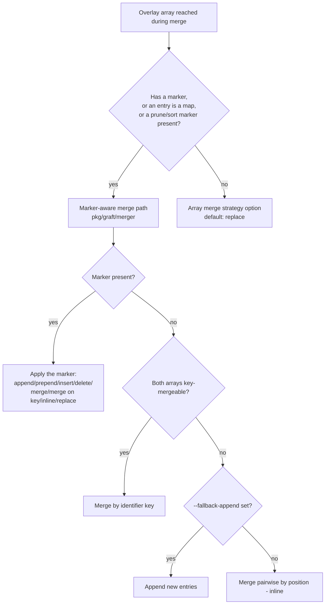
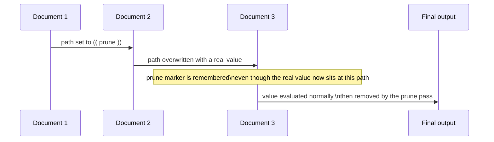

# Merge Semantics: Graft vs. Spruce

Spruce merges YAML documents left to right, applying array-merge markers
and two "ghost" behaviors around `(( prune ))` and `(( sort by <key> ))`
that survive being overwritten mid-merge. Graft aims to reproduce all of
this. This document lists the marker set both tools implement, the
default fallback chain applied when no marker is present, and where
graft's current implementation still diverges.

## Array merge markers

Both tools scan the leading string entries of a merged-in array for
operator markers before applying any other merge logic. Multiple markers
can chain in one array.

| Marker | Effect | Graft status |
|---|---|---|
| `(( append ))` | New entries are added to the end of the array. | Implemented, matches spruce. |
| `(( prepend ))` | New entries are added to the start of the array. | Implemented, matches spruce. |
| `(( insert after <idx> ))` / `(( insert before <idx> ))` | New entries are inserted at a numeric position. | Implemented, matches spruce. |
| `(( insert after "<name>" ))` / `(( insert before "<name>" ))` | New entries are inserted relative to a named entry. | Implemented, matches spruce. |
| `(( delete <idx> ))` | The entry at a numeric position is removed. | Implemented, matches spruce. |
| `(( delete "<name>" ))` | The entry matching a name is removed. | Implemented, matches spruce. |
| `(( merge ))` | Entries are merged by the default identifier key. | Implemented, matches spruce, for arrays that reach the marker-aware merge path (see below). |
| `(( merge on <key> ))` | Entries are merged by an explicit identifier key. | Same as above. |
| `(( inline ))` | Entries are merged pairwise by position. | Implemented, matches spruce. |
| `(( replace ))` | The original array is discarded; the new array is used as-is. | Implemented, matches spruce. |

Graft carries a direct port of spruce's marker-parsing engine
(`pkg/graft/merger`), including the same regular expressions for insert
and delete forms and the same `DEFAULT_ARRAY_MERGE_KEY` environment
variable override for the identifier key used by `(( merge ))` and
by-key default merging.

## Default merge fallback chain

When an array carries no marker, spruce tries, in order: merge entries
by key if every entry in both the original and new array is a map that
carries a hashable scalar value for the identifier key; otherwise merge
pairwise by position (`inline`); otherwise, if `--fallback-append` is
set, append the new entries onto the original array instead. A
`WarningError` is written to stderr when the fallback is triggered for a
non-trivial reason, such as an identifier key whose value is itself a
map or list.

Graft applies this same three-step chain through its marker-aware merge
path (`pkg/graft/merger`), which the CLI's merge builder routes into
whenever an overlay array contains map entries, an explicit array-merge
marker, or a prune/sort marker. Arrays of plain scalars with no marker
and no map entries take a separate, simpler path controlled by an array
merge strategy option (default: replace the original array outright).
This matches spruce's own behavior for scalar arrays, since spruce's
key-merge fallback also requires map entries to attempt a key match.

### Array-marker handling under `--skip-eval` matches spruce

In spruce, `--skip-eval` only gates the operator evaluator's three
phases (the pass that resolves scalar operator calls like
`(( grab ... ))` or `(( vault ... ))`). Array-merge markers are
consumed during the merge step itself, which runs unconditionally
before the evaluator is ever invoked, so `--skip-eval` has no effect on
them: `(( append ))`, `(( merge on <key> ))`, and every other array
marker are always resolved into the final array structure, skip-eval or
not.

Graft's merge builder (`pkg/graft/merge_builder_impl.go`) follows the
same rule. Its marker-detection logic (`needsLegacyMerger`) recognizes
every marker family — `append`, `prepend`, `replace`, `merge`,
`merge on <key>`, `insert`, and `delete` — and routes any array
carrying one through the real merger unconditionally, whether or not
`--skip-eval` is set. No marker is ever left as literal, unresolved
text in the output or silently dropped in favor of a plain inline
replace; `merge_marker_parity_test.go` pins this for both a lone
document and multi-document merges, with and without `--skip-eval`.

`(( sort by <key> ))` ghost-tracking follows the same rule too: once a
sort marker has been queued by an earlier document and the path is
later overwritten by a real array, the sort still applies to the final
output whether or not `--skip-eval` is set. The one place `--skip-eval`
still changes behavior is a lone, never-overwritten `(( prune ))` on a
single document: pruning that value is evaluator work in both tools
(there is no earlier document for the ghost-tracking below to apply
to), so it stays as literal, unresolved text in the output when
evaluation is skipped, matching spruce. Once a `(( prune ))` marker has
actually been overwritten by a later document, its ghost-tracking is
unconditional in both tools regardless of `--skip-eval` — see
[ghost prune/sort semantics](#ghost-prunesort-semantics) below.

## Ghost prune/sort semantics

`(( prune ))` and `(( sort by <key> ))` markers have a merge-order
quirk in spruce that is easy to miss in a straightforward
reimplementation: the marker's effect survives being overwritten by a
later document, in both directions.

- If an earlier document sets `(( prune ))` at a path and a later
  document overwrites that path with a real value, the path is still
  queued for pruning. The overwritten value is used for the rest of the
  merge and evaluation (so other operators can still reference it), but
  it is removed from the final output.

- If an earlier document sets a real value at a path and a later
  document overwrites it with `(( prune ))`, the path is queued for
  pruning going forward, and the marker is recorded even though the
  original value is gone.

The same before/after tracking applies to `(( sort by <key> ))`
markers: whichever document last touched the path determines the sort
key that gets applied to the final array, even if that document's own
value at the path was itself overwritten again later.

Graft's merge engine implements the same two-directional tracking
(`pkg/graft/merger`), including the same ordering guarantee that
pruning runs before sorting, which runs before cherry-pick filtering,
during post-processing. Graft additionally distinguishes array-index
paths from map-key paths when a prune marker is being replaced, and
preserves the original value at a path when it is a map or list (rather
than a scalar) so that other operators referencing that path during
evaluation still see it; spruce does not make this distinction.

## Related documents

- [YAML formatting differences](yaml-formatting.md)

- [Known gaps](known-gaps.md)

- [Genesis compatibility contract](genesis-compat-contract.md)
