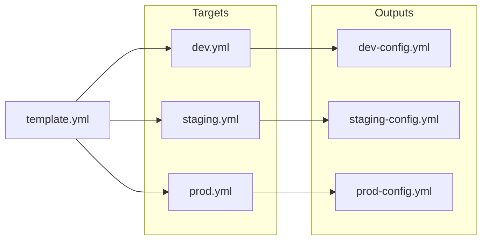

# fan Command

Perform cross-product merge against multiple target files.

## Usage

```sh
graft fan [flags] template.yml targets/
```

The `fan` command merges a template against each file in a target directory, producing multiple output files.

## Flags

| Flag | Short | Description |
|------|-------|-------------|
| `--output` | `-o` | Output directory (default: stdout) |
| `--skip-eval` | | Don't evaluate operators |
| `--prune` | | Remove key from output (repeatable) |

## Concept

`fan` is useful when you need to generate multiple configurations from a single template, each customized for a different target (environment, region, customer, etc.).



## Basic Usage

### Directory of Targets

```sh
graft fan template.yml targets/
```

**template.yml:**
```yaml
application:
  name: my-app
  version: 1.0.0
database:
  host: (( grab meta.db_host ))
  port: 5432
meta:
  environment: (( grab meta.name ))
```

**targets/dev.yml:**
```yaml
meta:
  name: development
  db_host: localhost
```

**targets/prod.yml:**
```yaml
meta:
  name: production
  db_host: db.prod.example.com
```

**Output:**
```yaml
# From targets/dev.yml:
application:
  name: my-app
  version: 1.0.0
database:
  host: localhost
  port: 5432
meta:
  environment: development
  name: development
  db_host: localhost

---
# From targets/prod.yml:
application:
  name: my-app
  version: 1.0.0
database:
  host: db.prod.example.com
  port: 5432
meta:
  environment: production
  name: production
  db_host: db.prod.example.com
```

### Output to Directory

```sh
graft fan template.yml targets/ --output=output/
```

Creates:

- `output/dev.yml`
- `output/prod.yml`

## Use Cases

### Multi-Environment Deployment

Generate configs for all environments:

```sh
# Template with common settings
cat > template.yml << 'EOF'
app:
  name: my-service
  replicas: (( grab env.replicas ))
  host: (( concat app.name "." env.domain ))
env:
  name: (( grab env.name ))
EOF

# Per-environment overrides
mkdir -p envs
cat > envs/dev.yml << 'EOF'
env:
  name: development
  domain: dev.example.com
  replicas: 1
EOF

cat > envs/prod.yml << 'EOF'
env:
  name: production
  domain: example.com
  replicas: 5
EOF

# Generate all configs
graft fan template.yml envs/ --output=generated/
```

### Multi-Region Deployment

```sh
# regions/us-east.yml
region:
  name: us-east-1
  endpoint: us-east.api.example.com

# regions/eu-west.yml
region:
  name: eu-west-1
  endpoint: eu-west.api.example.com

# Generate regional configs
graft fan service-template.yml regions/ --output=regional-configs/
```

### Customer-Specific Configs

```sh
# Generate configs for each customer
graft fan base-config.yml customers/ --output=customer-configs/
```

## Combining with Other Flags

### Prune Internal Keys

```sh
graft fan template.yml targets/ --prune meta --output=output/
```

### Skip Evaluation

Useful for debugging:

```sh
graft fan template.yml targets/ --skip-eval
```

## Examples

### Full Workflow

```sh
# Create template
cat > template.yml << 'EOF'
service:
  name: (( grab meta.service_name ))
  port: (( grab meta.port ))
  environment: (( grab meta.env ))
config:
  database_url: (( concat "postgres://" meta.db_host ":" meta.db_port "/app" ))
  redis_url: (( concat "redis://" meta.redis_host ":6379" ))
EOF

# Create target directory
mkdir -p targets

# Development target
cat > targets/dev.yml << 'EOF'
meta:
  env: development
  service_name: my-service
  port: 8080
  db_host: localhost
  db_port: 5432
  redis_host: localhost
EOF

# Production target
cat > targets/prod.yml << 'EOF'
meta:
  env: production
  service_name: my-service
  port: 443
  db_host: db.prod.internal
  db_port: 5432
  redis_host: redis.prod.internal
EOF

# Generate configs
graft fan template.yml targets/ --prune meta --output=output/
```

**output/dev.yml:**
```yaml
service:
  name: my-service
  port: 8080
  environment: development
config:
  database_url: postgres://localhost:5432/app
  redis_url: redis://localhost:6379
```

**output/prod.yml:**
```yaml
service:
  name: my-service
  port: 443
  environment: production
config:
  database_url: postgres://db.prod.internal:5432/app
  redis_url: redis://redis.prod.internal:6379
```

### CI/CD Integration

```sh
#!/bin/bash
# Generate all environment configs and deploy

graft fan deployment-template.yml environments/ --output=configs/

for config in configs/*.yml; do
  env=$(basename "$config" .yml)
  echo "Deploying to $env..."
  kubectl --context="$env" apply -f "$config"
done
```

## Notes

- Target files are processed in alphabetical order
- Output filenames match input target filenames
- The template is merged with each target independently
- Operators are evaluated after each merge

## See Also

- [merge](merge.md) - Single merge operation
- [Operators](../operators/) - Operators for templates
